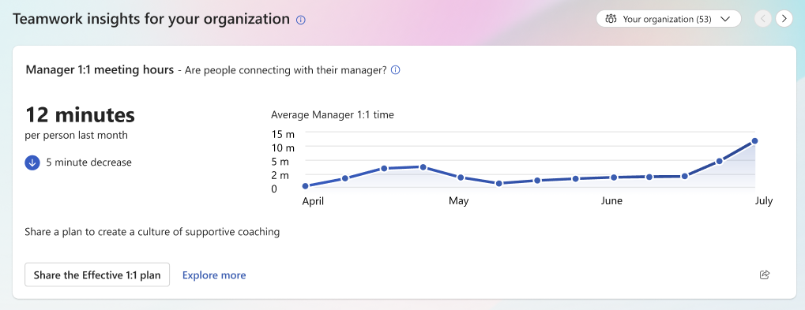

# Organization insights in the Viva Insights app

<!--original content from Jess, and some from the old Org trends doc-->
<!--provide info about what "measures" are-->

## About organization insights

<!---felt like we needed to describe what measurements are and what insights are, and how they're presented/how they help. Should be vetted by Jess/Faisal-->

Organization insights within the Microsoft Viva Insights app help you understand how well your group is doing in relation to *key indicators*--for example, focused work and work-life balance. By measuring your group in specific ways, like determining uninterrupted focus hours, Viva Insights can present this data as *insights*. Insights compare and contrast data across time, and encourage you to take specific action to help create a better employee experience.

### Who can access organization insights

To access organization insights, your admin needs to either assign you the **Insights Business Leader** role or configure you as a group manager. <!--how do they do this?-->

### How to use organization insights

If you're assigned the **Insights Business Leader** role, you can view organization insights that measure all employees in the company. If you're a group manager and have the **Insights Business Leader** role assigned, use the selector next to the section title to switch the scope of the insights you're viewing to your direct reports. <!--Verify that the scope is for direct reports vs whole org. Would be good to have a screenshot, too.-->

>[!Note]
>The list of direct and indirect reports is based on organizational data that your admin manages.

#### Navigation

Here are some things to remember while you explore organization insights within the Viva Insights app.

##### Tooltips and recommended actions

If you need a detailed definition of an insight, select the tooltip to the right.

<!--image-->

Each organization insight card includes a button for a primary recommended action. When you select it, Viva Insights takes you to a related feature that might help address that insight. For example, if your insight indicates that average meeting hours are up, the recommended action card might encourage you to **Set up a no-meeting day**. When you select the button, you'll start the no-meeting day setup right away.

##### Explore more

Each insight card also contains an **Explore more** button, which takes you to a full-page report that provides more information. The report includes:

* Trending changes over time.
* Comparisons to peer organizations and across internal group breakdowns (if eligible).
* Distributions to identify whether a significant share of employees have outlying experiences. <!--explanation needed-->
* Explanatory notes to help you interpret what the insight measures.
* Links to related insights and **Inspiration library** articles.

<!--do we need to keep the below?-->

These **Explore more** pages only include internal group breakdowns for people who have one or more managers who report directly to them, and when those reporting managers themselves have big enough organizations of direct and indirect reports. You'll see results for those sub-organizations labeled with the name of the manager who reports directly to you-- for example, “Ava Kim’s organization.” 

#### To share an insight

If you want to share an insight with others, select the share icon on that insight's card. Pick whether you want to share the insight through a Teams chat or share a link to the insight card.

Sharing an insight through a Teams chat sends recipients a Teams chat message with a screenshot of the insight. The app gives you a preview so you can edit your message before sending it.

<!--Do we have a screenshot we can share of this? I couldn't seem to find one on the Figma.-->

Sharing an insight through a link sends recipients directly to the insight card on their own **Home**, **Productivity**, **Teamwork**, or **Wellbeing** tab. This method is more suited for people within the same organization who all have permissions to access organization insights.

<!--could we put this in the FAQ? Seems like a bit too much info in this location/situation.

Sending a link doesn't grant anyone permissions to view data, so if recipients don't already have access to organization insights, they won't see anything new when they follow the link. -->

### Privacy

<!--How much of this information should we provide for users? Should we move this to our privacy doc?-->

 Organization insights protect individual privacy by enforcing minimum group size, applying differential privacy to averages, and suppressing results for distribution tails. Here's a few more details about each of these topics:

* Minimum group size: Because it’s easier to guess information about an individual based on results about a smaller group, you  won’t see results for groups with fewer than 10 people. Your admin can increase this minimum.
* Differential privacy: For simple averages and totals, Viva Insights introduces a small amount of noise into each calculation. The aggregated amount stays accurate, but you can't add or subtract different values to figure out results for a single person.
* Distribution tails: Where an insight counts how many people have a certain profile, like what percentage of your organization gets enough focus time, you won’t see results that would otherwise tell you that “almost all” or “almost none” of the group fit the profile, because that would effectively give the you information about every individual in the group.

## Organization insights by tab

### Home

Insights on the **Home** tab pull from different focus areas to help you stay informed about trends within the company.

#### Featured insights

Each day, you'll find a different featured insight on the **Home** tab, which draws from this list:

* Uninterrupted focus hours
* Manager 1:1 meeting hours
* Meeting hours
* After-hours collaboration
* No-meeting day impact
* Daily connected hours
* Focus time participation
* Join on time rate
* Focus time impact
* No-meeting day participation
* Multitasking hours
* Internal network size

Every insight shows the current week's average, and also shows the difference from the last week's average. Some show a trend graph, too. <!--added-->

To access other organization insight cards, select the **Show more** option beneath the visible insight cards.

### Teamwork, Productivity, and Wellbeing

The **Teamwork**, **Productivity**, and **Wellbeing** tabs present insight cards similarly. On each insight card within each tab, you'll find:

* This week's average measure (for example, minutes per person), along with the difference from last week's average measure.
* A trend graph for the most recent 12 weeks.

Here's an example from the **Teamwork** tab:

If you're an eligible user, insights compare this week's average measure to that of a peer organization.

Here are the insights you'll find on each tab, and which key indicator they address:

|Tab|Key indicator(s)|Insights|
|----|---|----| 
|**Teamwork**|<ul><li>Manager coaching <li>Networks</ul>| <ul><li>Manager 1:1 meeting hours <li>Internal network size</ul>
|**Wellbeing**| <ul><li>Focused work <li>Work-life balance</ul>|<ul> <li>Uninterrupted focus hours <li>After-hours collaboration<li>No meeting day impact<li>Daily connected hours<li>Focus time participation<li>Focus time impact
|**Productivity**| <ul><li>Meeting effectiveness</ul>|<ul><li>Meeting hours<li>Join on time rate<li>Multitasking hours </ul>

