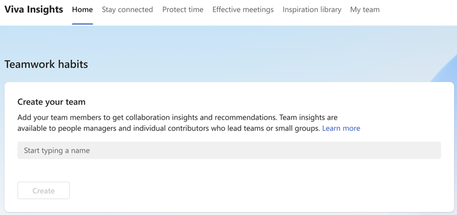
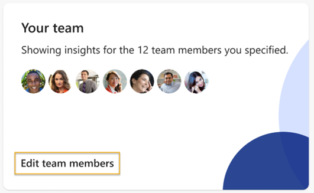

---

title: My team in Viva Insights
description: Learn about the My team page in Microsoft Viva Insights in Teams that shows managers their habits and how that impact their team
author: madehmer
ms.author: helayne
ms.topic: article
ms.localizationpriority: medium 
ms.collection: viva-insights-manager
ms.service: viva 
ms.subservice: viva-insights 
search.appverid: 
- MET150 
manager: scott.ruble
audience: Admin
---

# Teamwork habits

***Applies to**: Users who have a premium Microsoft Viva Insights license with an applicable service plan*

You can see insights and suggested actions based on your personal habits in **Teamwork habits** within the Microsoft Viva Insights app. You can also learn how your habits impact your team while getting suggestions on how to foster team culture.

To learn how to create a team, refer to [Manage your team](#manage-your-team). 

:::image type="content" source="../images/wpa/use/teamwork-habits-small.png" alt-text="Screenshot that shows the Teamwork habits page." lightbox="../images/wpa/use/teamwork-habits.png":::

## Data privacy

Microsoft protects employee privacy and fully complies with local regulations, such as the General Data Protection Regulation (GDPR) the same as for personal insights. For information about data privacy and GDPR compliance in Viva Insights, see [Privacy guide](../personal/teams/viva-teams-app-privacy.md).

## Admin tasks

**Teamwork habits** and its features (as described on this page) are available users who have a premium Microsoft Viva Insights license with an applicable [service plan](../personal/overview/plans-environments.md). Ask your admin about licensing and to install and set up the Viva Insights app in Teams for the organization. See [Admin tasks](../personal/teams/viva-teams-app-admin-tasks.md) for details.

## Install, pin, and configure the app

Your setup tasks for **Teamwork habits** are the same as for [Personal insights](../personal/teams/viva-teams-app.md) in the Viva Insights app. See the following to install, pin, and configure the app in Teams:

* [Install and pin the app](../personal/teams/viva-teams-app-install.md)
* [Configure the app](../personal/teams/viva-teams-app-settings.md)

## View Teamwork habits

On the Viva Insights Home page, you’ll see an insight about your team. To learn more about that insight, select **Learn more**.

>[!Note]
>You can also start a shared no-meeting day plan from the Home page.

Alternatively, select **Teamwork habits** in Viva Insights to see key recommendations, actions, and reflections relating to your team.

## Disable or enable Teamwork habits

1. Select the **ellipsis** (**...**) icon > **Settings** at the top right.
1. Select **Teamwork habits** on the left pane.

   * To disable, select **Opt out**.
   * To enable, select **Opt in**, select your team members, and then select **Save changes**.

## Manage your team

As a licensed Viva Insights user, you can create a team and view insights about them within the Viva Insights app. You’ll be able to add or confirm members on the Home page as explained below, but you can also make changes to your team on the **Teamwork habits** page.

If you’re *not* a manager, Viva Insights prompts you to **Create your team**.

If you *are* a manager, Viva Insights suggests a list of team members derived from Azure Active Directory. You can either confirm this list or edit it.

Once you get your team set up, you can make changes to it at any time through the **Teamwork habits** page **> Your team** card **> Edit team members**.

## Your habits

If you have a full schedule, it can be tough to stay in contact with your team members. Viva Insights brings together all the information you need to stay caught up and respond quickly to important requests, like:

* Acting on tasks you promised to get done or that team members asked you to complete
* Reviewing important emails and documents from team members that you haven’t read yet
* Scheduling [1:1 time](#11-time) with your team members (or rescheduling if a conflict comes up)
* Viewing and considering changes for [quiet hours impact](#quiet-hours-impact) and [team meeting habits](#team-meeting-habits)

### 1:1 time

As a team member, you often collaborate with other team members to get work done. However, with your own tasks and busy schedules, you might not feel you’re really staying in touch with each of your teammates. Dedicated 1:1 time can help.

As a people manager, it's likely that one of your many responsibilities is coaching team members to help them build the skills they need for their role. One of the simplest coaching tools you have at your disposal is 1:1 time. [Research by Microsoft](https://insights.office.com/productivity/what-great-managers-do-daily/) has shown that people who get consistent 1:1 time with their manager are more engaged and view the manager's leadership more favorably.

#### How 1:1 time is calculated

Any meeting on your calendar that includes only you and a team member counts as a 1:1. If the calendar invitation also has a meeting room assigned, it still counts as a 1:1.

If you directly call a team member over Teams outside of a scheduled 1:1 meeting, it does not count as 1:1 time.

### Team meeting habits

Emailing and chatting during meetings can lead to different interpretations of decisions, missed guidance, and inconsistent follow-through on action items.

No matter your role, practicing good meeting habits helps you and your teammates communicate effectively and efficiently, discuss important points, and be on the same page.

If you're a manager, you're a role model when it comes to collaboration habits.Team members tend to mimic their manager's behavior. [One study by Microsoft](https://insights.office.com/productivity/multitask-meetings-team-will/) found, for example, that managers who multitask in meetings (defined as reading or sending emails during a scheduled meeting) are more than two times as likely to have team members who also multitask in meetings.

#### How team meetings habits are calculated

A *team meeting* is any scheduled meeting on your calendar that includes you and at least one of your team members (including 1:1 meetings). The habits shown in this section are defined as follows:

* **<=1 hour** – Team meetings that you scheduled that were no longer than one hour.
* **No overlap with other meetings** –  Team meetings that you scheduled or were invited to that did not overlap with other meetings on your calendar.
* **You didn't multitask** – Team meetings that you scheduled or were invited to during which you did not read or send emails or chats.
* **RSVP'd** – Team meetings to which you were invited but did not explicitly accept (note that the denominator here excludes meetings that you declined).
* **Joined on time** – Online team meetings (over a Teams link) that you scheduled or were invited to and joined within a few minutes of the scheduled start time.

>[!Note]
>When you add a team member to your team, those changes are reflected in the next week's data.

### Quiet hours impact

Some team members may prefer to do some of their work outside traditional 9-5 working hours, but others may struggle to mentally disconnect and recharge for the next day if they receive a late-night message from work.

[Research by Microsoft](https://insights.office.com/productivity/multitask-meetings-team-will/) has shown that when managers work after hours, team members take that as a signal that they need to be 'on' too; in one study, every hour that people managers spent after hours translated to 20 minutes of additional direct report time spent after hours. 

#### How quiet-hours impact is calculated

Quiet-hours impact is based on collaboration activity that you initiate with team members more than one hour outside of their working hours as configured in Outlook. This activity includes emails and chats you send as well as meetings and calls you hold. For example, if a team member's configured working hours are 9 AM to 5 PM and you arrange a meeting with them from 6 to 7 PM, this counts as quiet-hours impact.

For emails and chats, it is not necessary for the team member to have actually read or responded to the message you sent; the insight is simply intended to draw your awareness to activities that might have impacted team members after hours.

>[!Note]
>When you add a member to your team list, your impact on the new member's quiet hours are reflected in next week's data.

## Plans

To create healthy team norms, you and your team might consider using shared plans. You can find and start plans—for no-meeting days and shared focus <!--and effective meetings-->—in the **Teamwork habits** page. Links to these plans are vertically arranged in cards on the right side of the app; to start one, just select **Get started**. If you already have a plan started, you can edit it by selecting the **Edit** button.

### No-meeting days

No-meeting days are a shared recurring time that everyone in your team can use to focus without interruptions. When you set up your plan, you can select the start date, frequency, status, and meeting title.

You're then prompted to confirm the team members to invite, an optional note for the email invitation, and then after you confirm the details, select **Send invitation**. Viva Insights will then invite your team to participate in the plan.

The day before a scheduled no-meeting day, your team members are prompted by Viva Insights to prepare for the no-meeting day by rescheduling or canceling any conflicting meetings.

They can select **Review schedule** within the notice to help with this task.

### Shared focus plan

*Shared focus plans are currently only available through a targeted release.*

Through a shared focus plan, your team can book daily, uninterrupted focus time to get your work done. A shared focus plan helps your team build a shared productivity habit. Refer to [Shared focus plan](shared-focus-plan.md) for details.

>[!Note]
>As you use the Viva Insights app, you can provide feedback about the app to Microsoft. To learn how, see **Q10** in [Teamwork habits FAQ](teamwork-habits-faq.md).

## Related topics

* [Personal insights in Viva Insights](../personal/teams/viva-teams-app.md)
* [Viva Insights introduction](viva-insights-intro.md)
