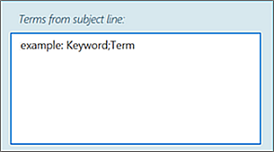

---

title: Language support and guidelines for Advanced insights in Viva Insights
description: Describes the languages supported by Advanced insights within Microsoft Viva Insights
author: madehmer
ms.author: v-lilyolason
ms.topic: article
ms.collection: 
- viva-insights-advanced
- viva-insights-leader
ms.localizationpriority: medium 
ms.service: viva 
ms.subservice: viva-insights 
manager: helayne
audience: Admin

---

# Advanced insights language support and guidelines

The user interface for the advanced insights app in Microsoft Viva Insights is currently available in the languages listed in [Supported languages](#supported-languages).

The advanced insights app automatically uses your language identifier (language and region) setting, as specified in one of the following sources:

* Windows
* Your web browser
* Location that's set for your Exchange Online mailbox

You can override this setting by replacing the language identifier in the URL. [Supported languages](#supported-languages) lists the languages currently supported.

For example, replace '/en-us/' with '/ja-jp/' in the following URL to indicate Japanese as the language to view it in: 'https://workplaceanalytics.office.com/ja-jp/'

## Supported languages

Language and region | Language identifier
------ | ------
English | en-us
Japanese | ja-jp
German | de-de
Chinese (Simplified) | zh-cn
Spanish | es-es
French | fr-fr
Portuguese (Brazil) | pt-br
Russian | ru-ru
Italian | it-it
Chinese (Traditional) | zh-tw
Korean | ko-kr

## Use of data other than English

If and when you are able to use the advanced insights app with _data_ that is in other languages, do the following as a guideline:

* Query names and descriptions must be in English, Japanese, or French.
* Column headers for the organizational data when you [prepare the organizational data](../Setup/Prepare-organizational-data.md) must be in English.
* When an analyst selects metrics while building a [query](/viva/insights/tutorials/query-basics?toc=/viva/insights/use/toc.json&bc=/viva/insights/breadcrumb/toc.json), the metric names they choose can be in the language of their choice. See [Supported languages for column headers](/viva/insights/use/view-download-and-export-query-results?toc=/viva/insights/use/toc.json&bc=/viva/insights/breadcrumb/toc.json#supported-languages-for-column-headers).
* For content within organizational data, you can use languages other than English.
* .csv files generated by Viva Insights are UTF-8 encoded. Excel doesn’t automatically use UTF-8 when opening .csv files, which may cause garbled characters. Refer to [Download and import query results](/viva/insights/use/view-download-and-export-query-results?toc=/viva/insights/use/toc.json&bc=/viva/insights/breadcrumb/toc.json) to learn how to import a .csv file in Excel.

## Privacy settings

In [Privacy settings](/viva/insights/use/privacy-settings?toc=/viva/insights/use/toc.json&bc=/viva/insights/breadcrumb/toc.json), when adding the subject line terms to exclude from analysis, the advanced insights app might not recognize uncommon compound words, especially those in other languages such as Japanese or Chinese. For best results, use single words, separated by a semicolon.

We appreciate all your feedback. To report any language-related issues, use **Send feedback** within the app.

## Related topics

* [Supported languages in meeting exclusion rules](/viva/insights/tutorials/meeting-exclusion-concept?toc=/viva/insights/use/toc.json&bc=/viva/insights/breadcrumb/toc.json#supported-languages)
* [Control settings](/viva/insights/use/settings?toc=/viva/insights/use/toc.json&bc=/viva/insights/breadcrumb/toc.json)
* [Privacy settings considerations](/viva/insights/privacy/privacy-considerations?toc=/viva/insights/use/toc.json&bc=/viva/insights/breadcrumb/toc.json)
