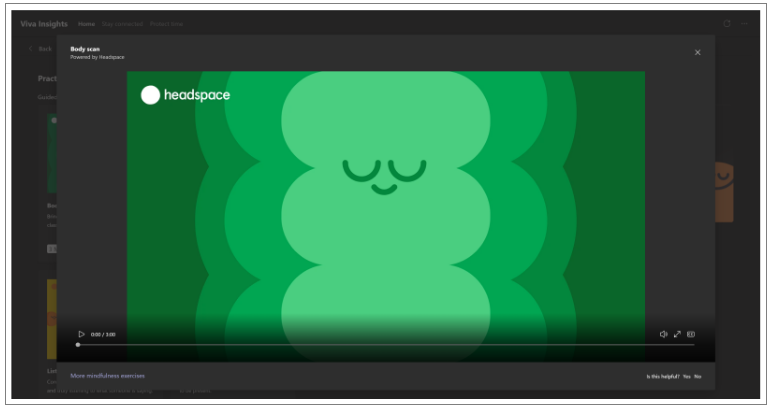

---

title: Headspace meditation with the Briefing email
description: Learn how to access the Headspace feature from the Briefing email
author: madehmer
ms.author: helayne
ms.topic: article
localization_priority: normal 
ms.service: viva 
ms.subservice: viva-insights 
ms.collection: 
- M365-analytics
- viva-insights-personal
manager: helayne
audience: user

---

# Start a guided meditation with Headspace

In the Headspace section of the Briefing email, you can launch a guided meditation to start your day grounded and focused.

Before you can use Headspace, you need access to Viva Insights in Microsoft Teams. See [Discover the Viva Insights app](../teams/viva-teams-app-install.md) for details.

>[!NOTE]
>Headspace is currently available only to you if your Outlook or Exchange Online language is set to English. Additional languages will be supported soon.

## Start a guided meditation

1. In the **Headspace** section of a Briefing email, select **Start meditating** or select the **Play** button to open Headspace within the Viva Insights Teams app (if you're using a computer) or in Teams Mobile (if you're on a mobile device).

   

   Before Teams opens, you might see a message about the "**site is trying to open Microsoft Teams**." If prompted to "**always allow teams.microsoft.com to open links of this type in the associated app**," you can select **Open** or **Cancel**. To continue to Teams and Headspace, select **Open**.

   

2. To start the meditation, select the **Play** button for **Headspace** to open it.

To learn more about other guided meditation resources in the Viva Insights Teams app, see [Mindfulness content from Headspace](../teams/viva-insights-headspace.md).

<!-- REMOVED PER KARYL ON 30 JULY 2021:

## Start a guided meditation

1. (Optional) In Headspace, browse through a curated set of meditations that are designed to fit different scenarios within the flow of your day. To see your options, open the **Practice mindfulness** page by selecting **More mindfulness exercises**.

2. Under **Practice mindfulness**, select a meditation option in the **Guided meditations** area or a musical option in the **Focus music** area:

   

## Run Headspace in the background

You can open and run Viva Insights in a new window. This lets you play Headspace meditations and Focus music while continuing your collaboration in Teams.

1. Locate the pinned Insights app on the left navigation pane of Teams.

2. Right-click the Insights icon.

3. Select **Pop out app**.

   

   This opens a new window in which the Insights app is running.

4. In this second window, select **More mindfulness exercises** and then start a Headspace meditation or Focus music as described in [Start a guided meditation](#start-a-guided-meditation).

5. Optionally, minimize the Insights window that you just opened. You can continue working in Teams in the original Teams window.
 -->

## Frequently asked questions

#### Q1. What is Headspace?

**A1.** The Headspace app gives you a curated set of guided meditations and Focus music that you can play to start your day more centered and grounded, relax your mind before a big presentation, or find focus before starting an important project. In just a few minutes a day, meditation and mindfulness with Headspace can help you decrease stress and increase focus.

#### Q2. Where can I get more information about meditation and other best practices?

**A2.** Check out Headspace app's [Questions about meditation](https://www.headspace.com/meditation-101/faq).

## Related topic

[Briefing email overview](be-overview.md)
