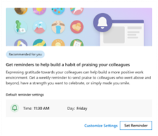

# Recommended actions in the Briefing email

Using the Briefing email’s **Recommended for you** cards, you can request regular reminders to use features including praise, virtual commute, and quiet time. You can also enroll in a Delay delivery plan.  

Before you can start using this section of the Briefing email, you'll need access to Viva Insights in Microsoft Teams. See Discover the Viva Insights app for details.

## Praise  

The Praise card provides you with the ability to enroll in praise reminders to establish a habit of recognizing others.  

Select **Set Reminder** to get reminders at the time indicated in the card 

If you’d prefer to receive your reminders at a different date or time, select Customize settings and update your reminder settings in the Viva Insights Teams App Praise settings page. 

## Delay delivery plan

You can opt in to the Delay delivery plan to get an unlimited number of inline suggestions for delaying email delivery to your coworkers.  

The delay helps minimize disruptions to recipients outside their working hours or when they’re away from work. It helps anybody who wants to maintain the flexibility to work when they want without putting the burden of their schedule on others. 

 

## Virtual commute

The virtual commute **Recommended for you** card allows users to set up their virtual commute through the Briefing email. Below are the steps a user needs to take in the Briefing email: 

Select the Try it out button. On clicking, the user will see ‘Enrolled’ message 

If the user wants to update their default settings, they can click on ‘Edit Settings’ which will take them to Viva Insights app in Teams where they can configure their Virtual Commute reminder settings.  

 

 