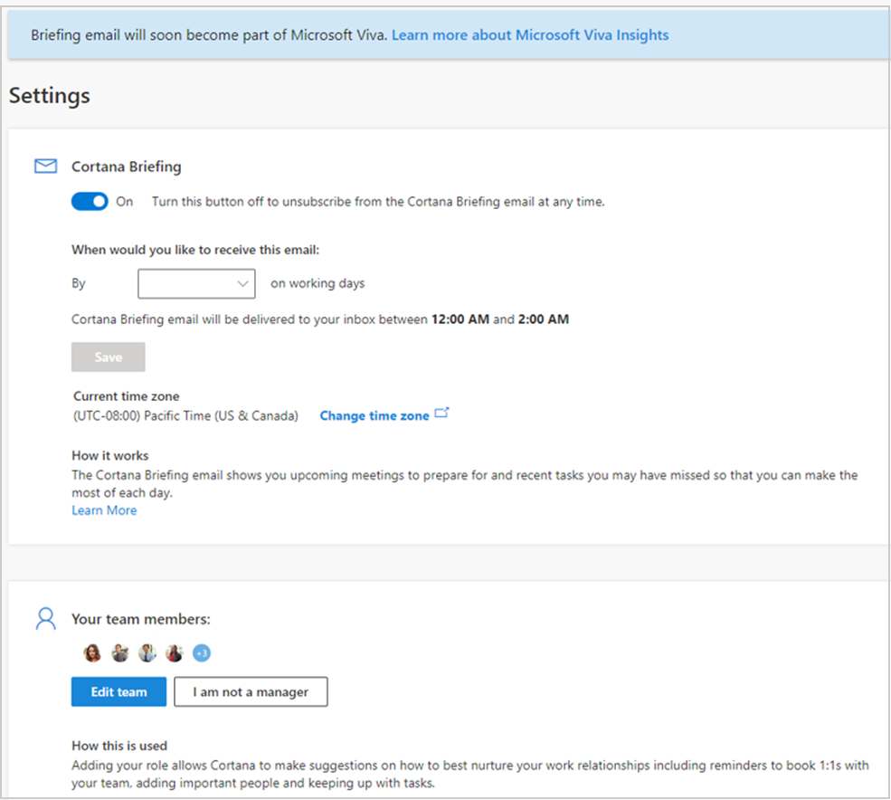

---

title: Settings for the Briefing email
description: Learn how to change your personal settings for the Briefing email from Microsoft Viva
author: madehmer
ms.author: helayne
ms.topic: article
ms.localizationpriority: medium 
ms.service: viva 
ms.subservice: viva-insights 
ms.collection: 
- M365-analytics
- viva-insights-personal
manager: helayne

---
# Settings for the Briefing email

You can change your personal settings for the Briefing email to set what time of day you receive the Briefing in your mailbox or to unsubscribe from it. These settings override or take precedence over what the admin sets up for your Briefing email. If the Briefing is using an incorrect time zone, use **Change time zone** to change your Outlook time zone setting.

**To update settings**

1. Near the end of any Briefing email, select **Settings**.
2. In **Settings**, you can change the following, which take effect the next working day if you have any insights:

   * To change your subscription to the Briefing email from Microsoft Viva, set **Briefing** to **On** to subscribe or **Off** to unsubscribe.
   * In **When would you like to receive this email**, select a preferred time period, and then select **Save**. You'll receive your next Briefing within two hours of this new time.

   

>[!Note]
>If you unsubscribe, you can always subscribe again at [https://cortana.office.com/briefing](https://cortana.office.com/briefing).

## Related topics

* [Briefing email overview](be-overview.md)
* [Configure Briefing email](be-admin.md)
