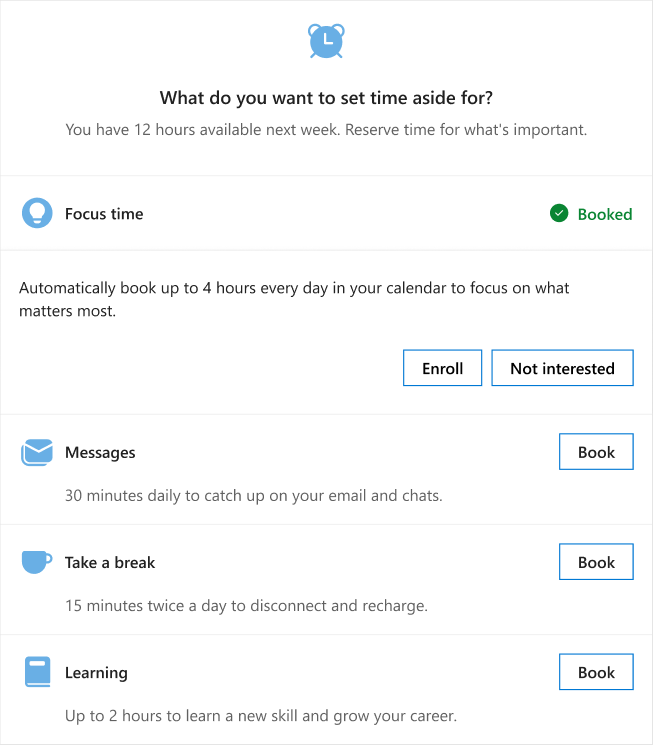

# Plan your week

If you get the [Adaptive email version](be-overview.md#adaptive-or-html-version), you'll see a **What do you want to set aside time for** section in a Briefing email about next week. This helps you plan the week ahead for important activities that improve long term productivity and wellbeing.

Select **Book** next one or more of the following to schedule it for each day during your work week:

* **Focus time** - Schedules up to two-hour blocks of available time on your calendar for uninterrupted focused work. When scheduled, your status shows as "focusing" and notifications are silenced.
* **Catch up on messages** - Schedules a 30-minute block of time to catch up on email and chats. When scheduled, your status shows as "busy" during this time each day.
* **Take a break** - Schedules a 15-minute block of time twice a day to disconnect and recharge.
* **Learning** - Schedules up to a two-hour block of time to learn a new skill or for career development.

This section will also reference and list any already scheduled time in your calendar for these activities.

For example, as shown in the following, you’d select **Book** next to **Catch up on messages** to schedule that time on your calendar for each day during your work week.

   

## To enroll in focus time

_**Applies to:** Enrollment in focus plan through the briefing email is currently available only to users who have a Viva Insights service plan enabled._

In the **What do you want to set aside time for?** section of the Briefing email, you can easily sign up to have focus time automatically added to your Outlook calendar.

* On the **Focus time** row, select **Book** and then select **Enroll**.

## Related topics

[Briefing email overview](be-overview.md)
