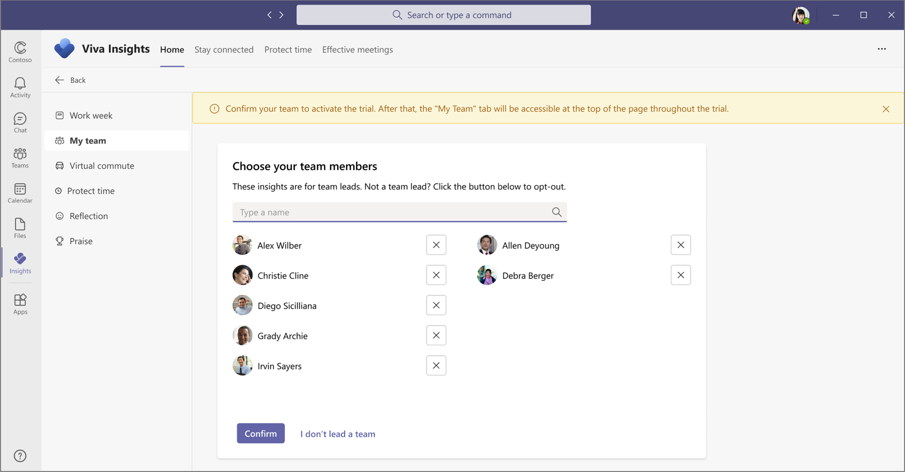

# Viva Insights trial

*This experience is only available through private preview*

The Viva Insights app in Microsoft Teams helps people and businesses thrive with data-driven, privacy-protected insights, and recommendations for improving productivity and wellbeing.

As a licensed user with a Microsoft 365 E3 or E5 plan, you can use this free 60-day trial to access insights to help build better work habits, such as following through on commitments made to collaborators and protecting focus time in the day for uninterrupted, individual work.

During your 60-day trial, you get access to premium features within the Viva Insights app. Your insights are based on information that you already have access to within Outlook and Teams. Viva Insights applies intelligence to this information to make it easier for you to reflect on work patterns and take action to improve yours and your team's productivity and wellbeing.

## My team trial features

As part of a team, you can use this trial to get valuable insights about you and your team’s work patterns. A team is defined as one of the following:

* Formal hierarchical structure with a team who reports to a manager.
* Informal virtual team of people collaborating closely with one another. This definition is flexible and dependent on you as an individual user.

After you enroll in the trial, you can experience the following subset of features within the **My team** page.

* **Stay connected and engaged with your team**: You'll see a rotating recommendation at the top of your **My team** page that's based on recent activity. It's likely that one of your many responsibilities is coaching team members to help them build the skills they need for their roles. One of the simplest coaching tools that team leads or managers have is regularly scheduled 1:1 time with each team member. Research by Microsoft has shown that people who get consistent 1:1 time with their manager and team members are more engaged. See [1:1 time in My team](../../org-team-insights/teamworkhabits.md#11-time) for more details.

* **Team meeting habits**: You’ll see your current behavior and suggestions on how to improve, such as if you RSVP’d, joined on time, and didn’t multitask during team meetings. When it comes to collaboration habits, you are a role model, and your team members tend to mimic your behaviors. Studies found, for example, that managers who multitask in meetings (defined as reading or sending emails during a scheduled meeting) are more than two times as likely to have team members who also multitask in meetings. See [Team meeting habits](../../org-team-insights/teamworkhabits.md#team-meeting-habits) for details.

* **Send praise**: You can use this feature to recognize the contributions of your employees and coworkers. Praise messages show up as notifications in Microsoft Teams. You can have a praise message delivered in a private chat or for wider recognition, in a Teams channel conversation. See [Praise in Viva Insights](../teams/viva-insights-praise.md) for details.

* **Stay on top of outstanding task suggestions**: It is easy to lose track of commitments made to your colleagues in email. This insight helps make sure nothing gets missed by reminding you. It's based on emails that you sent and requests you've made during the last 14 days of email communication, including the following. See [Stay on top of outstanding task suggestions](../teams/viva-insights-stay-connected.md#stay-on-top-of-outstanding-task-suggestions) for details.

  * **Commitments** – Something you promised or committed to do for someone else in an email.
  * **Requests** – Something another person asked you to do in an email.
  * **Follow-ups** – Something you asked someone else for in an email.

### Feature comparison

Features | Microsoft 365 (out of the box) | Viva Insights trial | Viva Insights premium value
-----------|------------|-------|--------
[Home page](../teams/viva-insights-home.md) | X | X | X
[My team trial features](#my-team-trial-features)| X | X | X
[My organization page](../../org-team-insights/org-trends.md) |&nbsp; |&nbsp; | X
[Advanced analysis tools and templates](../../index-orig.md) | &nbsp;| &nbsp; | X

## Privacy

These premium features use real, live collaboration data from Microsoft 365 but use only your data for your insights – no private data is available from other users, even as de-identified or aggregated data. These insights are generated by using your Exchange Online email and calendar data, which Viva Insights processes and stores within your Exchange Online mailbox, so data security is built in and enforced by Exchange.

Viva Insights is compliance with GDPR requirements. For more details, see the [Privacy guide](../teams/viva-teams-app-privacy.md).

## Admin tasks

After identifying an eligible group of users in your organization, as the Viva Insights admin, complete the following steps to give them access to this trial experience.

>[!Important]
>You must do **Step 5** to opt specific users out of this trial, otherwise everyone in the tenant will get this experience.

1. Use the following command in PowerShell to install this new version of Viva Insights:

   ```PowerShell
   Install-Module -Name ExchangeOnlineManagement -RequiredVersion 2.0.6-preview4 -AllowPrerelease
   ```

2. Use the following in PowerShell to connect with admin credentials:

   ```PowerShell
   Connect-ExchangeOnline
   ```

3. Complete the authentication as either a Global Administrator, Exchange Administrator, Teams Administrator, or Insights Administrator credentials.
4. Use the [Get-VivaInsightsSettings](/powershell/module/exchange/get-vivainsightssettings) and [Set-VivaInsightsSettings](/powershell/module/exchange/set-vivainsightssettings) commands in PowerShell, as required. For example:

   ```PowerShell
   Get-VivaInsightsSettings -Identity "testuser@tenant" -Feature discovertrybuy
   ```

   ```PowerShell
   Set-VivaInsightsSettings -Identity "testuser@tenant" -Feature discovertrybuy -Enabled $True
   ```

5. You'll also must run [Set-VivaInsightsSettings](/powershell/module/exchange/set-vivainsightssettings) for each user who needs to be opted out of this trial experience. For example:

   ```PowerShell
   Set-VivaInsightsSettings -Identity "testuser@tenant" -Feature discovertrybuy -Enabled $False
   ```

## Get started

After the admin tasks are complete, do the following to start your trial experience.

1. Within your Viva Insights app in Teams, select **Get started** in the banner at the top of the page to support your team's wellbeing and productivity with even more Viva Insights features.

   

2. When prompted in **You've made a great choice**, select **Get started**.

   

3. In **Choose your team members**, define your team with at least one other team member (to participate in this trial), and then select **Confirm**.

   

4. You can now use the **My team** page.

   

## Expiration

During the trial experience, you'll see a prompt at the top of the page within Viva Insights in Teams that shows how many days you can use the trial experience. It'll then count down to show you how many days are left during this trial phase.

Throughout the trial and up to 10 days after the trial ends, you are prompted to contact your admin to request a license for [Viva Insights](https://www.microsoft.com/microsoft-viva/insights/). See [My team](../../org-team-insights/teamwork-habits.md) for more details about advanced team features available with the full [Microsoft Viva Insights suite](https://www.microsoft.com/microsoft-viva/buy-insights).

## Related topics

[Viva Insights overview](../teams/viva-teams-app.md)
