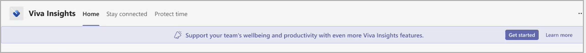

# Viva Insights trial

*This experience is only available through private preview*

The Viva Insights app in Microsoft Teams helps people and businesses thrive with data-driven, privacy-protected insights, and recommendations for improving productivity and wellbeing.

As a licensed user with a Microsoft 365 E3 or E5 plan, you get access to insights for building better work habits, such as following through on commitments made to collaborators and protecting focus time in the day for uninterrupted, individual work.

As a licensed user of MyAnalytics and Viva Insights, you can use the app and its premium features for a 60-day free trial period.

During the 60-day trial, you get access to premium insights within the Viva Insights app. These insights are based on information that you already have access to within Outlook and Teams. Viva Insights applies intelligence to this information to make it easier for you to reflect on work patterns and take action to improve yours and your team's productivity and wellbeing. All these insights are presented to an individual in the context of the team you define in the app.

## Premium insights

The following premium insights are available as part of this trial on the [My team](../../use/myteam.md) page.

* **Stay connected and engaged with team**:  

  * Schedule 1:1 time with team members (or reschedule for a conflict). As a people manager or a team lead, it's likely that one of your many responsibilities is coaching team members to help them build the skills they need for their roles.
  * One of the simplest coaching tools that team leads or managers have are 1:1 time. Research by Microsoft has shown that people who get consistent 1:1 time with their manager and team members are more engaged. See [1:1 time in My team](../../use/myteam.md#11-time) for more details.

* **Team meeting habits**: Managers are role models when it comes to collaboration habits; team members tend to mimic their manager’s behavior. Studies found, for example, that managers who multitask in meetings (defined as reading or sending emails during a scheduled meeting) are more than two times as likely to have team members who also multitask in meetings. See [How 1:1 time is calculated](../../use/myteam.md#how-11-time-is-calculated) for details.
* **Send praise**: You can use this feature to recognize the contributions of your employees and coworkers. Praise messages show up as notifications in Microsoft Teams. You can have a praise message delivered in a private chat or for wider recognition, in a Teams channel conversation.
* **Stay on top of outstanding task suggestions**: It is easy to lose track of commitments made to your colleagues in email. This insight helps make sure nothing gets missed by reminding you. It's based on emails that you sent and requests you've made during the last 14 days of email communication, including the following. See [Stay on top of outstanding task suggestions](../teams/viva-insights-stay-connected.md#stay-on-top-of-outstanding-task-suggestions) for details.

  * **Commitments** – Something you promised or committed to do for someone else in an email.
  * **Requests** – Something another person asked you to do in an email.
  * **Follow-ups** – Something you asked someone else for in an email.

## Privacy

The premium insights use real, live collaboration data from Microsoft 365 but use only your data for your insights – no private data is available from other users, even as de-identified or aggregated data. The insights are generated only with your data, which is based on your email, meetings, calls, and chats. Individual employee data is stored and protected in the same way as your Microsoft 365 data.

As is the case with the full Microsoft 365 suite, Viva Insights helps support compliance with GDPR requirements. For more details, see the [Privacy guide](privacy-guide-users.md).

## Admin tasks

As the Viva Insights admin, you'll need to do the following to give your employees access to the trial experience.

* Identify the group of users in your organization who are already using the Viva Insights app in Teams. This experience is intended for managers and team leads, so those groups would be your ideal candidate.
* To test the discoverability of the trial experience, you might want to test it with a specific group. To do this, you need to download a private build of the Viva Insights PowerShell cmdlet and then run the PowerShell commands to enable access for that group. And then ask that group if they see the banner prompting them to **Get started** as described in the next section.

## Get started

After the admin tasks are complete, do the following to start your trial experience.

1. Within your Viva Insights app in Teams, select **Get started** when prompted to Support your team's wellbeing and productivity with even more Viva Insights features:

   

2. When prompted in **You've made a great choice**, select **Get started**.
3. In **Choose your team members**:

   * If you are a team lead or manager, enter, confirm, or remove the names of the people you want to include in your team insights, and then select **Confirm**.
   * If you are not a team lead, select **I don't lead a team** to skip this prompt.

4. For team leads and managers, you'll see team insights on the **My team** page. If you don't lead a team, you won't see the **My team** page.

## Expiration

During the trial experience, you'll see a prompt at the top of the page within Viva Insights in Teams that describes that the trial period is 60 days. It'll then continue to show you how many days are left during the trial phase. It'll also prompt you to **Contact us** to complete a form and request a license to keep these features when the trial ends.

## Related topics

[Viva Insights overview](../teams/viva-teams-app.md)
