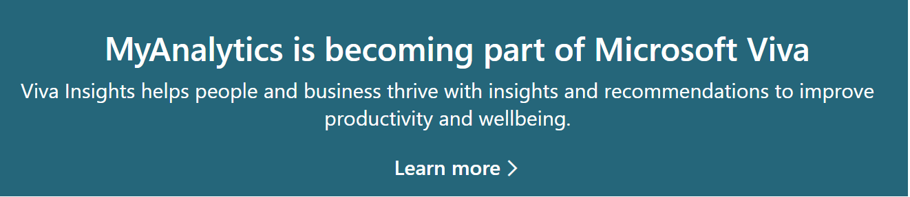

---

title: Learning collateral for MyAnalytics adoption
description: Learning materials that help you understand how to best adopt and use MyAnalytics
author: madehmer
ms.author: helayne
ms.topic: conceptual
ms.localizationpriority: medium 
ms.collection: viva-insights-personal 
ms.service: viva 
ms.subservice: viva-insights 
search.appverid: 
- MET150 
manager: scott.ruble
audience: Admin
---

# Adopt MyAnalytics

The following MyAnalytics adoption materials can help teams and individuals reduce stress and burnout, increase productivity and creativity, and make work more enjoyable. The following resources guide you through how to recognize problems and address them by building healthy work habits.

* [Individual adoption](Indiv-adopt-get-started.md): This section helps an individual use MyAnalytics to the fullest by providing a framework for building healthier habits and sustaining those changes.
* [Team adoption](Team-adopt-intro.md): This section leads a team through a multi-week program in which members learn how to use MyAnalytics to diagnose problems, set and track goals, and build new habits to change the way the team collaborates.
* [Habit resources](adopt-learning-modules.md): The learning modules and habit playbooks in this section help you build positive new habits and show you how to use MyAnalytics more effectively.
