# Use Viva Insights in Outlook

The following insight options help you get your work done fast.

## Prepare for your meetings

Meetings are vital for healthy collaboration. Better meeting practices can improve productivity, information sharing, innovation, decision making, and connections among team members.

**Prepare for your meetings** shows you a list of upcoming meetings that you've organized or that you've been invited to. This insight helps you decide whether each meeting is ready to go.

1. On the **Viva Insights** panel, the **Prepare for your meetings** insight tells you about meetings that you've organized or were invited to for the next seven calendar days (including the current day) to help you review and plan for them.

    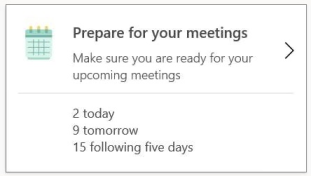

2. Select **Prepare for your meetings** to see an insight for each of your upcoming meetings. You can select to view **All**, **Organized**, or **Invited** to filter the list by.

   * As the meeting organizer, you will see an insight similar to this:

     

   * As a meeting invitee, you will see an insight similar to this:

     

#### Insight option details

Each meeting card title includes the meeting title, the organizer, the start time, and the location. Some of the following options apply to the meeting organizer, some apply to invitees, and some apply to people in both positions.

| Card section | Notes | Recommendations |
| --- | --- | --- |
|**Attendees** | The percentage of invitees who have accepted, and the number of invitees. Select the down arrow to see more information about these attendees. | Make sure that you have a quorum before the meeting. Consider sending a reminder if you haven't heard back from attendees. &emsp;&emsp;&emsp;&emsp;&emsp;&emsp;&emsp;&emsp;&emsp;&emsp;&emsp;&emsp;&emsp;&emsp;&emsp;&emsp;&emsp;&emsp;|
|**Conflicts** | This section outlines all other meetings that have a conflict with this meeting. | Take time to resolve conflicts well ahead of each meeting. Doing so helps other participants know whether there will be a quorum for the meeting. |
|**Respond** (RSVP)  &emsp; &emsp; &emsp;&emsp; | This section is only for invitees, not for the organizer. 
You can respond **Yes** or **No** to the invitation. If you have already responded, your response is shown here. 
If a meeting is scheduled outside of your typical meeting hours (when you typically organize and attend meetings during and outside the workday), it will be highlighted with an option to respond accordingly. |Responses help the organizer determine if required participants can attend or not, and then take any necessary steps, such as rescheduling or recording the meeting. |
|**Attachments** | This section shows the number of attachments, their titles, and their storage location (online or local). You can see more details and you can open the attachment if it is stored online. <!--   If you are the organizer and the invitation contains attached cloud documents, you can see the [open rates](#open-rate) for those documents.--> | |
|**Related documents** | This section shows documents that you might want to review to prepare for the meeting. |
|**Related tasks** | This section shows tasks that you might want to complete to prepare for the meeting. |
|**Online meeting link**  | (This section is only for the organizer, not for the invitees.) 
**Yes** or **No** indicates whether the meeting invitation includes a link for joining the meeting online in Skype for business or in Teams. | Be an inclusive meeting organizer. If you have attendees who are working remotely, consider adding an online link to your meeting.  |
|**Preparation time** | This section gives you the options to book either 15 minutes or 30 minutes of preparation time. This option appears only if there is an available slot in your calendar right before the meeting. Booked time appears on your calendar and references the meeting, as "Preparation time for [meeting title]." You can also cancel the meeting-preparation time or delete it directly from your calendar. | Be prepared. If you need travel time or have other tasks that need to be done right before the meeting to prepare for it, consider booking preparation time. |

## Track email and document open rates

_**Applies to**: This insight is currently available only to people who are enrolled in an applicable [service plan](../overview/plans-environments.md)._

Viva Insights can tell you how many people have opened your email and the average time they spent reading that email. In general, it informs you about email that you sent to five or more Microsoft 365 users who are internal to your organization. For more information about which email messages are reported about, see [Reporting details](#reporting-details).

Viva Insights also tells you how many email recipients opened a document that you shared in the email as a link or as an attachment (this insight works for documents that are stored in SharePoint or in OneDrive for Business).

After you send an email message, it can take up to 30 minutes before Viva Insights informs you about it. If the email is sent from a delegated mailbox with "send on behalf" permission, the delegate can see the read statistics.

Viva Insights shows the open rate for the sent email that is open in Outlook. It also groups open rate information for qualifying sent items into a single summary that you can select and expand to see a more detailed view.

### Reporting details

Viva Insights does not display read information about every email that you send, such as in the following circumstances.

#### Qualifying messages requirement

Read statistics are shown only for _qualifying messages_. A qualifying message is an email message that is sent to five or more qualifying recipients. A qualifying recipient is a person who is in the same company as the sender and has a cloud mailbox. Distribution lists are expanded before counting qualifying recipients.

#### Exceptions to qualifying messages

Viva Insights does not report about email messages in the following categories:

* Email that was sent from a shared mailbox
* Email that was sent more than 14 days ago.
* Email in which the total number of recipients (the sum of all of the recipients in the To:, Cc:, and Bcc: fields) is less than five.
* Email sent to modern groups. (If users are following the modern group, they are included in the count.)

#### Open rate

Viva Insights respects user privacy. For this reason, the Viva Insights add-in does not show information about individual recipients, and when necessary to protect privacy, it reports approximated values only.

Within 30 minutes of when you sent qualifying email, the Viva Insights add-in  reports the actual or an approximated open rate, as described here:

* **Below minimum.** For open rates lower than the minimum threshold, the threshold value is reported. For example, when 20% of 10 email recipients open the email, Viva Insights displays the open rate as "_&lt; 25%_."
* **Between thresholds.** If the actual open rate falls between the "Minimum" and "Maximum" values shown in the table, then the actual open rate is reported.
* **Above maximum.** For open rates higher than the maximum threshold, the threshold value is reported. For example, when 96% of the 25 email recipients open the email, Viva Insights displays the open rate as "_&gt; 95%_."

   | Number of recipients | Open rate reported |
   | ------- | ------ |
   | 5 - 10  | Minimum: 25%  Maximum: 75% |
   | 11 - 20 | Minimum: 10%  Maximum: 90% |
   | &gt; 21 | Minimum: 5%   Maximum: 95% |

 For more information, see [Email read rates and document open rates](../overview/privacy-guide-users.md#email-read-rates). To see who opened an email, use [Outlook's request read receipts](https://support.office.com/article/add-and-request-read-receipts-and-delivery-notifications-a34bf70a-4c2c-4461-b2a1-12e4a7a92141).

**To see read information about sent emails**

1. If the Viva Insights pane isn't already open, select the **Viva Insights** icon in the Outlook **Home** ribbon to open it.

   >[!Note]
   >If you see a "Welcome!" message, select **Get started**.

2. In **Viva Insights**, select one of the following:

   1. **In-context email open rate** - Shows read statistics for the sent email that you currently have open in Outlook. It also provides open rates for linked or attached documents that are stored in OneDrive for Business or in SharePoint.  

      >[!Note]
      >In rare cases, the document open rate can be higher than the email open rate. This can happen when recipients open the document through sources other than the email in which it was shared.

      

   2. **Track email open rates** - Shows read statistics for all sent emails.  

      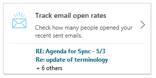

      The option you selected (in step 2a or step 2b) shows the email subject line and a summary of the open rate, the open rate (sometimes expressed as a percentage), and the number of forwards.

      

## View outstanding tasks

It is easy to lose track of commitments that you've made to your colleagues in email. The **View outstanding tasks** insight helps you make sure nothing falls through the cracks by reminding you of tasks that you've agreed to do. It is based on emails that you've sent and requests from your colleagues during the last 14 days of email communication. For example:

* "I will send you the latest report tomorrow"
* "Will get back to you by end of the week with a suitable meeting time"
* A colleague asked you three days ago: "Please review this deck by the end of the week"

In the **Viva Insights** pane, select **View outstanding tasks**. 

   

This opens a panel that displays insights for each of your suggested outstanding tasks.

   

This insight is available in the languages listed in [Briefing languages](../briefing/be-languages.md).

#### Insight option details

| Card section | Notes |
| ------ | ------ |
| **Name and icon**  &emsp; &emsp; &emsp; &emsp;&emsp;&emsp;&emsp;&emsp;| This is the person you might have an outstanding task for
| **Email subject line** |	Subject line preview of the email along with a hyperlink to open the email |
| **Task snapshot**| A snippet of text related to the task
| **Open** | Select this to open the relevant email so that you can review the task. |
| **Already done** | Select this to mark the task as completed. Suggested tasks disappear after two weeks or after you mark them as done.
| **Not a task Action** | Select this to mark the insight as not a task. This will help us improve the detection accuracy
| **Add to To Do Actions** | If available, select this to add the task to [Microsoft To Do](https://todo.microsoft.com/tasks/) so that you can catch up later. This tool can help you prioritize and even delegate work, which can lead to higher productivity.    Consider breaking tasks down into simple steps, adding due dates, and setting reminders to keep you on track. |

## Follow up on your requests

It can be easy to lose track of requests you made of your colleagues. By automatically extracting your outstanding follow ups from the last 14 days of email communication, the **Follow up on your requests** insight can help you check in on requests to your colleagues. For example:

* "Can you send me the latest report for this year?"
* "Everyone, please complete your performance evaluations by the end of the week."
* "Cancel my RSVP for Carrin Patman's lunch scheduled early next week."

In the **Viva Insights** pane, select **Follow up on your requests**. This insight is available only in English.

This opens a panel that displays insights for each of your suggested follow-up tasks.

#### Insight option details

| Card section | Notes |
| ------ | ------ |
| **Name and icon**  &emsp; &emsp; &emsp; &emsp;&emsp;&emsp;&emsp;&emsp;&emsp;&emsp; &emsp;&emsp; | The person with whom you might want to follow up  |
| **Email subject line** | Subject-line of the email that contains the follow-up item, along with a hyperlink to open the email
| **Follow up snapshot** | A snippet of text related to the follow-up
| **Follow up** | Select this to open the relevant email so that you can follow up on the task
| **Already done** | Select this to mark the follow-up as completed. Follow-ups disappear after two weeks or after you mark them as done.
| **Not a follow up** | Select this to mark the insight as not a follow-up and remove it from your list. This also helps Viva Insights improve its detection accuracy.
| **Add to To Do** | Select this to add the task to [Microsoft To Do](https://todo.microsoft.com/tasks/) so that you can catch up later.   This tool can make your days more manageable and reduce the stress of things falling through the cracks. It can also help effectively prioritize and even delegate work, which can lead to higher productivity.

## Book time to focus

Research shows that on average it takes 23 minutes to refocus on a task after a distraction, and constant distraction during focused work can cause higher stress, lower productivity, and bad mood. Further, it can be hard to go deep on challenging work if you have only small chunks of time to focus between meetings or are easily distracted by incoming emails and chats. Blocking a few hours every day to focus without interruptions can help you make progress on your important tasks and projects.

**Book time to focus** can help you protect time for focused work and also minimize notifications (and thus distraction) by Teams and Skype for business chats and calls during your focus time.

In the **Viva Insights** pane, select **Book time to focus**. This insight appears if your calendar has time available during your working hours that is not blocked by meetings or appointments.

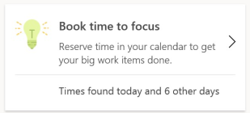

This opens a panel that displays all the time available to focus in the coming week, with a couple of available slots every day. With one click you can add focus time to your calendar and get ready for distraction-free deep work. You can also book all available time for focused work with one click, thus setting you up for focused work over a longer duration.

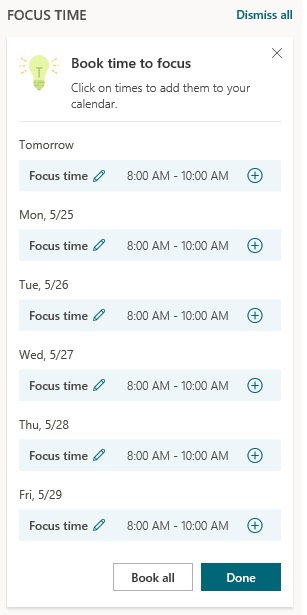

#### Insight option details

| Card section | Notes |
| ------ | ------ |
| **Date/Time** &emsp; &emsp; &emsp; &emsp;&emsp;&emsp; &emsp;&emsp;| Shows the date and time of the available focus time that you can book. |
| **+** | Select this to add time to your calendar as focus time. |
| **Pencil icon** | Say you want to focus on “Sales pitch” for two hours. Select the pencil icon, change the “Focus time” label to “Sales pitch,” and then click (+). This books a two-hour appointment on your calendar with title “Sales pitch.”  You can set priority contacts in Teams to ensure that you don’t miss important messages during focus time. |
| **Book all** | This books all available focus time at once, setting you up with protected time throughout the week.    Use [Set lunch hours](#set-lunch-hours) to set your lunch hour preferences. Viva Insights will respect your preferences when it proposes focus time. |

## Catch up on email

It is easy for important emails to get lost when your inbox is full of unread emails. With the **Catch up on email** insight, you can cut through the clutter by seeing a summary of the most important unread email, based on last 14 days of email communication.

In the **Viva Insights** pane, select **Catch up on email**.

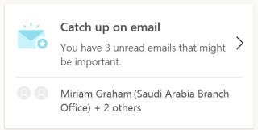

This opens a panel that displays insights for each of your important unread emails:

  

#### Insight option details

| Card section | Notes |
| ------ | ------ |
| **Name and icon** &nbsp; &nbsp; &nbsp; &nbsp;&nbsp; &nbsp;&nbsp; &nbsp;&nbsp; &nbsp;&nbsp;  | Sender of the email |
| **Email subject line** | Subject line preview of the email |
| **Email snapshot** | A snapshot of the text related to the email |
| **Open** | Select this to open the relevant email for your review.   Scanning your important unread emails first can help you get to your important workflows faster. |

## Catch up on documents

Searching for that document you had planned to read but just can't find? With so many documents shared across meetings and emails, it can be difficult to stay caught up on documents shared by your colleagues. With **Catch up on documents**, you can see a list of the shared OneDrive and SharePoint documents in email that you need to catch up on.

In the **Viva Insights** pane, select **Catch up on documents**:

This opens a panel that displays insights for each document shared with you in the last 14 days that you have not yet opened.

<!-- Don't know why Vivek had this here 
      
-->

#### Insight option details

| Card section | Notes |
| ------ | ------ |
| **Name and icon**| The person who sent you the email with the associated document |
| **Email subject line** | Subject-line preview of the email |
| **Document name** | Name of the document that you might want to catch up on. Select the document name to open it. |
| **Open email** | Select this to open the related email. |
| **Book time** | Select this to see an option to book calendar time to review the document. |

## Add important people

You might receive emails and tasks from various people but some items might deserve more attention more than others. For example, an outstanding task from your manager or a message from a key customer would likely be of higher priority. Based on your collaboration patterns, **Add important people** can suggest that you mark some of your contacts as important; afterwards, Viva Insights will remind you when you have tasks to do for these important people or unread email from them.

In the **Viva Insights** pane, select **Add important people**:

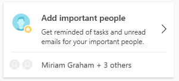  

This opens a panel with suggestions to mark a recommended contact as important:

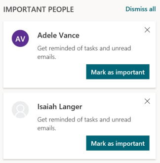  

#### Insight option details

| Card section | Notes | Recommendations |
| ------ | ------ | ------ |
| **Name and icon** | The person whom Viva Insights recommends to mark as Important
| **Mark as important** &emsp;&emsp;&emsp; &emsp;&emsp; &emsp;&emsp;&emsp; &emsp;&emsp;  &emsp;&emsp;&emsp; &emsp;&emsp;&emsp;&emsp;&emsp; &emsp;&emsp;| Select this to mark the suggested contact as important. Viva Insights will then help you stay on top of outstanding tasks, unread documents, and email from your important people. | Consider marking your top collaborators and contacts as important so that you are always aware of outstanding items from them. |

## Set lunch hours

Struggling to protect time for lunch? Colleagues keep sending meeting invitations during your lunch hours? Not taking a lunch break can leave you feeling more tired and stressed and less focused. Even if you just take 15-20 minutes, this is a proven way to maintain levels of concentration and energy during the day. Use this insight to protect your lunch time and personalize your Viva Insights to take into account your preferred lunch hours.

You can set your lunch hours in either of two ways, in **Settings** or by using the **Set lunch hours** card. This card is shown only for a short while to new users of Viva Insights. It is not available permanently, but you can always set your lunch hours in **Settings**:

#### Set lunch hours in _Settings_

1. In the **Viva Insights** pane, select **Settings** (the gear icon).

2. In the **Set lunch hours** area, select the edit (pencil) option:

   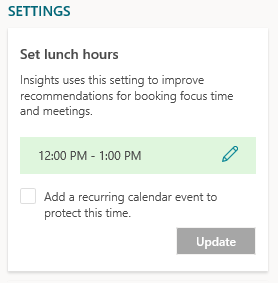

3. Change the values in the **Start** and/or **End** fields.

4. Select **Update**.

#### Set lunch hours through the _Set lunch hours_ card

1. In the **Viva Insights** pane, select **Set lunch hours**:

   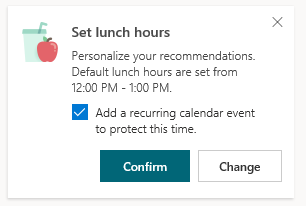  

2. Use the options that are described in the following table.

#### Insight option details

| Card section | Notes | Recommendations |
| ------ | ------ | ------ |
| **Default Lunch hours** &emsp; &emsp; &emsp; &emsp; &emsp; &emsp; &emsp; &emsp; &emsp; &emsp;| Your default lunch hours, which you can confirm or change | |
| **Change** | Select this to reset your lunch-hour times | |
| **Confirm** | Select this to save your settings. Viva Insights will then exclude lunch hours when recommending focus blocks or meeting times.  &emsp;&emsp;&emsp; &emsp; &emsp; &emsp;&emsp;&emsp; &emsp;&emsp; &emsp;&emsp;&emsp; &emsp;&emsp; &emsp;&emsp;&emsp; &emsp;&emsp; &emsp;&emsp;&emsp; &emsp;&emsp; &emsp;&emsp;&emsp; &emsp;&emsp; | Taking care of your mental and physical wellbeing. Studies show that taking a lunch break allows your mind to rest, recharge and refocus, which can directly improve your productivity for the rest of the day. |
| **Add a recurring calendar event** &emsp;&emsp;&emsp; &emsp;&emsp;&emsp;&emsp;&emsp; &emsp;&emsp; &emsp;&emsp; &emsp;&emsp; &emsp;&emsp; &emsp;&emsp; &emsp;&emsp; &emsp;&emsp; &emsp;&emsp; &emsp;&emsp; &emsp;&emsp; | By checking this box, you have the option to add a recurring calendar event to protect this time. | Consider setting a recurring calendar event if your preferred lunch hours frequently conflict with meetings. |

## Plan your time away

Taking time off from work helps reduce stress and burnout and improve overall wellbeing. However, research shows that a lack of planning can reduce the benefits of taking a vacation.

The **Plan your time away** checklist can help reduce the stress of planning for upcoming time away from work. This single tool helps you:

* Resolve all your meetings in one place with a custom message about your scheduled time off.
* Compose your autoreplies and notify your team about your planned time off.
* Schedule focus time to wrap up tasks before you go and to catch up on work when you get back.

You can plan your schedule with these options all at one time or individually as you get closer to the date. You can also come back at any time and change details before you go. Viva Insights will track your progress and update which actions are done.

In the **Viva Insights** pane, select **Plan your time away** to see a checklist of planning options.

* **Select dates** - Select **Start** and **End dates** for when you'll be out of office, and then select **Schedule**, which sets up an Out-Of-Office appointment on your calendar for the selected dates.

   >[!Tip]
   >Updating your calendar with out-of-office information is a best practice that’ll set the right expectations with coworkers who want to connect with you.

   

* **Set automatic replies** - Compose and save an out-of-office reply message here. Your automatic replies will be sent during the start and end dates you selected. You can select to send the same message to people inside and outside your organization, or you can compose a different auto-reply message for those outside your organization, and then select **Save**.

     

     > [!Note]
     > If you've composed a message for a previous out-off-office period, the most recent message that you used is shown in the **Compose or edit message** field. You can edit the message so that it pertains to your upcoming time away.

* **Notify collaborators** - You'll see a list of people that you collaborated with in the last four weeks. You can select to notify them through an email or meeting invitation, and then select **Compose**.

     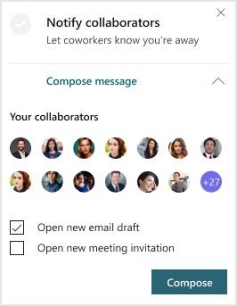

* **Resolve meetings** - You'll see a list of meetings you either organized or accepted for while you're away.

  * **Decline and cancel meetings with this message** - Edit the message that'll be sent to decline or cancel the meeting invitation.
  * **Select meetings to decline and cancel** - Select which meetings you want to decline or cancel, or use **Select all** to decline or cancel all the meetings listed. When you're done, select **Confirm**. You can also select **Open** next to a meeting to see more details about it.

    >[!Tip]
    >By using this option to quickly and easily resolve all your meetings, you're saving valuable planning time while also respecting your coworkers time.

    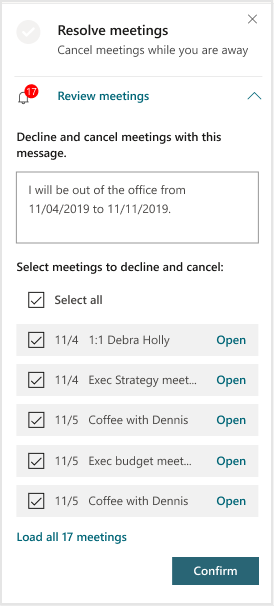

  * **Book time to focus** - You can schedule time to focus on wrapping up work before you go, and then on catching up after you get back. Select the **plus sign** (+) next to the available **Focus time** slots, and then select **Done** to add them to your calendar.

    >[!Tip]
    >With this time scheduled, you'll know you have time to get everything done both before you go and after you get back.

    

## Catch up with your team

People managers often have hectic schedules, and it can be tough to stay in close contact with each team member. Viva Insights brings together all the information managers need to stay caught up and respond quickly to important requests.

As a manager, you can:

* Schedule 1:1 time with a team member (or reschedule if a conflict comes up).
* Act on tasks you promised to get done or that team members asked you to complete.
* Review important emails and documents from team members that you haven't read yet.

<!-- REMOVING (12/4/2020) FOR NOW. REINSTATE PERHAPS THIS ENTIRE PARAGRAPH IN JANUARY 2021.

This feature is only available for Viva Insights users who have direct reports listed in Azure Active Directory or in Workplace Analytics. (The Workplace Analytics organizational hierarchy is used for a tenant only if **Viva Insights and plans** is turned on in the [Manager settings](../../use/settings.md#manager-settings) of Workplace Analytics.) If you are a manager but do not see this feature, contact your Microsoft 365 administrator.
-->

<!-- USING THE FOLLOWING COMPLETE PARAGRAPH FOR NOW. REINSTATE THE ENTIRE PRECEDING PARAGRAPH IN 2021.  -->

This feature is only available for Viva Insights users who have direct reports listed in Azure Active Directory. If you are a manager but do not see this feature, contact your Microsoft 365 administrator.

In the **Viva Insights** pane, select **Catch up with your team** to see the team members you need reconnect and actions you can take to do so

   

### To edit your team list

If your team member list is inaccurate, select **Edit team** to add or remove team members. Any changes you make apply only to your Viva Insights experience and do not synchronize back to Azure Active Directory.

## Meeting suggestions

While staying in touch with top collaborators can be difficult, a quick 1:1 meeting with key contacts can help you nurture your professional network. The **Meeting suggestions** insight can keep track of your collaboration pattern and provide meeting recommendations if you are falling out of touch. For example, if you have not had a 1:1 meeting with your manager in a while, this insight can suggest setting up a 1:1 and it can assist with scheduling the meeting.

In the **Viva Insights** pane, select the **Meet with &lt;name of contact&gt;** insight to use it:

  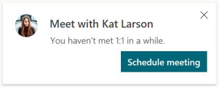

### Insight option details

| Card section | Notes |
| ------ | ------ |
| **Name and icon** &nbsp; &nbsp; &nbsp; &nbsp;&nbsp; &nbsp;&nbsp; &nbsp;&nbsp; &nbsp;&nbsp; &nbsp; &nbsp; &nbsp;&nbsp; &nbsp;&nbsp; &nbsp;&nbsp; &nbsp; &nbsp; &nbsp; &nbsp; &nbsp;&nbsp; &nbsp;&nbsp; &nbsp;&nbsp; &nbsp; | A person you collaborate with regularly but with whom you haven't had a 1:1 meeting in a while. |
| **Schedule meeting** | Select this to open a meeting form that you can quickly complete to set up a meeting. |

## Related topics

[Viva Insights Outlook add-in](add-in.md)
