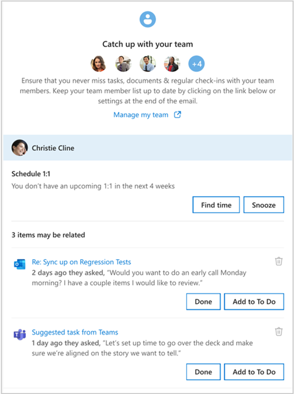

---

title: Catch up with your team through the Briefing email
description: Learn how to use the Briefing email to catch up with your team
author: madehmer
ms.author: helayne
ms.topic: article
ms.localizationpriority: medium 
ms.service: viva 
ms.subservice: viva-insights 
ms.collection: 
- M365-analytics
- viva-insights-manager
manager: helayne

---

# Catch up with your team

People managers often have hectic schedules, and it can be tough to stay in close contact with your team members. The Briefing can help you maintain a strong relationship with your team and stay caught up and respond quickly to important requests from your team.

Only managers who have team members can see this feature. You can add or edit your team members in [Settings](be-settings.md).

As a manager, you'll see one or more of the following based on your calendar and email activity in the **Catch up with your team** section of your Briefing email:

* **Schedule a 1:1** - If no 1:1 time is currently scheduled or you have a scheduling conflict, you're prompted to schedule it for a team member (or reschedule for a conflict).
* **You may have outstanding tasks** - Something you promised to get done or that one or more team members asked you to do.
* **Recent items you may have missed** - Important emails and documents from one or more team members that you haven’t read yet.

If you get the [Adaptive email version](be-overview.md#adaptive-or-html-version), you can also do the following:

* In **Schedule 1:1**, select **Find time** to schedule it, or **Snooze** to remind you to schedule it later.
* If you see items that may be related, you can select **Done** or **Add To Do**.
* To do the task later, select **Later**.
* Or if it's not a task, select the **Delete** (trashcan) icon to remove it from the list.

In the following example, you’d select **Find time** to schedule a 1:1 with Christie and select **Done** to mark the **Sync up** as complete.

   

## Related topic

[Briefing email overview](be-overview.md)
