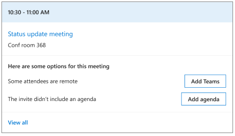

---

title: Prepare for meetings with the Briefing email
description: Learn how to use the Briefing email to prepare for upcoming meetings
author: madehmer
ms.author: helayne
ms.topic: article
ms.localizationpriority: medium 
ms.service: viva 
ms.subservice: viva-insights 
ms.collection: 
- M365-analytics
- viva-insights-personal
manager: helayne

---
# Prepare for upcoming meetings

In this section of your Briefing email, you’ll see today's first three meetings chronologically that have at least one suggested action. You can select the meeting heading to open the meeting details or select a document that’s related to the upcoming meeting to open and view it.

With the [Adaptive email version](be-overview.md#adaptive-or-html-version), you can also do the following to help prepare for today's meetings:

* To schedule a different time because of low acceptance or a majority of the attendees have declined a meeting you’ve organized, you can select **Reschedule**.
* For a document that is related to a meeting, if you got what you needed or you've already followed up on it, select **Done**. To remove the task from your list, select **Not related**.
* For a task that is related to a meeting, select **Add to To Do** to add to your task list. If you have already completed the task, select **Done**.
* To inform the meeting organizer whether you’re planning to attend a meeting or not, you can select **Accept** or **Decline** so the meeting organizer can better assess their meeting quorum. If you have a meeting conflict, you can select **Reply** to let the organizer know if you’ll be late, leave early, or be unable to attend.
* As a meeting organizer, you can add a Teams link to your invitation by selecting **Add Teams**.
* As a meeting organizer, you can select **Add agenda** if your upcoming meeting is missing an agenda. Agendas help make meetings more effective.

In the following example, you’d select **Weekly PM meeting** to open the meeting details or select the related **Status update** document to open and view it. If you see a meeting that has **low acceptance**, you could select **Reschedule** .

   

In the following example, for the **Status Update meeting**, you can select:

* **Add Teams** to add a Teams link to the invitation.
* **Add agenda** to add a meeting agenda to the invitation.

   

## Reschedule for low acceptance

As a meeting organizer, your Briefing alerts you to a meeting that is at risk of having low attendance.

Meetings with low attendance may be less productive because decisions can't be made without key decision-makers in attendance. You might have to repeat the meeting or share similar information again for those who do not attend.

You can select **Reschedule** to open the meeting invite and schedule it for a different time.

## Add Teams link

When scheduling a meeting, a common mistake is forgetting to include online meeting information for remote attendees. Online meeting access is important because it:

* Enables you to include remote collaborators or those working in other locations.
* Helps meetings start on time.
* Enables you to record meetings and present information to remote attendees.
* Having a single-select correction also saves you time and stress before and at the start of meetings.

When you select **Add Teams**, Microsoft Viva Insights adds a Teams meeting link to the meeting invite for you, so you don't have to open the meeting to add it and automatically sends an updated invite to all invitees.

## Add agenda

Agenda can help attendees understand what to expect out of a meeting, what prep is required, and what the outcome of the meeting should be. It’s a key step and a best practice for meeting preparation.

Selecting **Add agenda** sends a reply to the scheduled meeting.

## RSVP to a meeting with no conflicts

It is a best practice to let organizers know if you will attend their meeting so that they can plan accordingly. Briefing focuses on smaller meetings where it might be more likely that your attendance is required.

You can **Accept** or **Decline** a meeting in the Briefing email. If the meeting is recurring, **Accept** and **Decline** are for the series. **Accept** and **Decline** are sent as a response to the organizer. After declining, you can still see and interact with content for this meeting in the Briefing email.

## RSVP to a meeting with conflicts

Again, it’s best to let organizers know if you will attend their meeting so they can plan accordingly.

You will see the following actions for a meeting depending on the type of conflict you have with the meeting.

|Scenario |Meeting details |Reason |Action |
|---------|----------------|-------|-------|
|Late reply	|This meeting conflicts with [Meeting title] at [start time] to [end time]. |Let [organizer] know if you will be late |Reply |
|Leave early reply |This meeting conflicts with [Meeting title] at [start time] to [end time]. |Let [organizer] know if you need to leave early. |Reply |
|Decline or late reply |This meeting conflicts with [Meeting title] at [start time] to [end time]. |Let [organizer] know if you can’t make it or if you will be late. |Decline or Reply |
|Decline or leave early reply	|This meeting conflicts with [Meeting title] at [start time] to [end time]. |Let [organizer] know if you can’t make it or if you will need to leave early. |Decline or Reply |
|Accept or decline |This meeting conflicts with [Meeting title] at [start time] to [end time]. |Let [organizer] know if you will attend. |Accept or Decline |

## Related topic

[Briefing email overview](be-overview.md)
