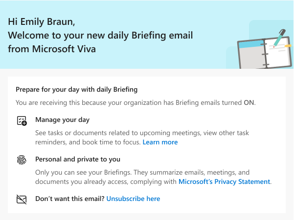

---

ms.date: 10/23/2024
title: Briefing email overview
description: About the Briefing email and how to use it to help with your workday
author: madehmer
ms.author: helayne
ms.topic: conceptual
ms.localizationpriority: medium 
ms.service: viva-insights
ms.collection: 
- M365-analytics
- viva-insights-personal
- highpri
manager: helayne

---

# Briefing email overview

>[!Important]
>We've paused sending Briefing emails to make some improvements. You can still access the [Viva Insights Outlook add-in](../use/add-in.md) or [Viva Insights app in Teams](../teams/introduction.md) for key functionality until this service resumes. For more information about this change, see [Briefing pause](../reference/briefing-pause.md).

The Briefing email helps you stay in control of your calendar and be intentional about your day. Within two hours of your workday (as set up in [Outlook](https://outlook.office.com/calendar/options/calendar/view/appearance)), you'll get an email about any relevant items to help you better prepare for the day ahead, including:

* Outstanding commitments, requests, and follow-ups to and from other collaborators in email that might have fallen through the cracks.
* Documents related to today’s meetings that you might want to review beforehand.
* Suggested focus time you can schedule to help get independent work done.

>[!Important]
>Briefing is available for Microsoft 365 Enterprise users with Exchange Online mailboxes that are in a [supported language](be-languages.md).

## Why am I getting this?

You're getting the Briefing email because it's currently turned on for all of your organization.

If you're *not* getting the Briefing email, it might be because you previously unsubscribed, or because your admin disabled it for you or your organization. To opt in, follow the steps in [Settings for the Briefing email](be-settings.md). If you don't see an option for **Briefing** in your Viva Insights app settings, contact your admin.

## Adaptive or HTML version

You’ll get a different version of the Briefing email depending on which version of Outlook you’re using:

* **Adaptive version** - If you open the Briefing email in OWA (Outlook Web Access), Outlook mobile (iOS and Android), and Outlook for Windows or Mac desktop, you’ll see the Adaptive version with links to open tasks, upcoming meetings, related documents, and complete in-line actions, and book suggested focus time.
* **HTML version** - If you open the Briefing in an email app other than Outlook or in OWA on a mobile device, you’ll see the HTML version that links to open tasks, upcoming meetings, and related documents, but won't include in-line actions or suggested focus time.

>[!Note]
>Government Community Cloud (GCC) only supports the HTML version for now.

## How it works

The Briefing email looks for actionable tasks in Outlook and includes the top results in the email. If these tasks are related to any upcoming meetings, they’re listed in context with the meeting. Meetings will also have links to any attached or potentially related documents.

The Adaptive version of the Briefing email also includes any last-minute options to schedule time to focus on deep work or to work through any of the tasks included in the email. Any existing focus time that’s already scheduled is also referenced in this section.

For more information, see [Prepare for meetings](be-meetings.md) and [Follow up on tasks](be-tasks.md).

## First Briefing

As a new user, your first Briefing email explains how to use it to prepare for upcoming meetings and manage pending tasks. It also explains how your personal information is kept private.
  
   

## Configuration

The Briefing email needs to be set up for your organization by the admin. See [Configure the Briefing email](be-admin.md) for details about configuration.

## Using the Briefing email

Depending on if you open the [Adaptive or HTML version](#adaptive-or-html-version), the Briefing email includes the following sections:

* [Prepare for today's meetings](be-meetings.md)
* [Tasks you need to follow up on](be-tasks.md)
* [Book focus time](be-focus.md) (Adaptive version only)
* [Plan your week](be-time.md) (Adaptive version only)
* [Catch up with your team](be-manager.md)
* [Settings](be-settings.md)

## Related topics

* [Configure Briefing email](be-admin.md)
* [Briefing email from Microsoft Viva FAQ](be-faqs.yml)
* [!INCLUDE [Viva Insights community](../includes/insights-community.md)]
