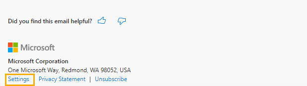
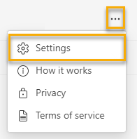
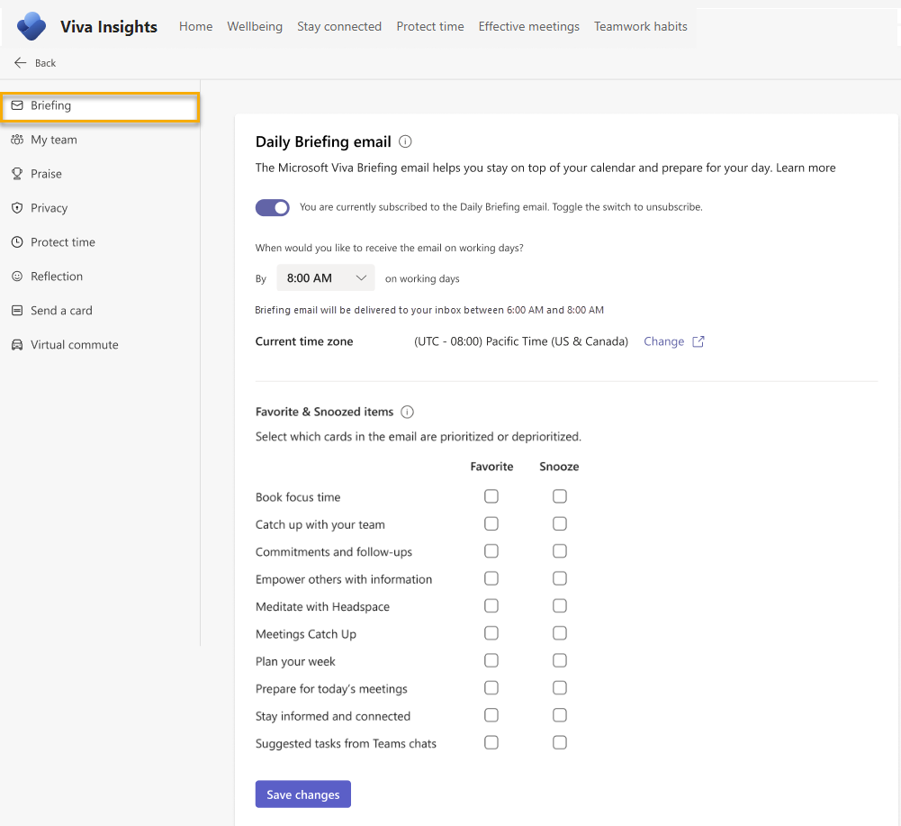

---

ms.date: 01/26/2021
title: Settings for the Briefing email
description: Learn how to change your personal settings for the Briefing email from Microsoft Viva
author: lilyolason
ms.author: v-lilyolason
ms.topic: article
ms.localizationpriority: medium 
ms.service: viva 
ms.subservice: viva-insights 
ms.collection: 
- M365-analytics
- viva-insights-personal
manager: anirudhbajaj

---
# Settings for the Briefing email

>[!Important]
>We've paused sending Briefing emails to make some improvements. You can still access the [Viva Insights Outlook add-in](../use/add-in.md) or [Viva Insights app in Teams](../teams/introduction.md) for key functionality until this service resumes. For more information about this change, refer to [Briefing pause](../reference/briefing-pause.md).

Use Briefing settings to pick what time of day you receive the Briefing email in your inbox, which items you want to prioritize in your Briefing email, or to unsubscribe from the email. What you set here  overrides or takes precedence over what your admin sets up for your Briefing email.

## To update settings

### Find the settings page

You can update your Briefing email settings in two places:

* Through the Briefing email itself. Near the end of any Briefing email, select **Settings**.

    
* Through the Viva Insights app in Teams or on the web. In the Viva Insights app, open the settings page by selecting the ellipses (**...**) at top right, then selecting **Settings**.

    

These methods take you to the Briefing email's setting page in the Viva Insights app in Teams or on the web.

### Change your settings

Once you arrive at the settings page in the Viva Insights app in Teams or on the web, you can make changes to the following settings:

* Subscription. If you don't want to get the Briefing email anymore, toggle the switch off. If you want to re-subscribe later, just turn this switch back on.
* The time you want to get the Briefing email in your inbox. If you need to change your time zone, you can do that through the **Change** link under **Current time zone**.
* Items you want to **Favorite** and items you want to **Snooze**. With **Favorite** and **Snooze**, you can arrange your Briefing email based on which cards are most relevant and useful to you. When you get Briefing emails in the future, the cards you favorited will be prioritized and the cards you snoozed will be deprioritized.

 

## Related topics

* [Briefing email overview](be-overview.md)
* [Configure Briefing email](be-admin.md)

