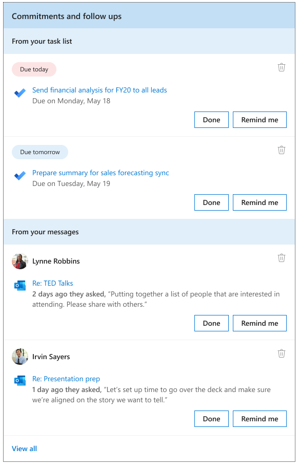
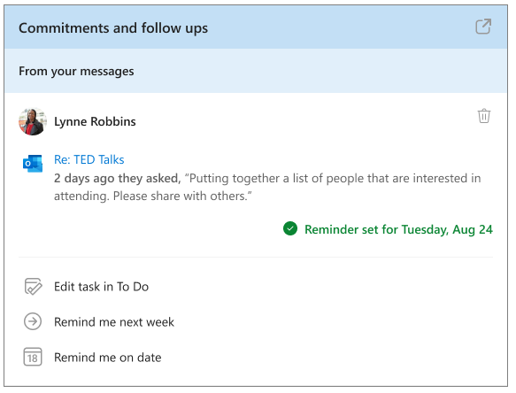

---

title: Follow up on tasks with the Briefing email
description: Learn how to use the Briefing email to get today's tasks done
author: madehmer
ms.author: helayne
ms.topic: article
ms.localizationpriority: medium 
ms.service: viva 
ms.subservice: viva-insights 
ms.collection: 
- M365-analytics
- viva-insights-personal
manager: helayne

---
# Follow up on tasks

For **Commitments and follow-ups** in your Briefing, you'll see one or more of the following based on your recent email activity:

* **Commitment** - Something you promised or committed to do for someone else in an email.
* **Request** - Something another person asked you to do in an email.
* **Follow-up** - Something you asked for from someone else in an email.
* **To Do task** - A task that you've added to your To Do task list.

If you get the [Adaptive email version](be-overview.md#adaptive-or-html-version), you can also do the following:

* If the related task is already done, select **Done**.
* If you’d like to follow up on the task later, select **Remind me**. The task is automatically added to To Do and a Briefing email reminder is set for the next working day.  
* After you select **Remind me**, you can customize the task or its reminder in these ways:

  * To edit the task, select **Edit task in To Do**.
  * To choose a date on which you’d like to be reminded of the task, select **Remind me on date**.
  * To be reminded of the task in the briefing email during the following week, select **Remind me next week**.
* To remove the task from your list, select the **Delete** (trashcan) icon.

In the following example, you’d select **Done** to confirm you’ve already done the task related to **TED Talks**. Or you could select **Remind me tomorrow** to get a reminder in your next day's briefing email and to view the task in To Do. After you select **Remind me**, you can further customize your management of the task by editing it in the To Do app or by selecting a reminder for another day.

Or if you use the To Do feature, you could select **Edit task in To Do**.

## Related topic

[Briefing email overview](be-overview.md)