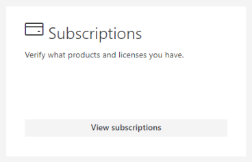

---

title: Personal insights FAQ
description: Frequently asked questions about Personal insights with Microsoft Viva Insights
author: madehmer
ms.author: helayne
ms.topic: article
ms.localizationpriority: medium
ms.service: viva
ms.collection: M365-analytics, viva-insights-personal
manager: helayne
audience: Admin, user
ms.subservice: viva-insights

---

# Personal insights FAQ

This article answers frequently asked questions about Microsoft Viva Insights' personal insights options—like the [Dashboard](../use/dashboard-2.md), [Digest emails](../use/email-digests-3.md), [Viva Insights Outlook add-in](../use/add-in.md), and [Inline suggestions](../use/mya-notifications.md).

>[!IMPORTANT]
> The dashboard will be retired soon. You'll still be able to find personal insights content in your Viva Insights app in Teams or on the web. [Read more about this change](../reference/mya-retirement.md).

Questions and answers are organized into three sections:

* The [Privacy](#privacy) section, which applies to everyone
* The [For using personal insights](#for-using-personal-insights) and [For IT administrators](#for-it-administrators) sections, which are grouped by roles

## Privacy

#### Q1. Who can see my data?

Only you can see your data. The statistics and insights that are generated from your data are for your eyes only. Your manager or system administrator can't view your personal data.

For more details, see the [Privacy guide](Privacy-Guide-users.md).

#### Q2. How does Viva Insights protects my data?

Viva Insights uses data from your Microsoft 365 mailbox, namely data about your email and your meetings plus data about your calls and chats in Teams or in Skype for Business.

Viva Insights stores your data in your mailbox itself, and gets the same protection that your email and calendar itself gets. This means your data is protected the same way your email and calendar information is kept private and protected.

Every calculation that Viva Insights performs is based on data that you, yourself, can get by gathering and examining metadata of your email, meetings, calls, and instant messages, such as their start and end times and their subject lines. In other words, Viva Insights automates what would otherwise be a painstaking task; these automatic calculations provide you with transparency into your workplace collaboration habits.

Viva Insights doesn't have any tracking software running on your computer.

#### Q3. What data does Viva Insights use?

>[!Note]
>Viva Insights processes the data as described in the [Privacy Guide](privacy-guide-users.md).

**Viva Insights uses**:

 * Information from email items:

   * Metadata - which includes the email's timestamp, sender, recipients, and "read" signal
   * Statements that people have made in email body text - these statements are used to create [task cards](../use/MyA-Outlook-add-in/MyA-Add-in-To-do.md) for your use only
   * Actions of other users who receive your email - for example, whether or not they have opened your email. (This would be used only in aggregate form, to protect individual privacy.)

 * Information from calendar items:
  
   * Type (meeting or appointment)
   * Status (busy, free, out-of-office, tentative)
   * Category
   * Subject
   * Duration
   * Attendees

 * Information from Teams:

   * Viva Insights counts audio calls, video calls, and chats that people make in Teams as collaboration activities.

 * OneDrive SharePoint data: Viva Insights shows a count of OneDrive and SharePoint documents that you have worked on. 

 * _Used only if you have opted in_: Data derived from activities on your computer, such as applications that you've used and websites that you've visited.

**Viva Insights doesn't use**:

Email and calendar data from people outside of your organization, with the following exception: Viva Insights uses data that is present in your own Microsoft 365 mailbox. For example, if you conduct a meeting with a person outside of your organization, the start and end times of that meeting can be found in your mailbox and therefore are visible to you. This data, therefore, can be used in computations about your collaboration history.

## For using personal insights

### Data sources

##### Q1. Can data be extracted from on-premises installations of Microsoft Exchange or Skype for Business?

No. Only Exchange Online and Teams are used as data sources of Viva Insights data.

### Meetings

##### Q1. Does "meeting time" include time that I block out for personal work on my calendar?

If you block out your calendar for personal work by using an appointment (see [Create or schedule an appointment](https://support.office.com/article/create-or-schedule-an-appointment-be84396a-0903-4e25-b31c-1c99ce0dacf2)) or by creating a meeting with just yourself, this time doesn't count as meeting time and will count as focus time.

### Focus time

##### Q1. Does "focus time" exclude time that I block out for personal work on my calendar?

If you block out your calendar for personal work by using an appointment (see [Create or schedule an appointment](https://support.office.com/article/create-or-schedule-an-appointment-be84396a-0903-4e25-b31c-1c99ce0dacf2)) or by creating a meeting with just yourself, this time can count as focus time. For more details, see [Focus](../Use/focus.md). To exclude focus time, right-click the appointment and set **Show As** to **Out of Office**.

##### Q2. Why does my focus time seem incorrect or inaccurate?

Try the following to troubleshoot your focus-time totals:

1. Verify that your work time and time zone settings are correct. (See  [Outlook settings](https://outlook.office.com/calendar/options/calendar/view/appearance).)
2. For more details about focus time, see [Focus](../Use/focus.md).  

### Calendar

##### Q1. How do I tell Viva Insights that I am on vacation?

If you plan to go on vacation (or on holiday), create an Outlook calendar event that includes the days of your vacation and set the status to **Out of Office**. Viva Insights will count zero focus and meeting hours for you while you're away.

##### Q2. Can I change my settings to make time outside of work more accurate?

Yes. You can change your time zone and your working time in your [Outlook settings](https://outlook.office.com/calendar/options/calendar/view/appearance).

### Digest emails

#### Q1. How do the Viva digest emails show up in Outlook?

 Your [digest emails](../use/email-digests-3.md) are system generated notifications that don't go through the standard email delivery process. They are inserted directly into your Outlook inbox by Viva Insights.

### Opt out

#### Q1. Can I opt out of Viva Insights? And if I do (or if an admin opts me out), can I opt back in later?

Yes to both questions. You can opt out of access to individual parts of Viva Insights or out of all of Viva Insights at once. And you can [opt back in](../use/opt-out-of-mya.md#if-i-opt-out-can-i-opt-back-in) again later, if you want.

See the following for details:

##### Opt out of all of Viva Insights

 * [Opt out of Viva Insights](../use/opt-out-of-mya.md)

##### Opt out of different elements

 * [Opt out of the dashboard](../use/dashboard-2.md#opt-out-of-the-dashboard)
 * [Opt out of digest emails](../use/email-digests-3.md#opt-out-of-digests)
 * [Opt out of the Viva Insights Outlook add-in](../use/add-in.md#to-opt-out)
 * [Opt out of inline suggestions](../use/mya-notifications.md#opt-out-of-inline-suggestions)

##### Opt in to Viva Insights

 * [If I opt out, can I opt back in?](../use/opt-out-of-mya.md#if-i-opt-out-can-i-opt-back-in)

#### Q2. Can I add or remove the Viva Insights Outlook add-in?

Yes, you can. But first, what's the difference between "opt out" and "remove"?

* **Opt out**: If you opt out, you lose access to the feature. (But remember that you can opt back in if you change your mind. To do so, follow the steps in [Opt out of the Viva Insights Outlook add-in](../use/add-in.md#to-opt-out) but in step 4, set the control to **On**.)
* **Remove**: If you remove the add-in, not only do you lose access to the feature, its icon is also removed from your Outlook ribbon. (Note that you can change your mind about this, as well: See [Add the Viva Insights Outlook add-in](#add-the-viva-insights-outlook-add-in)).  

##### Remove the Viva Insights Outlook add-in

Follow these steps to remove the Viva Insights add-in from your Outlook ribbon.

>[!Note]
>This procedure also removes [inline suggestions in Outlook](../use/mya-notifications.md).

1. On the Outlook Home Ribbon, select the **Get Add-ins** icon.

    

2. Select **My add-ins**.
3. In **Admin-managed**, select the **ellipsis** (**...**) for **Viva Insights**, and then select **Remove**.

    

##### Add the Viva Insights Outlook add-in

Follow these steps to add the Viva Insights add-in to your Outlook ribbon.

1. On the Outlook Home Ribbon, select the **Get Add-ins** icon.
2. Select **Admin-managed**.
3. Find **Viva Insights**, and then select **Add**.

### Visibility and access

>[!IMPORTANT]
> Questions 1 through 3 below address the dashboard, which will be retired soon. You'll still be able to find personal insights content in your Viva Insights app in Teams or on the web. [Read more about this change](../reference/mya-retirement.md). 

#### Q1. Why can't I see the dashboard?

The dashboard is only available if your organization has a *qualifying plan*. Qualifying plans are listed in [Plans and environments](plans-environments.md). If an organization has no *qualifying plan*, its members can't see any of the personal insight elements, including the dashboard, and Viva Insights doesn't use their data.

#### Q2. I used to get a dashboard full of data but now it's grayed out. What happened?

Your personalized data is only accurately calculated when you have a minimum level of activities with Microsoft 365. Check back on your dashboard in a few days to get a fully personalized experience.

#### Q3. Even though I don't have a Viva Insights license, why is the toggle "on" in the dashboard's Feature settings? What will happen if I change it?

Viva Insights will not be available to you if you don't have a license. However, your data contributes to the email read statistics for other users. For example, when you receive a qualifying email and read it, Viva Insights includes that statistic in the read percentage that's shown to the sender. You can change this and not contribute data by turning the toggle off in the [Feature settings](../overview/privacy-guide-admins.md#opt-in-or-out) on the dashboard.

#### Q4. How can I find out what my plan is?

Some Viva Insights feature descriptions start with _**Applies to**_ sections that refer to Microsoft 365 or Microsoft 365 "plans," and then point to the [Plans and environments](plans-environments.md) article. What plan do I have?

You can identify your _plan_ (and also your _service plan_) by following these steps:

1. Open your [Home page](https://insights.viva.office.com/).
2. At the top right of the page, select your initials or picture, and then select **View account**.
3. For **Subscriptions**, select **View subscriptions**:

   

4. In **Subscriptions**, the available service plans are listed under **Licenses**.

#### Q5. What languages are supported?

Personal insights are available in most of the same languages as the Microsoft 365 apps you're viewing them through. See [What languages is Office available in](https://support.office.com/article/what-languages-is-office-available-in-26d30382-9fba-45dd-bf55-02ab03e2a7ec). Also, see [Language support](../overview/plans-environments.md#language-support) for more details about what's supported by Viva Insights.

#### Q6. If my assistant manages my email and calendar, does Viva Insights include these activities in my data?

* Email sent by your assistant on your behalf is not included in your data. Viva Insights only includes data about email that you send from your mailbox.
* However, Viva Insights does include your calendar events in your data, including the events created and accepted on your behalf by your assistant.

#### Q7. Does Viva Insights use cookies?

Viva Insights only uses cookies to authenticate users for the dashboard. See [Microsoft Privacy Statement](https://privacy.microsoft.com/privacystatement#maincookiessimilartechnologiesmodule) for more about cookies.

#### Q8. Which Viva Insights experiences include Windows 10 activity history?

Viva Insights uses Windows 10 or 11 Activity history to power insights related to time spent in documents within working hours and after hours. These show up as Food for thought in the Viva Insights dashboard. The time spent in documents is also added to the total collaboration time and affects metrics, such as “Time available to focus” and “Quiet time.”

#### Q9. How can I check if Window 10 or 11 Activity history is enabled on my device?

1. Open Windows Settings.
2. Search for “Activity History Privacy Settings.”
3. The following two settings must be selected for Viva Insights to use the data.

   

#### Q10. Will Viva Insights work for shared mailboxes?

No; currently the Viva Insights or MyAnalytics service plans can't be used with shared mailboxes.

#### Q11. When the dashboard is activated, does it show any historical data or does it start from the day of activation?

After activation, Viva Insights processes historical data for four weeks before the date of activation. No data before this four-week date range is shown in the dashboard. For calculating active collaborators, Viva Insights processes historical data for the previous 12 months.

### Insights Outlook add-in

#### Q1. What languages are the task cards (commitments) available in the Insights Outlook add-in?

The [task cards](../use/MyA-Outlook-add-in/MyA-Add-in-To-do.md) of the Outlook add-in are available only in English.

#### Q2. Can I get email read rates for shared or secondary mailboxes?

Viva Insights doesn't use data from shared or secondary mailboxes.

#### Q3. Why are read statistics not available for some of my email?

To see read statistics for an email that you sent, you must have sent it within the past 14 days to at least five recipients.

## For IT administrators

The questions in this section are sorted into the following areas:

* [Admin management tasks and capabilities](#admin-management-tasks-and-capabilities) &ndash; Questions about the tasks of IT admins.
* [Feature visibility and access](#feature-visibility-and-access) &ndash; Questions about when Viva Insights features are available to users. (Also see the [Visibility and access](#visibility-and-access) section.) 
* [User data privacy](#user-data-privacy) &ndash; Questions about how admin actions affect data privacy. (For general privacy issues, see the [Privacy](#privacy) section.)  

### Admin management tasks and capabilities 

#### Q1. How do I manage the Viva Insights experience for users?

You can manage the experience in two ways:

* Configure access to Viva Insights elements for your entire organization. For details, see [Configure access at the tenant level](../setup/configure.md#configure-access-at-the-tenant-level).
* Turn Viva Insights access on or off for individual users. For details, see [Configure access at the user level](../setup/configure.md#configure-access-at-the-user-level).

#### Q2. How can I pilot Viva Insights to a subset of users?

Turn on the "Insights by MyAnalytics" or "MyAnalytics (Full)" service plan for the pilot users. Because these plans are enabled by default, you'll need to confirm that the plans are turned off for other users. For details on how to turn off the plans, see [Assign licenses to users](/office365/admin/subscriptions-and-billing/assign-licenses-to-users).

#### Q3. How can I manage Viva Insights experiences in Microsoft 365 GCC?

You can enable or disable Viva Insights experiences by following the applicable steps in [Assign licenses to users](/office365/admin/subscriptions-and-billing/assign-licenses-to-users). More granular controls for each user surface will be available by the end of 2019. 

#### Q4. How can I manage the Windows 10 activity history for the organization?

You can set the following two Group Policy settings at the tenant level for the organization:

* System\OS Policies\Allow upload of User Activities
* System\OS Policies\Allow publishing of User Activities

For details, see [New policies for Windows 10](/windows/client-management/new-policies-for-windows-10).

### Feature visibility and access

#### Q1. What browsers can I use with Viva Insights and the Insights Outlook Add-in?

See [Browser support in Plans and environments](plans-environments.md#browser-support) for a list of web browsers that the Dashboard or Viva Insights web-based pages support.

As an Outlook Add-in, the Insights Outlook Add-in requires a browser compatible with your system's platform and operating system. For details, see [Browsers used by Office Add-ins](/office/dev/add-ins/concepts/browsers-used-by-office-web-add-ins).

#### Q2. How can I confirm that the Insights Outlook add-in is installed?

See [Confirm installation of the Viva Insights Outlook add-in](../setup/verify-add-in.md) to confirm it's installed.

#### Q3. How long before new users can access the dashboard and other Viva Insights elements?

The dashboard is available to Viva Insights users a few days after getting assigned a license with a MyAnalytics or Viva Insights service plan. For more details about when new users get access to Viva Insights, see [Access to Viva Insights elements](plans-environments.md#access-to-viva-insights-elements).

#### Q4. How do the Viva digest emails show up in Outlook?

 The [digest emails](../use/email-digests-3.md) are system generated notifications that don't go through the standard email delivery process. They are inserted directly into a user's Outlook inbox by Viva Insights. Digests can't be managed by email setting transport rules.

#### Q5. Which features are _not_ available to which service plans?

The cards that show [email read rates and document open rates](../use/use-the-insights.md#track-email-and-document-open-rates) aren't currently available with the *Insights by MyAnalytics* service plan.

>[!Note]
>All Viva Insights features are available to users who have the *MyAnalytics (Full)* or Viva Insights service plan.

#### Q6. Why can't licensed users see one or more personal insights with Viva Insights?

* Check [Access to Viva Insights elements](plans-environments.md#access-to-viva-insights-elements) to see when the elements become available after users are assigned a license with a qualifying service plan.
* Check if **EWSAllowList** is configured to allow "myanalytics" for users; see [Set-OrganizationConfig](/powershell/module/exchange/organization/set-organizationconfig) for more details:

   ```Set-OrganizationConfig -EwsAllowList  @{Add="myanalytics/*"}```

### User data privacy

#### Q1. Can Microsoft personnel access a person's Viva Insights data?

The same rules apply as with Microsoft 365 commercial online services, Microsoft personnel don't have access to an individual's personal data in Viva Insights. To learn more, see [Who can access your data](https://www.microsoft.com/trust-center/privacy/data-access).

#### Q2. Does the system enable admins the ability to log or audit data activity, such as accessing, modifying, or deleting data?

No. Viva Insights doesn't support auditing.

#### Q3. Where and for how long is user data stored?

User metrics data is stored in users' mailboxes. Depending on the scenario, daily data is stored for up to 35 days and weekly data is stored for up to 9 weeks. However, data about the number of collaborators in the past 12 months is stored for up to 370 days.

#### Q4. Can data be extracted from on-premises installations of Microsoft Exchange?

No. Only Exchange Online, Skype for Business Online, and Teams are used as data sources of Viva Insights data.

#### Q5. Can I ask that Viva Insights user data be deleted and not stored?

Yes, you can delete and restrict the processing of Viva Insights user data if required by law or when requested by a user, which supports GDPR data subject rights. For delete data instructions, see [the third obligation of GDPR Compliance](privacy-guide-admins.md#gdpr-compliance).

   >[!Note]
   >If a person opts out of using Viva Insights, this action doesn't delete that person's Viva Insights data.

#### Q6. If a user opts out or is opted out in PowerShell, will they stay opted out even through upgrades of Microsoft 365 or Viva Insights? 

Yes. Opt-out settings can only be modified by the user or the tenant administrator. They aren't changed as a result of upgrades.

#### Q7. Can an admin disable Viva Insights at the tenant level?

Administrators can configure the default setting for Viva Insights at the tenant level for Viva Insights. This can be overridden by the user, based on their choice to opt out or opt in.

Administrators can also [Assign licenses to users](/microsoft-365/admin/add-users/add-users?preserve-view=true&view=o365-worldwide) to enable or disable access for individual users. If licenses aren't assigned, the user doesn't have access to any Viva Insights features.

#### Q8. Can I see who in my organization is using Viva Insights?

Yes. Microsoft 365 admins can see the Viva Insights activity report in the admin center. For details, see [Viva Insights activity](activity-report.md).
