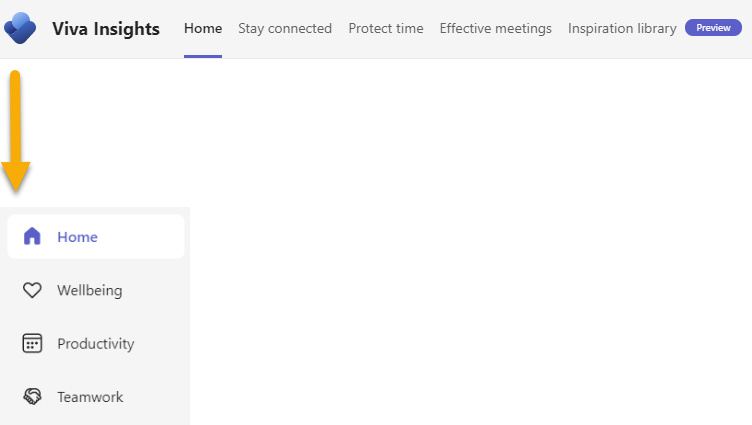
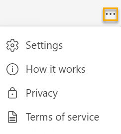
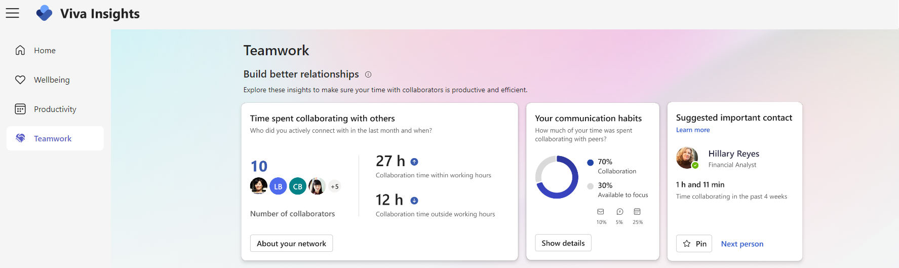

# Viva Insights app redesign

To make it easier to move around and find new features on the Viva Insights app, we're doing two things:

* Updating the navigation experience on Viva Insights in Teams and on the web
* Consolidating several existing tabs into four

The Microsoft Viva Insights web application will remain discoverable through https://insights.viva.office.com/ (https://gcc.insights.viva.office.com/ for Government Community Cloud customers).

## What's changing?

After we roll out these changes, you'll be able to navigate the Viva Insights app through a left-positioned bar instead of the current, top-aligned one.  

You'll also find Viva Insights content consolidated across four tabs. Because of this consolidation, these tabs from the old design won't be available anymore:

* **Stay connected**
* **Effective meetings**
* **Teamwork habits**
* **Organization trends**
* **Inspiration library**

>[!Note]
>In the previous design, insights for leaders used to only appear on the **Organization trends** or **Teamwork habits** tab. Now, leaders can find insights throughout each new tab. We talk about leader content more [later](#for-leaders).

### Navigation

The navigation bar will always sit on the left-hand side of the page, and you can access it at any time. <!--pending confirmation re: Focus mode-->

Like in the previous navigation setup, you'll get to **Settings**, **How it works**, **Privacy information** and **Terms of service** through the ellipses (**...**) at the application's top right.

### Tab consolidation

#### Home

We built the **Home** tab as your jumping-off point to explore and use Viva Insights features, and also to summarize important benchmarks.

:::image type="content" source="../../Images/MyA/reference/redesign-homepage-small.png" alt-text="Screenshot of the Viva Insights Home tab." lightbox="../../Images/MyA/reference/redesign-homepage.png":::

From **Home**, you'll be able to:

* Send praise to colleagues.
* Set up a shared meeting or focus plan.
* Start a no-meeting day with your team.
* Access Headspace meditations and reflect about the day.
* Set up scheduled send suggestions for emails.
* Check in on your focus plan and quiet time progress.
* Read **Inspiration library** articles.

#### Wellbeing

The **Wellbeing** tab is designed to help you understand your work habits, act with intention, and achieve a sustainable work-life balance. Features you used to find on the **Protect time** tab—focus time and focus plan, virtual commute, and quiet time progress—will appear in **Wellbeing**. Looking for the reflect or Headspace meditation features? Those will be here too, along with wellbeing-related articles.

:::image type="content" source="../../Images/MyA/reference/redesign-wellbeing-small.png" alt-text="Screenshot of the Viva Insights Home tab." lightbox="../../Images/MyA/reference/redesign-wellbeing.png":::

#### Productivity

Effective meetings and clear tasks are key to increasing productivity. 
That's why we built the **Productivity** tab—to help you identify ways to identify and decrease non-productive meeting time, and also stay on top of your work with suggested tasks. Content you used to find in **Effective meetings** (meeting surveys, meeting categories insights, shared meeting plans, and meeting habits) and **Stay connected** (suggested tasks) will soon live in **Productivity**.

:::image type="content" source="../../Images/MyA/reference/redesign-productivity-small.png" alt-text="Screenshot of the Viva Insights Home tab." lightbox="../../Images/MyA/reference/redesign-productivity.png":::

#### Teamwork

With its insights on network and collaboration, **Teamwork** will become your hub for building and strengthening connections with your team. We're moving some familiar content from your MyAnalytics dashboard here—like network and collaboration habits—so you can get a quantitative picture of who you collaborate with and how.

### For leaders

Each tab will contain insights for leaders to help you drive productivity, promote work-life balance, and strengthen connections with your team. On each tab, you'll find insights related to different key indicators for your group:

* **Wellbeing** - Focused work and work-life balance
* **Teamwork** - Manager coaching and networks
* **Productivity** - Meeting effectiveness

Every day, you'll find a different featured insight on each tab. Insights on the **Home** tab draw from insights on the **Productivity**, **Wellbeing**, and **Teamwork** tabs. Each insight shows the current week's average measure, along with the difference from the last week. 

You'll notice several new insights throughout each tab, including **Meeting hours**, **No-meeting day impact**, **Join on time rate**, and **Focus time impact**. You can share insights with others through a Teams chat or direct link.

## When will these changes happen?

We'll roll out changes between February 1 and March 31, 2022.

## What should I do to prepare?

Review and assess the impact on your organization. Consider updating your documentation as appropriate to reflect the above changes.