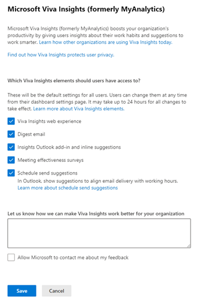

---

title: Personal insights configuration for Microsoft 365 administrators
description: Configuration options that Microsoft 365 administrators can make for personal insights in Microsoft Viva Insights
author: madehmer
ms.author: v-lilyolason
ms.topic: article
ms.localizationpriority: medium 
ms.service: viva 
ms.subservice: viva-insights 
ms.collection: 
- M365-analytics
- viva-insights-personal
manager: helayne
audience: Admin

---

# Configure personal insights

>[!Important]
> This article discusses the dashboard, which will be retired soon. Users will still be able to access their personal insights settings through their Viva Insights app in Teams or on the web. [Learn more about this change](../reference/mya-retirement.md).

**Role**  Global admin, Exchange Online admin, or Viva Insights admin

* **Prerequisite** – Users have access to Microsoft Viva Insights only if they have licenses that include a Viva Insights service plan, as described in [plans and environments](../Overview/plans-environments.md).

* **Data privacy** – See the [Privacy guide](../Overview/privacy-guide-users.md) to understand how privacy is built into Viva Insights and to learn what you can configure to address specific privacy requirements.

**To configure Viva Insights**

>[!Important]
>You must have a Global admin, an Exchange Online (EXO) admin, or an Insights admin role to configure users for Viva Insights in PowerShell.

* [Assign licenses with a service plan](#assign-licenses-with-a-service-plan)
* [Configure access at the tenant level](#configure-access-at-the-tenant-level) or [at the user level](#configure-access-at-the-user-level)

>[!Note]
>When you set the defaults (at either the tenant or user level), users can individually override these settings. Similarly, if you opt out users with a user-level setting, those users can choose to opt back in. The exception is if a user's license with a Viva Insights service plan expires, that user cannot opt in.

## Assign licenses with a service plan

Viva Insights is available to users who are assigned a license with a Microsoft Viva Insights service plan. For more details about which licenses have Viva Insights service plans and when users get access to Viva Insights elements after license assignment, see [plans and environments](../Overview/plans-environments.md).

For information on how to assign a license, see [Assign licenses to users in Microsoft 365 for business](https://support.office.com/article/assign-licenses-to-users-in-office-365-for-business-997596b5-4173-4627-b915-36abac6786dc).

## Configure access at the tenant level

You can configure access to Viva Insights elements for all users in your organization.

>[!Important]
>You need to have a Global admin or an Exchange Online admin role to configure tenant-level settings in the admin center. Make sure you're signed in to the Microsoft admin center as a Global or Exchange Online admin before configuring settings.

### To manage availability for the Viva Insights app in Teams

1. On the Viva Insights [admin page](https://admin.microsoft.com/Adminportal/Home?source=applauncher#/viva), select **Viva Insights**.
1. Under **Viva Insights in Microsoft 365**, select **Manage availability in the Teams admin center**. This option takes you directly to the Teams admin center, where you can configure the appropriate settings.
    

Go to our [Teams admin tasks](../teams/viva-teams-app-admin-tasks.md) doc for more information about setting up the Viva Insights app in Teams.

### To enable access to Viva digest emails, meeting effectiveness surveys, Viva Insights Outlook add-in, and schedule send suggestions

1. On the Viva Insights [admin page](https://admin.microsoft.com/Adminportal/Home?source=applauncher#/viva), select **Viva Insights**.
1. Under **Viva Insights in Microsoft 365**, select **Manage settings for Viva Insights**.
    
1. In the resulting pane:
    1. Select **Viva Insights web experience** to keep all Viva Insights users in your organization opted _in_ for access to the Viva Insights app on the web. Clear the selection for **Viva Insights web experience** to opt users _out_.  
    1. Select **Digest email** to keep all Viva Insights users in your organization opted _in_ for access to the [digest mails](../../personal/use/email-digests-3.md). Clear the selection for **Digest email** to opt users _out_.  
    1. Select **Insights Outlook add-in and inline suggestions** to keep all users in your organization opted _in_ for access to the add-in. Deselect it to opt users _out_. If you opt out of the Viva Insights Outlook add-in, the Productivity inline suggestions are also turned _off_ for all users. Individuals can also turn [inline suggestions](../use/mya-notifications.md#opt-out-of-inline-suggestions) *on* or *off* through their own **Settings** within the Viva Insights add-in.
    1. Select **Meeting effectiveness surveys** to keep all users in your organization opted _in_ for access to the surveys. Deselect it to opt users _out_. If you opt users out, they won't see an option for meeting effectiveness surveys in their settings.
    1. Select **Schedule send suggestions** to keep all Viva Insights users in your organization opted in for access to schedule send suggestions, and then select **Save changes**. Deselect **Schedule send suggestions** to opt users out. These will be default settings for all users. Users can change them at any time from their Viva Insights Outlook add-in and dashboard settings page. It may take up to 24 hours for all changes to take effect.

    >[!Note]
    >After a new tenant is established, it can take up to 48 hours for this functionality to become available.


    
1. Select **Save**.


You can also get to these settings in from the main [Microsoft 365 admin center](https://admin.microsoft.com/Adminportal):

1. In the left pane, expand **Settings** and then select **Org settings**.
1. On the **Services** tab, select **Microsoft Viva Insights (formerly MyAnalytics)**.

## Configure access at the user level

You can configure Viva Insights access for individual users in your organization. For example, you could opt out the user completely, which would turn off all Viva Insights functionality for that user. However, the user can choose to [opt back in](../use/opt-out-of-mya.md#if-i-opt-out-can-i-opt-back-in). 

You configure Viva Insights by setting the *PrivacyMode* parameter. For information about the values of PrivacyMode, see [User configuration settings](#user-configuration-settings). Before you can make this setting, you must take preparatory steps; see [Command sequence](#command-sequence).

>[!Important]
>The PowerShell cmdlets [Get-UserAnalyticsConfig](/powershell/module/exchange/get-useranalyticsconfig) and [Set-UserAnalyticsConfig](/powershell/module/exchange/set-useranalyticsconfig), which you might have used to configure access to Viva Insights, are no longer available. Instead, use the following new cmdlets: [Get-MyAnalyticsFeatureConfig](/powershell/module/exchange/get-myanalyticsfeatureconfig) and [Set-MyAnalyticsFeatureConfig](/powershell/module/exchange/set-myanalyticsfeatureconfig), which offer the same functionality along with some additional granular control.

### User configuration settings

PrivacyMode parameter  | Licensed user  | Unlicensed user
------------- | -------------  | ---------------
Opt-in (default setting)        | <ul><li>Microsoft 365 data is used for aggregated information shown to licensed users</li><li>Viva Insights app on the web is available</li><li>User can opt out</li></ul>  | <ul><li>Microsoft 365 data is used for aggregated information shown to licensed users</li><li>Admins can opt out unlicensed users through the admin PowerShell </li></ul>  
Opt-out    | <ul><li>Microsoft 365 data is not used for aggregated information shown to licensed users</li><li> Viva Insights app on the web is not available</li><li>User can opt in through the settings menu in the Viva Insights app in Teams or on the web</li></ul>   |  <ul><li> Microsoft 365 data is not used for aggregated information shown to licensed users.</li></ul> |

### Command sequence

You will use the [Set-MyAnalyticsFeatureConfig](/powershell/module/exchange/set-myanalyticsfeatureconfig) and [Get-MyAnalyticsFeatureConfig](/powershell/module/exchange/get-myanalyticsfeatureconfig) cmdlets to work with user configuration settings. Before you can use them, you need to install a module and sign in to be authenticated. This is the sequence of steps:

1. [Connect to Exchange Online](#connect-to-exchange-online) and, when prompted, sign in with your admin credentials.
2. After you've signed in, you are ready to work with user-configuration settings:

   * [Set access for one user](#set-access-for-one-user)  
   * [Confirm access for a user](#confirm-access-for-a-user)
   * [Set access for multiple users](#set-access-for-multiple-users)

#### Connect to Exchange Online

In this procedure, you install prerequisites and then you install the [Exchange Online PowerShell V2 module](/powershell/exchange/exchange-online-powershell-v2).

1. Open PowerShell.

2. <u>Prerequisite #1:</u> Installing packages from the [PowerShell Gallery](/powershell/scripting/gallery/getting-started) requires the latest version of the PowerShellGet module. Run these commands to install it:

   ```powershell
   Install-Module PowerShellGet –Repository PSGallery –Force
   ```

   For more information, see [Installing PowerShellGet](/powershell/scripting/gallery/installing-psget).  

3. <u>Prerequisite #2:</u> Install the Exchange Online PowerShell V2 module:

   ```powershell
   Install-Module -Name ExchangeOnlineManagement -RequiredVersion 2.0.4
   ```

   For more information, see [Install-Module](/powershell/module/powershellget/install-module).
   
4. <u>Connect to Exchange Online.</u> In PowerShell, run the command [Connect-ExchangeOnline](/powershell/module/exchange/connect-exchangeonline).

   ```powershell
   Connect-ExchangeOnline
   ```

   This will prompt you to authenticate, which you do by entering your admin credentials.

#### Set access for one user

Configure access settings for a user with the PowerShell cmdlet [Set-MyAnalyticsFeatureConfig](#command-reference-set-myanalyticsfeatureconfig):

```powershell
Set-MyAnalyticsFeatureConfig –Identity <string> [-PrivacyMode <string[]>]
```

Parameter   |   Required   |   Description   | Default value
----------  |  ----------  |  -------------- | -------------
Identity   |   Yes   | User ID for the current user as stored in Azure Active Directory (AD)   |   --
PrivacyMode   |   Yes   | <ul><li>**Opt-out**: Viva Insights won't use the user's data to compute derived statistics for other users. The user won't see statistics in Viva Insights, but can choose to opt in from the Feature settings menu.</li><li>**Opt-in**: Viva Insights uses the user's data to compute derived statistics for other users. The user can see statistics in Viva Insights, but can choose to opt out from the Feature settings menu.</li></ul>|  Opt-in

<!-- REMOVED MARCH 5 PER VIKRAM: 
> [!Important]
> The 'Excluded' value of PrivacyMode is being retired. Users whose privacy mode was previously set to Excluded will now be set to Opt-out. -->

Use Set-MyAnalyticsFeatureConfig to change the configuration settings of the user who is identified by the -Identity parameter. The following is a sample output of this cmdlet. It indicates that the user was opted in and that all of that user's Viva Insights features were turned on except the digest email:

   ```
    UserId : <username>@<domain>
    PrivacyMode : opt-in
    IsDashboardEnabled : true
    IsAddInEnabled  : true
    IsDigestEmailEnabled : false
   ```

   Also see [Command reference: Set-MyAnalyticsFeatureConfig](#command-reference-set-myanalyticsfeatureconfig).

#### Confirm access for a user

Use the following to confirm whether a user has access to Viva Insights (the value for PrivacyMode):

```powershell
Get-MyAnalyticsFeatureConfig –Identity <string>
```

Parameter   |   Required   |    Description    |   Default value
----------- | ------------ |  ---------------  | ---------------
Identity    |  Yes         |    User ID for the current user as stored in Azure AD  | -

Get-MyAnalyticsFeatureConfig reveals the current configuration settings of the user who is identified by the -Identity parameter. The following is a sample output of this cmdlet. It indicates that the user is currently opted in and that they have all Viva Insights features turned on except the digest email:

   ```
    UserId : <username>@<domain>
    PrivacyMode : opt-in
    IsDashboardEnabled : true
    IsAddInEnabled  : true
    IsDigestEmailEnabled : false
   ```

#### Set access for multiple users

Use the following steps in the [Exchange Online PowerShell V2 module](/powershell/exchange/exchange-online/exchange-online-powershell-v2/exchange-online-powershell-v2) to change access to Viva Insights (the value of PrivacyMode) for multiple users by running a PowerShell script that iterates through the users, changing the value one user at a time.

1. Create a comma-separated value (.csv) text file that contains the UserPrincipalName field of the users you want to configure. For example:

   ```
   UserPrincipalName
   ClaudeL@contoso.onmicrosoft.com
   LynneB@contoso.onmicrosoft.com
   ShawnM@contoso.onmicrosoft.com
   ```

2. Specify the location of the input .csv file, the output .csv file, and the value of PrivacyMode that you want to set for each user:

   ```powershell
   $inFileName="<path and file name of the input .csv file that contains the users, example: C:\admin\Users2License..csv>"
   $outFileName="<path and file name of the output .csv file that records the results, example: C:\admin\Users2License-Done..csv>"
   $privacyMode = "Opt-in"

   $users=Import-Csv $inFileName
   ForEach ($user in $users)
   {
   $user.Userprincipalname
   $upn=$user.UserPrincipalName

   Set-MyAnalyticsFeatureConfig –Identity $upn -PrivacyMode $privacyMode
   Get-MyAnalyticsFeatureConfig –Identity $upn | Export-Csv $outFileName
   }
   ```

   Also see [Command reference: Set-MyAnalyticsFeatureConfig](#command-reference-set-myanalyticsfeatureconfig).

3. Run the resulting commands at the Exchange Online PowerShell V2 module command prompt. For more information about the module, see [Exchange Online PowerShell V2 module](/powershell/exchange/exchange-online/exchange-online-powershell-v2/exchange-online-powershell-v2).

This PowerShell script:

* Shows the user principal name for each user.
* Sets the specified privacy mode for each user.
* Creates a .csv file with all the users that were processed and shows their status.

### Command reference: Set-MyAnalyticsFeatureConfig

The PowerShell command [Set-MyAnalyticsFeatureConfig](/powershell/module/exchange/set-myanalyticsfeatureconfig) can be used in three different ways:

* [Set the PrivacyMode parameter](#set-the-privacymode-parameter)
* [Enable or disable Viva Insights features](#enable-or-disable-Viva Insights-features)
* [Set PrivacyMode _and_ enable or disable features](#set-privacymode-and-enable-or-disable-features)

#### Set the PrivacyMode parameter

For more information about PrivacyMode, see [Configure access at the user level](#configure-access-at-the-user-level).

##### Command syntax - PrivacyMode

Set-MyAnalyticsFeatureConfig -Identity \<string\> -PrivacyMode <opt-in/opt-out>

##### Example - PrivacyMode
Running the following command sets the privacy mode to "opt-in" and enables all the personal insights features for the user:

   ```powershell
   Set-MyAnalyticsFeatureConfig -Identity <string> -PrivacyMode opt-in   
   ```

#### Enable or disable Viva Insights features

##### Command syntax - features on or off
`Set-MyAnalyticsFeatureConfig -Identity \<string\> -Feature <dashboard/add-in/digest-email/all> -isEnabled <$true/$false>`

##### Example - features on or off
Running the following command disables the digest email for the user:

   ```powershell
Set-MyAnalyticsFeatureConfig -Identity <string> -Feature digest-email -isEnabled $false
   ```

#### Set PrivacyMode _and_ enable or disable features

##### Command syntax - PrivacyMode and features

`Set-MyAnalyticsFeatureConfig -Identity \<string\> -PrivacyMode <opt-in/opt-out> -Feature <dashboard/add-in/digest-email/all> -isEnabled <$true/$false>`

##### Example - PrivacyMode and features
Running the following command opts the user in (by setting PrivacyMode to 'opt-in') and enables all the personal insights features except the digest email:

   ```powershell
Set-MyAnalyticsFeatureConfig -Identity <string> -PrivacyMode opt-in -Feature digest-email -isEnabled $false 
   ```
