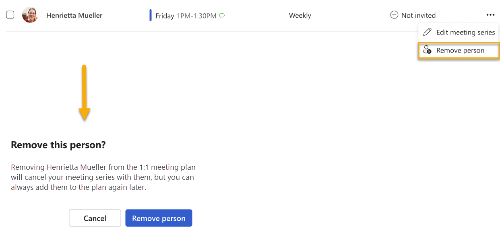

# 1:1 meeting plan

*Applies to: users with a premium subscription. Refer to the note below.*

As a people manager with a busy schedule, you know how hard it can be to keep up with your direct reports. That’s why we built the 1:1 plan—to help you connect regularly with your team.

## How the 1:1 plan works

1:1 meeting plans find time that work for both you and your team member, then book recurring meetings during that time at the frequency you pick. The day before your scheduled 1:1, both you and your team member get a notification from Viva Insights. This notification prompts you to cancel or reschedule any meetings that conflict with your 1:1 time, and it also invites you to add top-of-mind topics to the 1:1 meeting chat. During your 1:1, you'll be able to access those topics through the chat window.

>[!Note]
>This feature is premium, but because it’s in a preview state, participants don’t require a premium subscription join the plan. This requirement is subject to change.

## For plan organizers

<!--describe outlook experience?-->

### To set up a 1:1 meeting plan

On the **Teamwork** tab within the Viva Insights app, you’ll find a card prompting you to start a 1:1 meeting plan. Select **Set up 1:1 plan** to get started.

The app then shows you table with a:

* List of your direct reports.

    >[!Note]
    >Viva Insights determines your direct reports based on your company’s organizational data. For more information, refer to Team insights FAQ.

* Proposed meeting time based on your availabilities.
* Meeting frequency, with **Weekly** as the default.
* **Status** column, which indicates whether the individual is enrolled in the plan.
* **Actions** column, where you can edit the plan at any time.

Review the information in the table to make sure you have all the right participants and time slots. If you don’t see someone in the list who you want to add to your plan, find them through the **Add a person to invite** search bar.

When you’re ready to get your 1:1s started, select checkmark next to each participant, and then select **Invite**. Team members get an invitation in Outlook for a recurring meeting. After participants accept the invite, they’re enrolled in the 1:1 plan.

If a recurring 1:1 meeting series already exists for any direct report, the plan will include that series as part of the experience.
 
After you send your invitations, the **Status** column shows “Invitation sent.” When invitees accept the invitation, the status changes to "Invited."
 

### To edit or end a 1:1 meeting plan

#### Edit meeting times

To edit the time you meet with a participant, select the ellipses (**...**) under **Actions**, and then select **Edit meeting series**. The plan automatically suggests times that work for both you and your team member. You can also specify a custom day and time for your 1:1 series.

The plan automatically suggests times that work for both you and your team member. Use the dropdown menu beneath the meeting title to pick available times. When you're ready to send the invitation, select **Invite**.

#### End a plan

To end a 1:1 plan with a specific team member, select the ellipses (**...**) under **Actions**, and then select **Remove person**. After you confirm that you want to remove them, the plan automatically removes this person from the setup table and cancels the active 1:1 series.

 To end all your 1:1s, you'll need to remove each person separately.

## For plan invitees

When your manager invites you to a 1:1 plan, you'll receive an Outlook meeting series invitation. To join the plan, select **Accept**. Viva Insights then adds a recurring 1:1 meeting on your calendar.

## For all participants

### To prepare for your 1:1 meeting

The day before your 1:1, Viva Insights sends the organizer and the invitee a Teams notification. Select **Next** on this notification.

The app then shows you a list of your calendar events that conflict with the 1:1. Cancel or reschedule those events here, then select **Next**.

Lastly, the app encourages you to add talking points to the meeting chat. When you start your 1:1, you’ll find what you entered here in the meeting’s chat window.

## To edit your notification settings

You can stop receiving the meeting prep notification in two ways: 

* Select the **Change notification settings** link on the notification we discuss in [To prepare for your 1:1 meeting](#to-prepare-for-your-11-meeting).
* Go to your Viva Insights app settings in Teams:
    1. Select the ellipses (...) at the top of any page in the Viva Insights app, then select Settings.
    1. <!--TBD where this will be-->
    1. Under **1:1 meeting plan notification settings**, select **Don't remind me**, then select **Save changes**.

You can turn on reminders again whenever you want. 