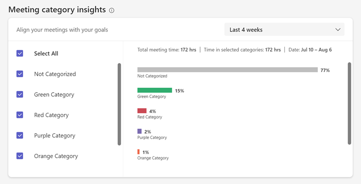
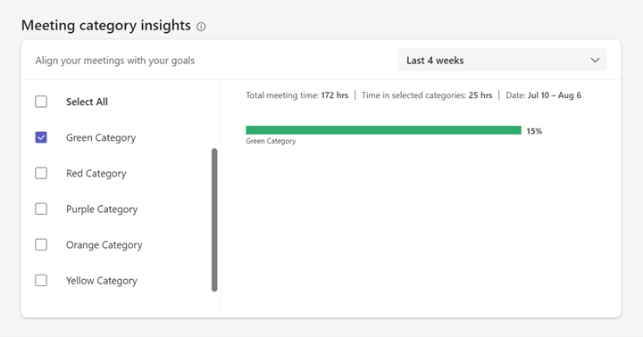

# Effective meetings

*This feature is available to users with a Viva Insights subscription. Refer to [Plans and environments](../Overview/plans-environments.md) for more information.*

You can use **Effective meetings** in Microsoft Viva Insights to help reinforce positive meeting habits. This feature also helps you identify and work on areas of improvement so you can lead more effective meetings.

## Meeting category insights

You can use **Meeting category insights** in **Effective meetings** to help understand how you’re allocating time across your Outlook meeting categories.

>[!Note]
>To set up Outlook meeting categories, refer to [Assign a color category to a calendar appointment, meeting, or event (microsoft.com)](https://support.microsoft.com/office/assign-a-color-category-to-a-calendar-appointment-meeting-or-event-750596d9-707d-4412-8c0e-7fdc0fc52527).

  
**Meeting category insights** shows you how many hours you’re spending in meetings, then breaks down the time you spend in each of your categories.

You can customize what you see here. If you want to:

* Analyze a specific category, select it from the checklist to the left.

    

* Pick a specific timeframe, use the dropdown menu in the top-right. You can choose from **Last 3 months**, **Last 4 weeks**, or **Next 4 weeks**.

    

>[!Note]
>If you haven’t categorized any meetings between the last three months and next four weeks, these insights won’t be available to you. However, you’ll have access to them once you categorize any meeting within this time period as long as you have a Viva Insights subscription.
