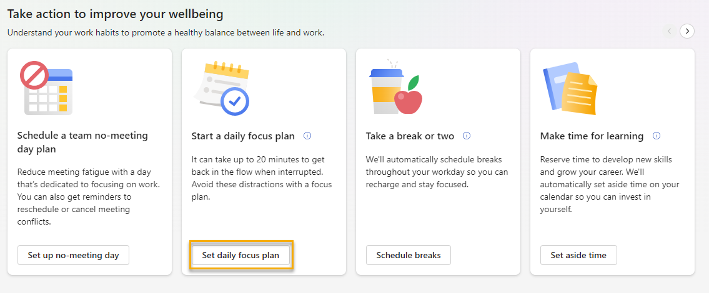
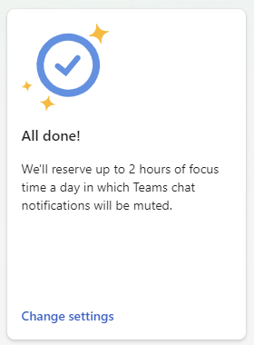

---

title: Focus plan for Viva Insights
description: Viva Insights focus plan
author: madehmer
ms.author: v-lilyolason
ms.topic: article
ms.localizationpriority: medium
ms.collection: 
- viva-insights-personal
- highpri
ms.service: viva 
ms.subservice: viva-insights 
search.appverid: 
- MET150 
manager: helayne
audience: user
---

# Focus plan

Meetings, emails, and chats are necessary to get work done, but they often leave us with little time during the workday for uninterrupted individual work. Some people report spending over 80% of their day collaborating with coworkers, and research has shown that it can take over 20 minutes to refocus after checking just one email.

The focus plan in Microsoft Viva Insights helps you block regular time for your top-priority work by scheduling up to four hours every day to focus. 

When you enroll in a focus plan, Viva Insights books time on your calendar every day to focus. The first time you use a focus plan, we prompt you to set up your preferences, which we talk about later.

>[!Note]
>If you leave your focus plan and enroll in one later, we'll use your preferences from last time. You can edit or leave your focus plan whenever you want.

## To create your focus plan

You can create your focus plan in two places:

* [Viva Insights app](#in-the-app)
* [Insights Outlook add-in](#in-the-insights-outlook-add-in)

### In the app

To start a focus plan:

1. Go to the **Take action to improve your wellbeing** section of your **Wellbeing** tab.
1. Find the **Start a daily focus plan** card, then select **Set daily focus plan**.

    

1. If you're prompted, configure your plan settings:
    * How much focus time you want to schedule each day
    * Whether you prefer to focus in the morning or afternoon
    * Whether you want a Teams reminder to begin focus mode
    * Whether you want Teams to silence notifications during your scheduled focus time

    As mentioned earlier, we won't prompt you to configure your settings if you've used a focus plan before. We'll apply the same settings as last time. You can edit these settings whenever you want.

After your plan is set up, a confirmation card appears in your **Take action to improve your wellbeing** section. 

If you want to change your settings right away, select **Change settings**. Otherwise, you can make edits as we describe in [To make changes](#to-make-changes).

### In the Insights Outlook add-in

1. Select the **Want focus time every day?** insight.

   

2. Select **Book time now**.

   

   The Insights pane now notifies you that your focus plan has begun, and your calendar now contains focus-time blocks:

   

Now that your focus plan is underway, you can do the following: 

* [Check the progress of your focus plan](#to-check-the-progress-of-your-focus-plan).
* [Change or leave your focus plan](#to-change-or-leave-your-focus-plan).

## To check the progress of your focus plan

After your plan has started, you can check your progress and make sure that you have focus time booked every day over the upcoming two weeks. If the plan has run for at least few days, it will have numbers to report.

In the app, go to your Wellbeing tab's **Track your progress** section:

   
  
An important metric shows under **Last week** about how many days last week that you had time to focus.

The **Plan ahead** area helps you plan focus time for the upcoming days with the following sections.

## To change or leave your focus plan

You can change or opt in and opt out of the focus plan as many times as you want.

### To make changes

To edit your focus plan settings:

1. Select the ellipses (**...**) at the top-right of any Viva Insights tab, then select **Settings**.

    

1. Select **Protect time** from the left pane.
1. Edit your scheduled focus hours per day, morning or afternoon preferences, and reminder and notification preferences.

 

#### To leave

Select the **Leave plan** button at top right. 

   

Answer the survey question, then select **Leave plan** again.

## Concepts

The following sections provide information that can help you as you create or monitor focus plans.  

### Automatic booking of focus time

After you set automatic booking as your preference, Viva Insights starts looking for time on your Outlook calendar to set aside as focus time. The scheduled focus time shows in your calendar as a different color and is labeled "Focus time."

Focus time never creates a calendar conflict; that is, focus time will not be booked over any existing calendar event, such as all-day meetings, booked personal time, or appointments.

Although two hours is the maximum length of a focus-time block that can be scheduled automatically, you can extend your focus time, by hand, in your Outlook calendar.

#### Booking schedule

Viva Insights books focus time two weeks in advance. For example: when you open your calendar on a Monday, you should see focus time booked every day of the current week and all the way through the Friday of the following week. Each weekend it looks for time blocks in the next week out and books time accordingly.

#### How time slots are selected

The time it reserves for you depends on the time you have open during the day. Viva Insights starts its search at the beginning of your workday, as it is defined in your Outlook settings. 

Viva Insights also respects the **Do not schedule focus time earlier than** setting in the **Plan configuration** dialog box. For example, if you set this to 9:00 AM, Viva Insights will select no focus-time slots that begin earlier than 9:00 AM.  

Viva Insights also prioritizes your preferences for length of focus time slots and part of day (morning or afternoon). For example, if you choose four hours of focus time and choose afternoon, Viva Insights first scans your calendar to find four-hour open slots in the afternoon. If it finds no four-hour open slots in the afternoon, it continues to scan your calendar to find four-hour open slots in the morning. If only smaller amounts of time are available, it can book focus blocks as short as 30 minutes. 

After it books a block on one day, it then moves on to the next day to find the next suitable block, based on your preferences. (In most cases, it creates only one block of focus time per day.) 

#### Lunchtime

Viva Insights considers the time from noon to 1:00 PM as time for the midday meal. If you have automatic booking turned on, Viva Insights tries to book any other time of day first. If it finds no other blocks of time available, it will then book focus time during the lunchtime period.

### Chats are muted during focus time  

During focus time, your status in Teams and Skype for Business will automatically change to "Focusing" to silence chat notifications and help you stay focused. When the focus time appointment ends, your status will automatically revert back to the status you were previously in. Note that you can set priority contacts in Teams to ensure you don’t miss important messages during focus time.

For more information, see [Manage notifications in Teams](https://support.office.com/article/manage-notifications-in-teams-1cc31834-5fe5-412b-8edb-43fecc78413d).

### Digest emails and Viva Insights Outlook add-in

#### Focus plan digest

After you enroll in a focus plan, the content in your digest email will be tailored based on your participation in the plan. It might, for example, remind you to schedule focus time for days on which none is set aside.

#### Viva Insights add-in

You can open the Outlook add-in to check whether any upcoming days are missing focus time. To do so, use this card:

Selecting this card shows the following options, with which you can book focus time on individual days or for several days at once:  

## Calendar color settings

>[!Note]
>Outlook no longer automatically shows focus time as green, or any other color, on the calendar.

If you want to personalize your focus time to show as a specific color, you can do that by using conditional formatting in the Outlook desktop app on Windows. Follow the steps below to create a new conditional formatting rule.

1. From the calendar view, select the **View** tab **> Current View > View Settings**.

    

1. Select the **Conditional formatting** button.

    

1. Select the **Add** button to create a new rule.

    

1. In the **Conditional Formatting** dialog box:
    1. Give your rule a name.
    1. Select the color you want focus time blocks to appear as.
    1. Select the **Condition** button.

    

1. In the **Filter** dialog box, add "Focus time" as your search term. Leave the **In:** field set to "subject field only."

     

1. Select the **OK** button on each of the three dialog boxes. Your focus time blocks should now appear as the color you set in step 4.
