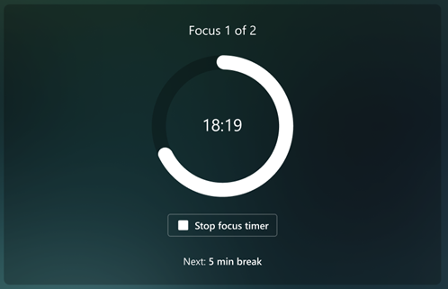

# Focus

Research shows that it can take an average of 23 minutes to refocus on a task after being interrupted. Constant distractions during focused work can cause higher stress and lower productivity. It's difficult to focus on challenging work when you only have small chunks of time available between meetings or are distracted by incoming emails and chats. Blocking a few hours every day to focus without interruptions can help you make progress on your important tasks and projects.

Viva Insights can help you protect time for focused work and minimize notifications (and thus distraction) from Teams chats and calls while focusing.

## To schedule focus time

You can schedule focus time in two ways: through a focus plan, which automatically books focus time for you every day based on the preferences you set, or through single, non-recurring sessions.

### Start a focus plan

To start a focus plan, check out our [Focus plan](../use/focus-plan.md) document.

### Book single, non-recurring focus sessions

Let's say you have some free time in your schedule you want to dedicate to independent work. You can book a one-time, non-recurring focus session during a block of time you choose. Because this block isn't part of a recurring focus plan, it just shows up on your calendar once.

To book a one-time focus session:

1. Go to the **Act with intention** section of your **Wellbeing** tab. 
1. Under **Focus**, go to the **Book focus time** section.
1. Viva Insights shows you a few empty spots in your calendar for the next day. Use the arrows to the right of the date to see different days. You can view a week's worth of available focus time.
1. When you find a time you want to schedule, select **Book time**.

:::image type="complex" source="images/wellbeing-book-focus-time2.png" alt-text="Screenshot that shows the Focus theme of the Act with intention section.":::
   Screenshot of the Act with intention section of the Wellbeing tab. There are three buttons above the section's content cards: "Focus," "Guided meditations," and "Articles"; "Focus" is selected to show the section's focus content. Be There are three sections on this card; the middle section is titled, "Book focus time." Below the card header, there's a table with four rows titled, "Friday, December 9." The first row shows that focus time has been booked from 2:30-4:30 PM. The other three rows provide open time slots with a "Book time" button. The first "Book time" button is highlighted.
:::image-end:::

After you **Book time**, the time you chose adds itself to your calendar. The **Book focus time** section also shows that date and time with a **Focus time booked** status.

## To use focus mode

Focus mode intersperses short breaks within your focus time to help you stay on-task and to boost productivity. Read on to learn how to start and use this feature.

### Start a focus session

If you pre-booked time to focus—either through a plan or by booking earlier—you’ll get a Teams notification.

:::image type="content" source="images/focus-mode-teams-reminder.png" alt-text="Screenshot that shows the focus mode Teams desktop notification card.":::

To enter focus mode, select this notification. If you don’t select the notification, your calendar will still show the **Focus time** event, your Teams status will update to **Focusing**, and you won’t get Teams notifications unless they’re from priority contacts you set.

>[!Note]
> If you want to keep using Teams while you’re in focus mode, right-click on the Viva Insights app icon, then select **Pop out app**.
>
>:::image type="content" source="images/pop-out-app2.png" alt-text="Screenshot that shows the using the Pop out app option.":::

#### Use features during your focus session

 When you’re in focus mode, Viva Insights shows you three sections: **Timer**, **Tasks**, and **Mindfulness break**.

##### Timer

When you launch focus mode, you’ll arrive at the **Timer** section. Here, your focus time is displayed in minutes, which correspond to the time you set through your plan, or when you booked time. If you need to increase or decrease this time, select the arrows. 

If you increase time, the app asks whether you want to extend your scheduled focus time. You can select the **Add 15 minutes** button to add 15 more minutes to your scheduled time, or you can add another amount by selecting the button’s down arrow.
 

To skip automatically scheduled breaks, select the box next to **Skip breaks**. 
To adjust other settings, like sounds and how long breaks and focus intervals last, open the **Timer settings**.

When you’re ready to start your timer, select the **Start focus timer** button. You can stop the focus timer whenever you need to.

##### Tasks

You can use the **Tasks** section to help direct your work during your focus session. **Tasks** displays existing tasks from Microsoft To Do, which are either due today or have a reminder set for today.

In addition to viewing your existing tasks, you can:

* **Add a new task.** Below **Your tasks**, select **Add a task**.
* **Add a suggested task surfaced from Outlook or Teams.** If To Do notices a potential task in your chats or emails, a notification appears above **Your tasks**. Select the down arrow to expand the message. If you want to put this task on your To Do list, select the **Add to your tasks** button.
* **Cross a completed task off your list.** Select the circle to the left of the task name, which sends the task to your **Tasks completed today** list. If you want to delete the task from To Do, select the trash can icon to the right of the task name.
* **Set a reminder.** Select the ellipses (…) to the right of the task name, then pick a time you want to be reminded. Reminders appear in your Microsoft To Do list and in your Briefing email, if you’re subscribed to receive Briefing emails. You can also **Edit** and **Delete** tasks from this menu.

##### Mindfulness break

During breaks between focus intervals, you can use the guided videos in Mindfulness break to catch your breath and reset. After you select **Start** beneath a video, you’ll complete a three- or five-minute exercise before your next focus interval starts.

#### To end a focus session

After your timer runs out, a **Congratulations** message appears. If you want to extend your focus time, select **Restart interval timer**.

If you’re done focusing, you can move forward with your day and continue using Teams. Your Teams status will stop showing as **Focusing** and, if they were muted, you’ll start receiving Teams notifications again.
