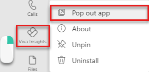

---

title: Mindfulness content from Headspace in Viva Insights
description: Learn how to start a guided Headspace meditation in the Viva Insights app
author: lilyolason
ms.author: v-lilyolason
ms.topic: article
ms.collection: viva-insights-personal
ms.localizationpriority: medium 
ms.service: viva
ms.subservice: viva-insights
manager: anirudhbajaj
audience: user
---

# Mindfulness content from Headspace

*Applies to: users whose language in Teams is set to English, French, German, Portuguese, or Spanish*

In your Microsoft Viva Insights app, you'll find a curated set of guided meditations and focus music from Headspace. Start your day grounded, relax your mind before a big presentation, find focus before starting an important project, or close out your day with a mindfulness exercise during your virtual commute. In just a few minutes a day, meditation and mindfulness with Headspace can help you decrease stress and increase focus.

## Start a guided meditation

You can start a guided meditation whenever you want. To find and complete a meditation:

1. In the **Wellbeing** tab in your Viva Insights app, go to the **Act with intention** section, and select **Guided meditations**.

    :::image type="content" source="images/wellbeing-headspace-meditiation.png" alt-text="Screenshot that shows the Act with intention, Guided meditations section, which contains four guided meditation cards.":::

1. Start an exercise by selecting its **Play** button.
1. If you want to do another exercise, select **More exercises**. Otherwise, close the window to complete your meditation.

    :::image type="content" source="images/wellbeing-headspace-more-exercises2.png" alt-text="Screenshot that shows selecting the More exercises link below a playing meditation video.":::

<!--verify with Anji whether there's any other way to get to these other exercises-->

### Run Headspace in the background

Let's say you wanted to listen to focus music from Headspace while you continued using other features in Teams. Here's how you keep using Teams while also using Headspace features:

1. Locate the pinned Viva Insights app on the left navigation pane of Teams.

2. Right-click the Viva Insights icon.

3. Select **Pop out app**.

   

4. In the resulting second window, select **More mindfulness exercises** and then start a Headspace meditation or Focus music as described in [Start a guided meditation](#start-a-guided-meditation).

5. Optionally, minimize the Insights window that you just opened. You can continue working in Teams in the original Teams window.

## More information

For more information about meditation and other best practices, check out the Headspace app's [Questions about meditation](https://www.headspace.com/meditation-101/faq) page.
