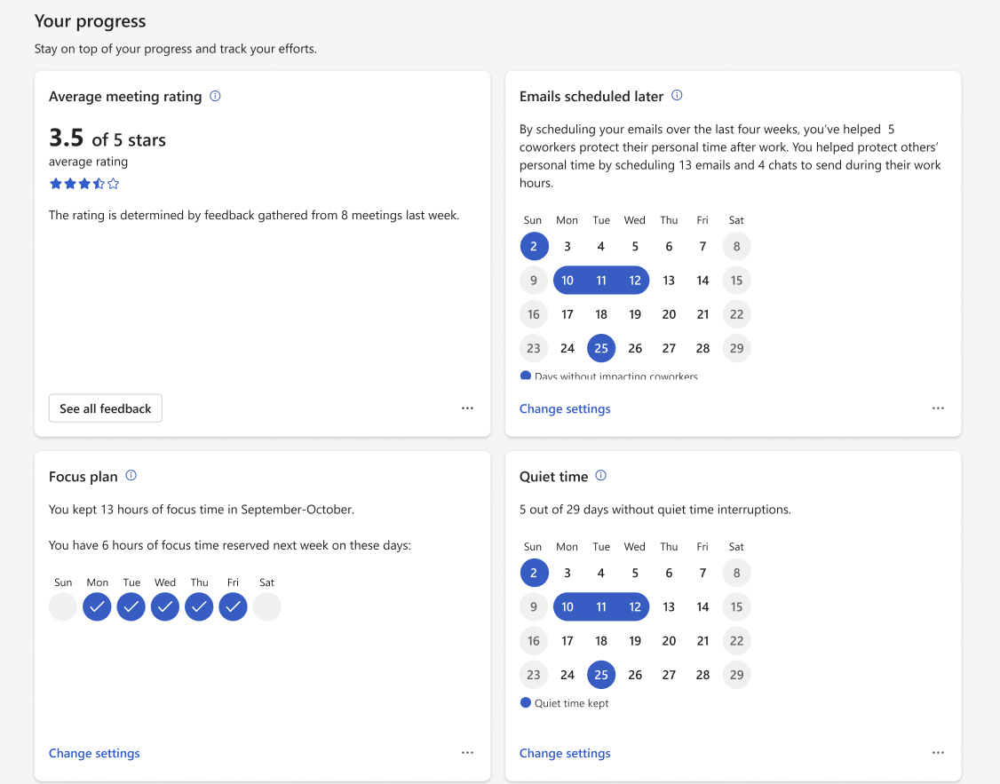

---

title: Viva Insights Home page in Teams and on the web
description: About the Home page in the Microsoft Viva Insights app
author: lilyolason
ms.author: v-lilyolason
ms.topic: article
ms.collection: viva-insights-personal
ms.localizationpriority: medium 
ms.service: viva
ms.subservice: viva-insights
manager: anirudhbajaj
audience: user
---

# Viva Insights Home

Use Viva Insights **Home** to discover key wellbeing, productivity, and teamwork insights and actions. Here, we highlight insights and actions that give you the most value in the flow of work. You'll find these sections on your **Home** tab:

* Recommended for you
* Your progress
* Inspiration library

If you're an organizational leader, meaning you're assigned the Insights Business Leader role or your admin has enabled group manager access for you, you'll also find an **Insights for your organization** section at the top of your **Home** tab. We talk about organization insights later on, in [For managers and leaders](#for-managers-and-leaders).

## Recommended for you

**Recommended for you** curates content from across the Viva Insights app to highlight actions and insights for individuals. From here, you can:

* Send [praise](praise.md) to colleagues.
* Set up a [1:1 plan](1-1-plan.md) with your direct report.
* Promote [healthy meeting norms](shared-meeting-plan.md).
* Schedule a team [no-meeting day](shared-no-meeting-day.md).
* Start a shared focus plan. <!--to create a doc-->
* Schedule [emails for later](../use/schedule-send.md).
* Relax with [quiet time](quiet-time.md).
* Set [virtual commute](virtual-commute.md) reminders.
* Make [time for messages](wellbeing-plans.md).
* [Mediate](headspace.md) or do a breathing exercise.
* [Reflect](reflect.md) on the day.

## Your progress

Use **Your progress** to find out how well your meetings are going, how well you're keeping quiet time work-free, how many hours of focus time you've booked, and more. If you want to change your settings for, you can do that by selecting **Change settings**.

## Inspiration library

The Inspiration library is your hub for curated wellbeing- and productivity-related content from industry experts. [Learn more about the Inspiration library](inspiration.md).

## For managers and leaders

*Applies to: people who have a premium Viva Insights license **and** are assigned the **Insights Business Leader** role or have group manager access enabled*

Organization insights help you understand how your organizations—the people who report to you directly or indirectly—are succeeding at work. On the **Home** tab, you'll find key indicators of your organization’s wellbeing, productivity, and team culture, along with features and tools to help support your teams. 

Specifically, you'll find an insight related to one of the following topics each day:

* Uninterrupted focus hours
* Manager 1:1 meeting hours
* Meeting hours
* After hours collaboration
* No meeting day impact
* Daily connected hours
* Focus time participation
* Join on time rate
* Focus time impact
* No meeting day participation
* Multitasking hours
* Internal network size

All insight cards show the current week's average measure, and also provide the difference from the prior period. Here's an example:

To learn more about organization insights, refer to our [organization insights documentation](../../org-team-insights/org-insights.md).

## Related topics

[1:1 meeting plan](1-1-plan.md)

[Headspace](headspace.md)

[Inspiration library](inspiration.md)

[Praise](praise.md)

[Quiet time](quiet-time.md)

[Reflect](reflect.md)

[Schedule send](../use/schedule-send.md)

[Shared meeting plan](shared-meeting-plan.md)

[Shared no-meeting day](shared-no-meeting-day.md)

[Virtual commute](virtual-commute.md)

[Wellbeing plans](wellbeing-plans.md)

