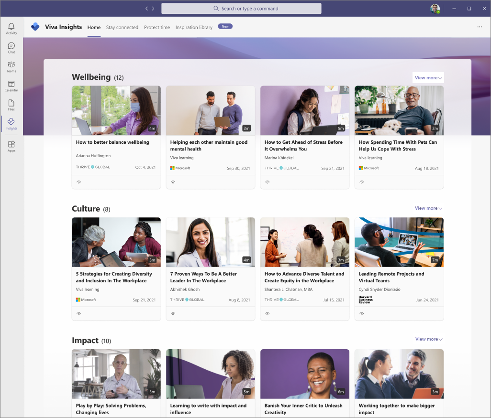
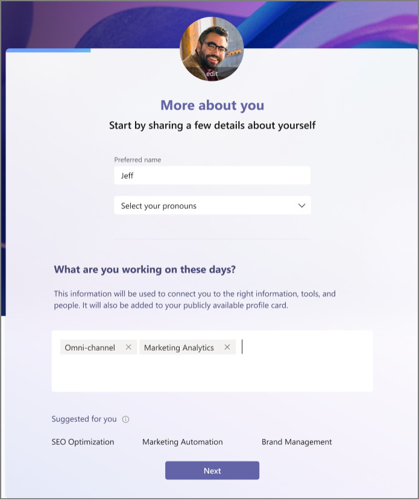

# Inspiration library in Viva Insights

You can use the Inspiration library in Microsoft Viva Insights to learn more about the things that matter most to you. This library is designed to inspire you in life and at work to get the most out of both.

You can use the library to turn your personal insights through Viva Insights into actions. The articles are geared toward helping you improve your overall wellbeing and employee experience.

The library uses the details you enter in [More about you](#more-about-you) and your personal Viva Insights data for initial article line-up. And then based on what you read and your *feedback* (thumbs up or down), the library will show you more of what you're interested in as you use it.

## Article feedback and options

Over time, the library uses AI to show you articles that are based on what you read and your feedback about them, such as the **thumbs up** and **thumbs down**.

You can also select the **eye** icon to focus in and view the complete story. For example, the following shows what you might see from Thrive Global.

## Filters

You can use the available filters to focus in on articles you're most interested in, such as:

* **Theme** - Select to filter and focus on a specific theme, such as articles about wellbeing, culture, impact, and resilience.
* **Author** - Filter the articles based on the author, such as from Microsoft, Harvard Business Review (HBR), and Thrive Global.
* **Type** - Filter by type of article, such as documents, videos, and audio recordings.

## More about you

When you first open Microsoft Viva, you are prompted to enter a few details about yourself, such as what you're working on, the people you're working with most, and the topics you'd like to learn about. The library uses this information to show you documents, videos, and audios that are most related.

Select the **ellipsis** (...) icon to edit these details whenever you want to change up what you're working on or what you want to learn more about through the library.

## Related topics

[Viva Insights introduction](viva-teams-app.md)
