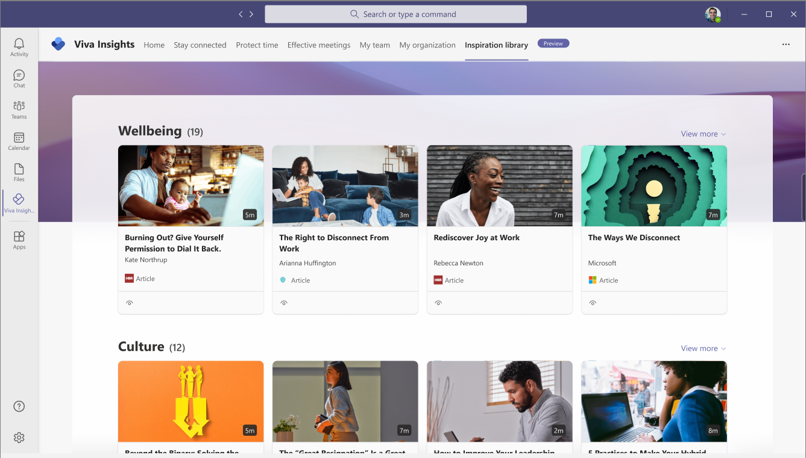
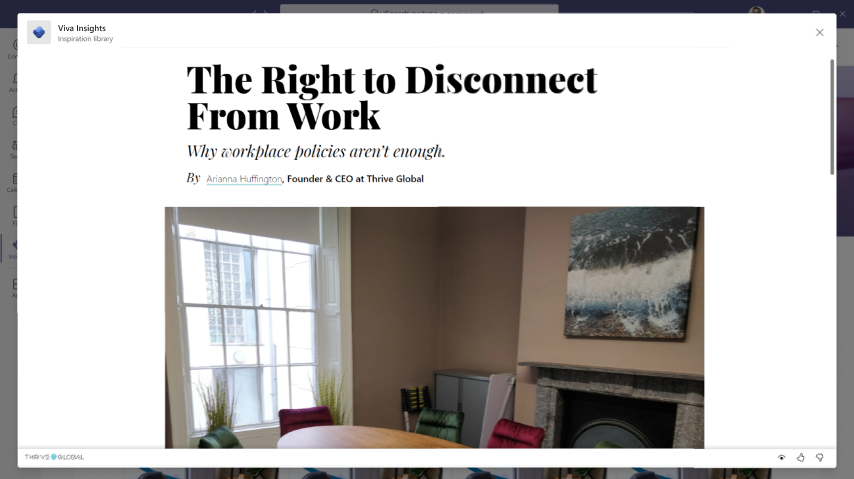

# Inspiration library in Viva Insights

You can use the Inspiration library in Microsoft Viva Insights to learn more about the things that matter most to you. This library brings together thought leadership from industry experts that’s designed to inspire you in life and at work to get the most out of both.

You can use the library to help transform your personal, manager, and leader insights into actions. The articles are shown on the page within specific themes, such as wellbeing, culture, impact, and resilience. The article sources include Microsoft, Harvard Business Review, and Thrive.

>[!Note]
>This new preview feature is available in a rolling release starting now through April 2022.

## View an article

The library shows you articles that you haven’t read yet first. You can view these articles within your Teams app on your computer or mobile device, or within the Viva Insights app on the web. Select the article title to open and read it. For example, the following shows what you might see from Microsoft. To view all the articles available to read within a specific theme, select **View more** in that section.

You can also provide feedback on the articles you have read by selecting the **thumbs up** and **thumbs down** icons at the end of the article. The articles are available in the same [languages supported with advanced insights](../../overview/supported-languages.md#supported-languages).

## Related topics

[Viva Insights introduction](viva-teams-app.md)
