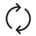
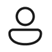

# Meeting habits

The **Meeting habits** section of the **Productivity** tab highlights your habits or practices in meetings you organized and accepted. Switch between the **Meeting habits** and **Meeting details** views by selecting the tabs above the graph/table.

* Use percentage data from the **Meeting habits** view to understand how often you organize or attend meetings that apply certain habits. For example, you might notice that 80% of the meetings you attended ended on time. 

    :::image type="content" source="images/effective-meetings-habits1.png" alt-text="Collaboration Meeting Habits View." lightbox="images/effective-meetings-habits1.png" :::

* For details about all your meetings in the past four weeks, use the **Meeting details** view.
    

    :::image type="content" source="images/meeting-effectiveness-details.png" alt-text="Collaboration Meeting List View." lightbox="images/meeting-effectiveness-details.png":::

    The **Meeting details** view classifies meetings by using icons, which we describe in the following table:

   |Icon|Description |
   |--|---|
   | |  This meeting is recurring |
   ||This meeting is recurring and you organized it
   ||You were invited to this meeting
    || You organized this meeting
   | | This meeting meets the requirement of the habit in the column header. For example, if the meeting started on time, you'd see a check under **On time**. |
   | |This meeting doesn't meet the requirement of the habit in the column header. For example, if the meeting didn't start on time, you'd see an **X** under **On time**. |
   | |Not applicable. The  habit in the column header doesn't apply to this meeting. For example, **On time** doesn't apply to a canceled meeting, so you'd see a dash instead of a check or an **X**. |

You can sort the **Meeting details** table by selecting the column header.

## How meeting habits are calculated

Here's how we calculate the habits shown in this section:

* **<= 1 hour** – Meetings you organized that were one hour or shorter
* **Advanced notice** – Meeting invitations you sent with more than 24 hours' notice before the scheduled start time
* **Added a Teams link** – Meetings you organized that included a Teams link for remote attendees
* **During working hours** – Meetings you organized or accepted during your working hours
* **Ended on time** – Online meetings (on Microsoft Teams) that you ended within one minute of the scheduled end time
* **High attendance** – Meetings you organized or accepted that had a response rate over 50%
* **Joined on time** – Online meetings (on Microsoft Teams) you joined within five minutes of the scheduled start time
* **No overlap with other meetings** – Meetings that didn't overlap with other meetings on your calendar
* **RSVP'd to invite** – Meetings you were invited to and either accepted or declined (that is, you didn't leave your status as **Tentative**)
* **You didn't multitask** – Meetings where you didn't read or send emails or chats

## Meeting exclusions

These types of meetings are excluded from meeting metrics—that is, they don't factor into the habits you see in this section.

* Meetings that are 24 hours or longer, which include meetings marked as **All day** 
* Meetings marked as **Private**
* Meetings where you're the only participant, like when you block focus time in your calendar or set reminders
* Meetings with a **Show As** status set to one of these:
    * Free
    * Working Elsewhere
    * Tentative
    * Out of Office

>[!Note]
>Viva Insights counts double-booked meetings only one time for metric calculations. For example, if you have two meetings scheduled for 10:00 AM to 11:00 AM on the same day, Viva Insights counts this as only one hour of meeting time.

