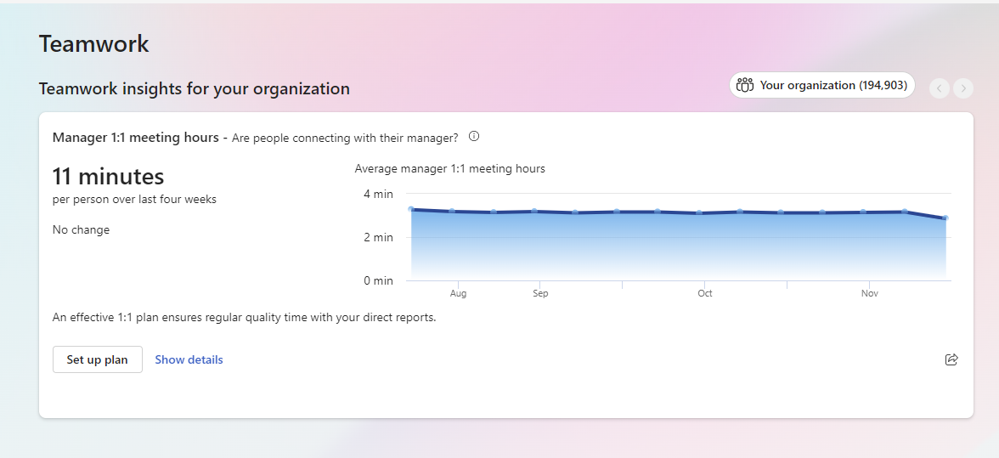

# Teamwork

**Teamwork** is your hub for building and strengthening connections with your team. Use this tab to understand who your top collaborators are and how much time you spend collaborating with others.

If you manage direct reports or are an organization leader, check out this article's [For managers and leaders section](#for-managers-and-leaders).

## Build better relationships

:::image type="complex" source="../images/teamwork-ic2.png" alt-text="Screenshot that shows Build better relationships section on the Teamwork tab.":::
   Screenshot of the "Build better relationships" section of the Teamwork tab. The subtitle says, "Grow your network and foster healthy work relationships with your collaborators." Below the subtitle, there are three cards. The first card is named, "Time spent collaborating with others," and the subtitle says, "Who did you actively connect with in the last month and when?". The card then shows a numerical insight, "10", with profile images of collaborators, labeled, "Number of collaborators." To the right, there are two numerical insights: "27 h," labeled "Collaboration time within working hours," and "12 h," labeled, "Collaboration time outside working hours." The button in the bottom left of the card is labeled, "View my network." The next card reads, "Your communication habits," labeled, "How much of your time was spent collaboration with peers?". The card shows a donut graph of collaboration time and time available to focus, and show statistics about how much collaboration time went to each surface: email, chat, and meetings. The button in the bottom left of the card reads, "Show details."The third card is "Suggested important contact," which shows a collaborator's name and their profile image, and provides a numerical insight about "Time collaborating in the past 4 weeks." Users can select the "Pin" button and/or move to "Next person."
:::image-end:::

You’ll find three cards on your **Teamwork** tab, under the **Build better relationships** section:

* Time spent collaborating with others shows how many people you’ve collaborated with over the last month. It also shows how much time you’ve spent collaborating during and after working hours. For more information about who you’re collaborating with, select **View my network**. We talk about this section more in Network.
* **Your communication habits** shows what percentage of your time is available to focus and what percentage of your time is spent collaborating with others. The card also breaks down how much collaboration time you spend per communication channel—meetings, chats and calls, and email. For more information about your communication habits, select **Show details**. 
* Suggested important contact is a contact you’ve worked with and who you might want to consider pinning as a favorite. When you pin someone as a favorite, using the **Pin** button, Viva Insights prioritizes tasks from them in the [Productivity](productivity.md) tab’s **Tasks** feed.
 

When you select **View my network** on the **Time spent collaborating with others** card, you arrive at the **Network** page. Insights on this tab show how you work with your active collaborators. Learn more about the **Network** page and what you can do there in Network.

## For managers and leaders

*Applies to: users with a premium subscription*

If you’re an organization leader—that is, your Insights admin has assigned you the **Insights Business Leader** role or enabled you as a group manager—you’ll see a **Teamwork insights for your organization** section at the top of your **Teamwork** tab. Each day, you’ll receive an insight about internal network size across your organization or company. To learn more about organization insights, refer to [Organization insights in the Viva Insights app](../../../org-team-insights/new/org-insights.md).

