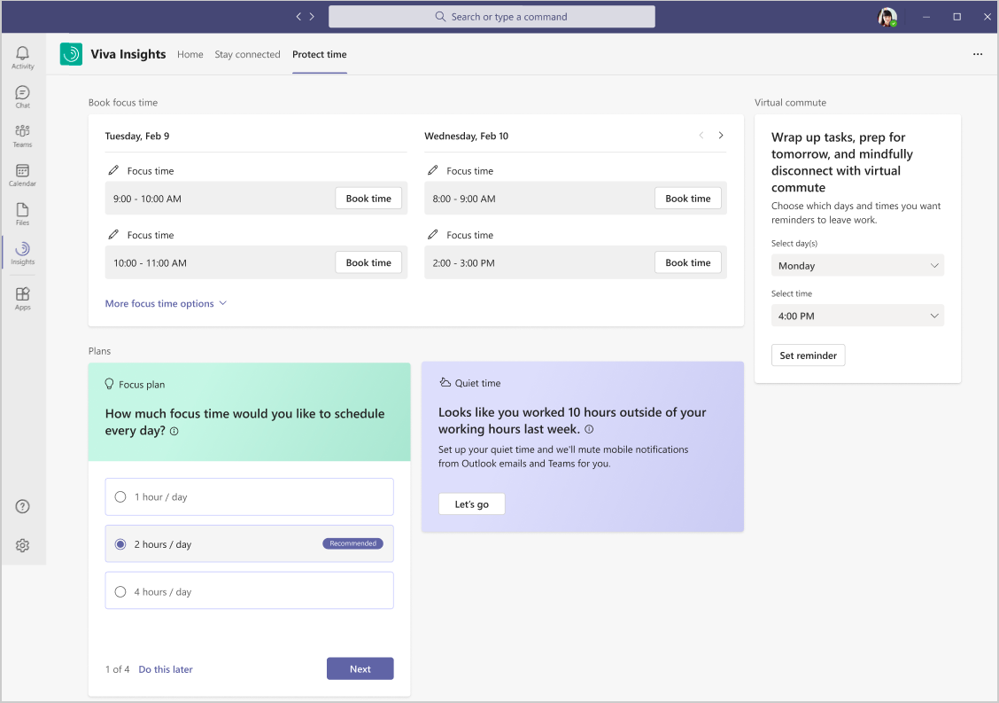
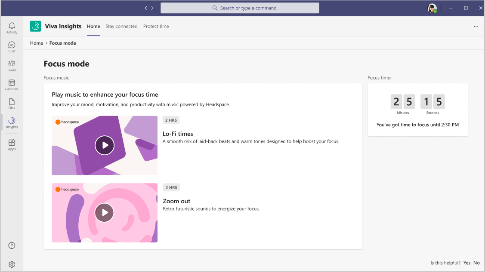
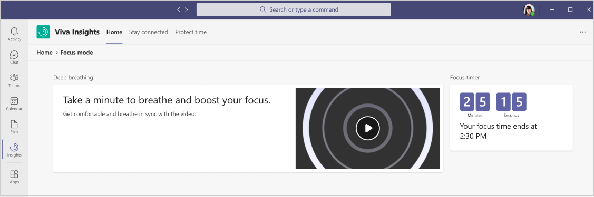
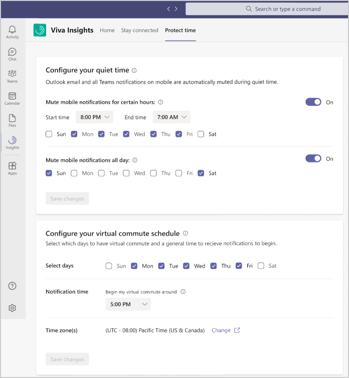

# Protect time with Viva Insights

You can use this feature in the Microsoft Viva Insights app in Microsoft Teams to protect your time in the following ways:

* [Schedule focus time](#schedule-focus-time) for future workdays.
* [Configure quiet time](#configure-quiet-time) to disconnect from work and recharge.
* [Start a virtual commute](viva-insights-virtual-commute.md) to end your day.

## Schedule focus time

Research shows that it can take an average of 23 minutes to refocus on a task after being interrupted. Constant distractions during focused work can cause higher stress and lower productivity. It is difficult to focus on challenging work when you only have small chunks of time available between meetings or are distracted by incoming emails and chats. Blocking a few hours every day to focus without interruptions can help you make progress on your important tasks and projects.

Viva Insights can help you protect time for focused work and minimize notifications (and thus distraction) from Teams chats and calls while focusing.

### Book focus time or a plan

You can schedule focus time on the **Protect time** page, as follows:

* **Book focus time** - Use this section to reserve time slots for focused work during the next two or more days.

  * After you select **Book time**, you'll see **Focused time booked**. If you see **Review meeting conflict**, select it to view your calendar and resolve the conflict.
  * If you have selected **Book time** and decide that you don’t need it anymore, you can delete the focus time block from your calendar.
  * Before booking time, you can select **Edit** (the pencil icon) to change the name of the focus time block, which automatically updates the subject for the scheduled focus time.

* **Focus plan** - Within **Focus plan**, select **Get started** to create a focus plan.

  * If this is not your first time using a focus plan, you'll automatically be set up with the default settings from your last plan. Then based on the prompt, you can then select **Edit settings** to make any changes.
  * If this is your first focus plan, you'll be prompted to select the following options.

    * **Do this later** skips the prompts and simply enrolls you in a default plan based on your settings.
    * How much focus time do you want to schedule each day.
    * Do you prefer morning or afternoon hours for scheduled focus time.
    * If you'd like a Teams reminder to begin focus mode.
    * If you'd like Teams to silence notifications during scheduled focus time.

At any time after the initial setup, you can confirm or change any of the options or leave the plan by selecting **Focus plan preferences** in **Settings** (gear icon) within the Viva Insights app.

### Focus mode

If you selected the option to be reminded to begin focus mode, you will be prompted by Viva Insights in Teams to start focus mode. When you select the **Ready to focus** prompt, it'll open a **Focus mode** page.

You can also start focus mode through **Home** > **Launch focus mode**. Or if you leave focus mode, you always restart it through **Home** > **Return to focus mode**.

* If Headspace for Viva Insights is enabled by your organization, you'll see options to play music and a **Focus timer** that tracks your time within the **Focus mode** page.

  

* If Headspace is disabled, you'll be prompted to play a short one-minute **Deep breathing** exercise within the **Focus mode** page. You'll also see a **Focus timer** that tracks your time.

  

### Pop out Focus mode

You can open **Focus mode** in a separate pop-out window in Teams, which allows you to play focus music while using Teams for other work.

1. In the left navigation in Teams, right-click **Viva Insights**.
2. Select **Pop out app**.

## Configure quiet time

>[!NOTE]
>Quiet time is only available as a preview.

Research shows that long hours and the pressure to always be available can lead to employee burnout. The amount of time you spend collaborating outside of business hours can be an indicator that you are at risk of burnout, even as you and your team embrace flexibility.

This feature can help protect your quiet time, which is the hours each day when you want to disconnect from work and recharge. To minimize work related interruptions, you can schedule when you want mobile notifications from Outlook and Teams to automatically be muted.

In the **Quiet time** section on the **Protect time** page, if you haven't scheduled quiet time and are prompted to, select **Let's go**. You are then prompted to select a start and end time for when to mute mobile notifications from Outlook and Teams. In **Mute mobile notifications all day**, you can also select which days to mute notifications for the full 24 hours.

After the initial setup, you'll see the following options in **Configure your quiet time** in **Settings** (gear icon). You can confirm or change any of the quiet-time options or turn quiet time off at any time.

## Related topics

* [Viva Insights introduction](viva-teams-app.md)
* [Virtual commute](viva-insights-virtual-commute.md)