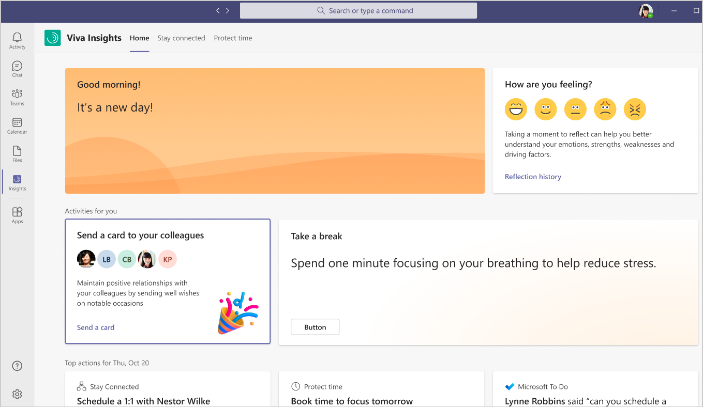
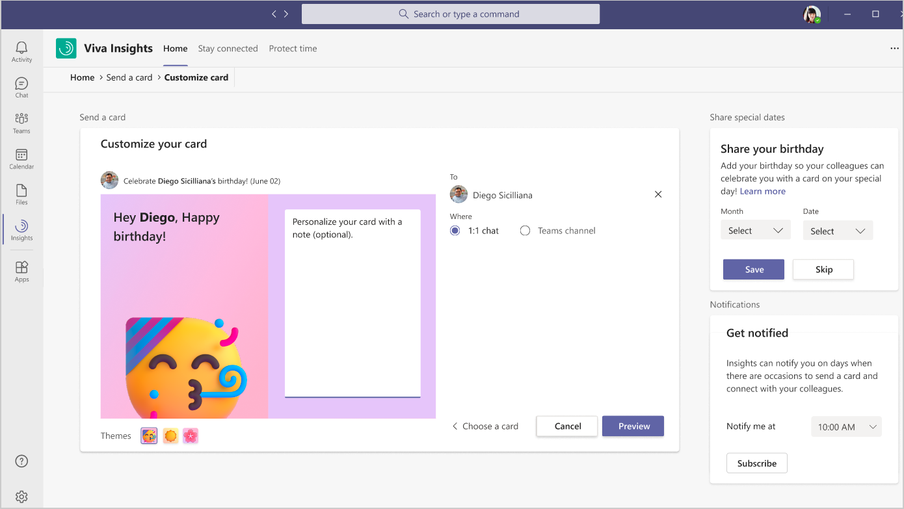

# Send a card in Viva Insights

*This experience is currently only available as a preview release.*

You can use this feature in the Microsoft Viva Insights app to send your colleagues a message celebrating an occasion, such as a birthday or a holiday.

Use the **Send a card** feature to maintain positive relationships and connect with your colleagues in a fun way. You can send a card from several different categories in Teams as either a 1:1 chat or in a Teams channel.

You'll see recommendations on cards you can send to these colleagues who you [closely collaborate with](../use/network.md) or have pinned as [important](../use/network.md#important-people). Viva Insights uses your collaboration activity (email, meetings, calls, and chats) to identify the people you closely collaborate with.

You can also share your birthday with Viva Insights, so your colleagues will know when to send you a birthday card. You can also customize the card with a personal message and select how it is sent.

If you subscribe to notifications, you'll get a notification in your activity feed in Teams on the day of an event with card recommendations. You can select what time of day you want to be notified about these recommendations.

## Send a card

1. On the **Home** page, select the **Send a card to your colleagues** card in the **Activities for you** section:

   

2. You can select a card from a number of different types and themes. For example, when you select a birthday card, you can then select from a number of different birthday themes.
3. In **Customize your card**, enter an optional personal message, and then select where you want to send it, either as a **1:1 chat** or in a **Teams channel**.

   

4. Select **Preview**, and then you can select **Edit** to make any necessary changes, **Cancel** to cancel the card, or **Send** to send it.

## Share special dates

In this section of Send a card, you can share your birthday by selecting the **Month** and **Date**, and then select **Save**. Viva Insights will remind your colleagues to send you a birthday card on your birthday.

You can also select **Skip** to not share your birthday. Or if you change your mind about sharing your birthday, select the **ellipsis** (...) > **Settings** in Viva Insights to add, edit, or delete your birthday information at any time.

## Notifications

In this section of Send a card, you can select when to be notified about occasions, so you can send a card for them and connect with your colleagues.

To get these notifications, select the time of day you want to be notified, and then select **Subscribe**. The time you select applies to notifications for each day of the week. You cannot set different times for different days of the week.

The notification might not arrive exactly at the scheduled time, but within 15 minutes on either side of it. For example, for a 5 PM notification, you’ll see it sometime between 4:45 and 5:15 PM.

To change your notification time settings, select the **ellipsis** (...) > **Settings** within Viva Insights in Teams.

## Related topics

[Viva Insights introduction](viva-teams-app.md)
