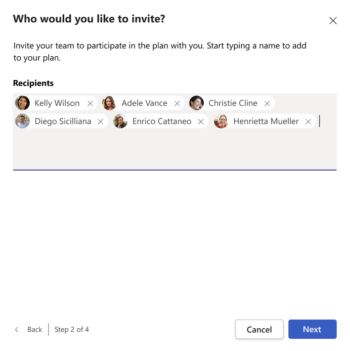

# Shared focus plan

*To start a shared focus plan, you need to have a Viva Insights premium license. For more information, refer to [Plans and environments](../overview/plans-environments.md). A Viva Insights license isn't required to participate in a shared focus plan.*

>[!Note]
>This article talks about a focus plan shared between a group. If you just want to block out time on your calendar to focus, refer to our [Focus plan documentation](../use/focus-plan.md).

A shared focus plan in Microsoft Viva Insights helps your group book daily, uninterrupted time to get work done. This plan also helps build shared productivity habits with your coworkers.

## For plan organizers

### To create a shared focus plan

1. In the **Wellbeing** tab, go to the **Take action to improve your wellbeing** section.
2. Find the **Start a shared focus plan** card and select the **Set up plan** button.

   

3. When prompted, select **Next**.
1. In **Who would you like to invite?**, add people you want to invite. You can start typing names in the search box. When you’re done, select **Next**.
   
    

1. In **Customize your shared focus plan**, select the number of hours per day, the general time of day, and whether to silence notifications, and then select **Next**.

    

6. When prompted, you can either accept or edit the draft note or delete it, and then select **Send invitation**.

    
<!--this doesn't have an action button-->
After you send the invitation, Viva Insights sends notifications to the recipients. These notifications remain available to your recipients for eight weeks or until you cancel the shared focus plan. <!--verify the 8 weeks info-->

## For plan recipients

### To join a shared focus plan

If someone invited you to join a shared meeting plan, you'll get an invitation in Teams. 

1. Select the notification.

2. When you select **Join plan** in the **Shared focus plan** invitation, one of the following occurs. Or if you select **Dismiss**, it cancels the invitation and suppresses any reminders of it.

   * If you were _not_ already enrolled in a focus plan, you'll see the **All done** message and skip the rest of these steps.
   * If you _were_ already enrolled in a focus plan, go to the next step.

3. In **Select focus plan settings**, you can do the following: 

   * To switch from your individual plan to the shared plan, select **Join plan**.
   * To switch and join the shared plan but first change some of the settings, select **Edit settings**. You can then change the number of hours per day, the general time of day, and whether to silence notifications, and then select **Join plan**.
   * To keep your current (individual) focus plan, close this page by selecting the **X**. The invitation will no longer be visible, and your current focus plan will be unaffected.

4. On the **All done** page, select **Done**. You have now successfully joined your team’s shared focus plan.

## For all participants

### Leave a plan

To leave a shared focus plan:

1. Select the ellipses (...) at the top of any page in Viva Insights, then select **Settings**.
1. 

>[!Note]
>When you leave a shared focus plan, you don't remove anyone else from it. Other plan participants stay in the focus plan until they leave it.

If you have a personal focus plan, you'll still be enrolled in it even after you leave the shared focus plan. To leave the personal focus plan or change its settings, refer to our [Focus plan documentation](../use/focus-plan.md#to-change-or-leave-your-focus-plan).

### Check the details of your shared focus plan

To check the details of your new plan, open the **Home** page of Viva Insights. The **Shared focus plan** details will be included in the **Plans** section:

   

If you have a Microsoft Viva Insights license with an applicable [service plan](../overview/plans-environments.md), you'll also see the plan details on the **My team** page.

If you are the creator of a shared focus plan, you'll also see details in the **Plans** section of the Viva Insights **Home** page:

   

### Concepts

To learn about how focus time is scheduled, refer to [Focus plan](../use/focus-plan.md#concepts)
