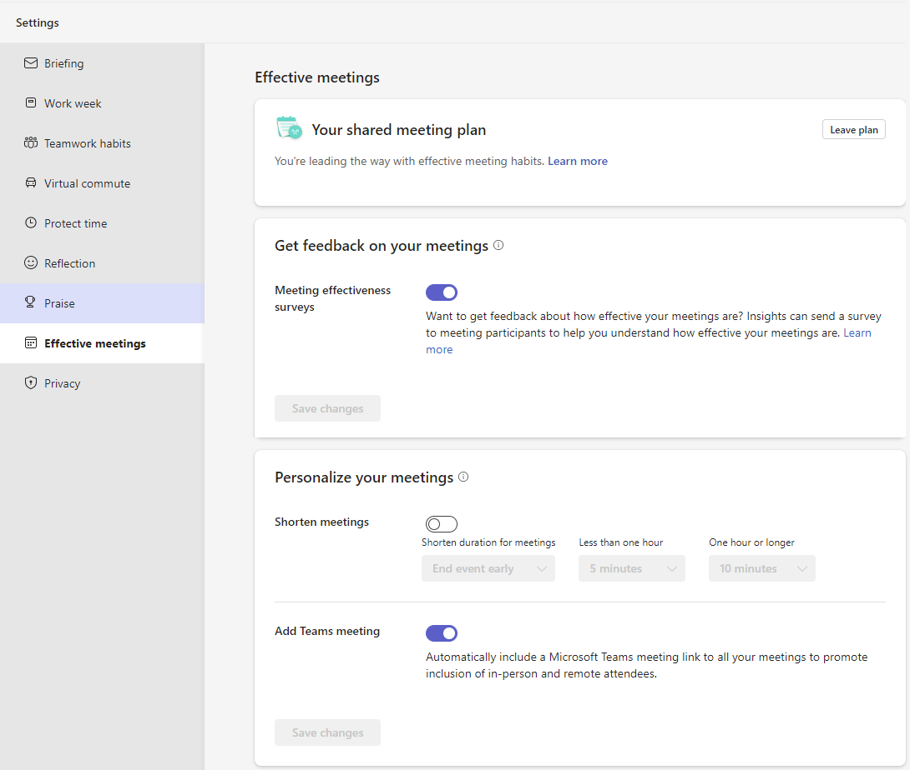
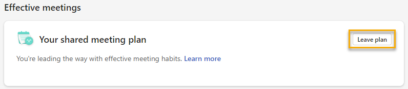

# Shared meeting plan

<!--shared or effective for Productivity tab?-->

>[!Note]
> We're in the process of rolling out these changes to customers.

Shared meeting plans in Microsoft Viva Insights help you promote healthy meeting norms with your colleagues. With shared meeting plans, you can automate the following settings to promote research-backed meeting best practices:

* **Meeting duration** – Give people a breather between events by starting meetings a few minutes late or ending them a few minutes early.
* **Teams link** – Include a Microsoft Teams meeting link to all your meetings so people can attend remotely.
* **Feedback** – Find out how your meetings are doing by sending participants meeting effectiveness surveys.

## For plan organizers

As long as you have a premium Viva Insights subscription, you can create and share a meeting plan. You don't have to be a manager. In this section, we talk about how to create and share a plan with people you choose.

### To create and share a meeting plan

To create a shared meeting plan:

1. Go to the **Productivity** tab in the Viva Insights app in Teams or on the web.
1. In the **Recommended for you** section, find the **Promote healthy meeting norms** card and select **Get started**.

Learn a bit more about how a shared meeting plan can help. Then select **Get started**.

First, you'll set some meeting norms that affect how your meetings appear on calendars and in Teams. Then, you'll invite participants to join your plan.

#### Create meeting norms

* **Automatically shorten the duration of all meetings** – Choose whether you want events to automatically start late or end early, then pick by how many minutes. You'll set a default number of minutes for meetings that are less than one hour and for meetings that are one hour or longer. When you automatically shorten meetings, you promote wellbeing for all participants by allowing breaks between back-to-back events.

* **Automatically include a Microsoft Teams meeting link** – Select whether every meeting invite includes a link for an online meeting in Microsoft Teams. Adding Teams links promotes hybrid meetings by including both remote and in-person attendees.

* **Get feedback from your meeting participants** – Activate meeting effectiveness surveys for plan participants who have a Viva Insights subscription. Meeting effectiveness surveys promote a healthy meeting culture by providing aggregated feedback to meeting organizers on what’s going well with and what you could improve in future meetings.

When you're done setting your meeting norms, select **Next**.

>[!Important]
>You'll be able to make changes to your personal settings after you start your plan. However, if you want to make changes for everyone, you'll need to leave the plan and start a new one.

#### Invite participants

Type in names to the **Recipients** field. When you're done adding recipients, you're ready to send them an invitation to join your plan. Select **Confirm** to send.

If you have one or more people reporting to you, we'll automatically fill in your team members. You can then add or remove people as you need to.

After they get your invitation, recipients can accept or decline it.

## For plan recipients

Anyone can join and participate in a shared meeting plan. If you don't have a premium Viva Insights subscription, Viva Insights won't display any settings to request meeting feedback. 

### To join a shared meeting plan

If someone invites you to join a shared meeting plan, you'll get an invitation in Teams. If you want to join the plan and like the settings the organizer has configured, select **Join**. If you want to edit settings for your meetings before joining, select **Edit**.

If you're already part of a shared meeting plan, Viva Insights applies the settings from the plan you were just invited to, then summarizes the changes under **Changes to your plan**. If you're OK with these changes and want to continue joining the plan, select **Join**. If you want to make changes before joining, select **Edit**.

## For all plan participants

After you're part of a shared meeting plan, either as an organizer or a participant, you’ll see that reflected on your **Effective meetings** tab under the **Shared meeting plan** section. 

### To edit a shared meeting plan

Anyone who's part of a plan can make changes to their personal settings. Select **Edit** on the **Your shared meeting plan** card, which takes you to your **Settings** page.

<!--confirm final design-->

To change whether you send out feedback surveys about your meetings, toggle the switch under **Get feedback on your meetings**. You won't find this setting if you don't have a premium Viva Insights subscription.

To start or stop automatically shortening meetings, toggle the switch under **Shorten meetings**. If you're turning on the feature, use the dropdown menus to set how early you want to end your meetings or how late you want to start them.

To add or stop adding Teams links to meetings, toggle the switch under **Add Teams meeting**.

>[!Note]
>Changes you make here only apply to your settings and won't change any other plan participants' settings. If you organized the plan and want to make changes that apply to everyone, you'll need to leave the plan, create a new one, and re-invite participants.

### To leave a shared meeting plan

If you want to leave a plan, either [**Edit** the plan](#to-edit-a-shared-meeting-plan) from the **Effective meetings** tab or go to your **Settings** page and select **Effective meetings**.

Within **Your shared meeting plan**, select **Leave plan**.

After you select **Leave plan**, pick whether you want to keep any of these meeting-related settings from your plan:

* Automatically shorten duration for all meetings
* Automatically include a Microsoft Teams meeting link
* Get feedback from your meeting participants

Select **Confirm**. Your settings apply right away. 