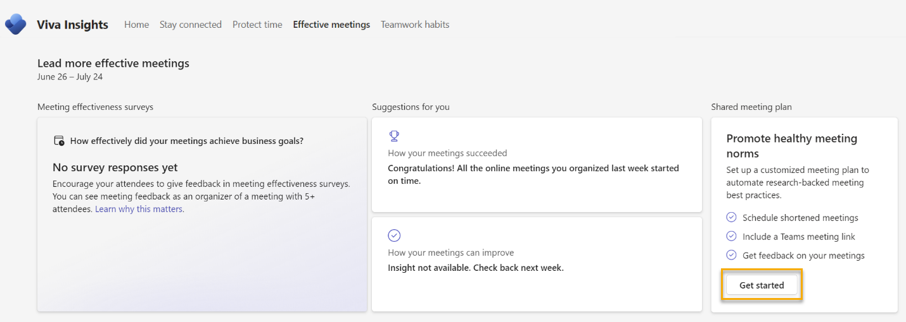

# Shared meeting plan

Shared meeting plans help you promote healthy meeting norms with your colleagues. You can configure it in the following ways to automate research-backed meeting best practices:

* Automatically shorten duration of all meetings (start late or end early) to take a breather between back-to-back meetings and promote team wellbeing.
* Automatically include a Microsoft Teams meeting link to all your meetings to promote inclusion of in-person and remote attendees.
* Get feedback from your meeting participants through meeting effectiveness surveys.

## For plan organizers

As long as you have a premium Viva Insights subscription, you can create and share a meeting plan. You don't have to be a manager. In this section, we talk about how to create and share a plan with people you choose.

### To create and share a meeting plan

To create a shared meeting plan, go to the **Effective meetings** tab in the Viva Insights app in Teams or on the web. Then, select **Get started** in the **Shared meeting plan section**.

Learn a bit more about how a shared meeting plan can help. Then select **Get started**.

First, you'll set some meeting norms that affect how your meetings appear on calendars and in Teams. Then, you'll invite participants to join your plan.

#### Create meeting norms

* **Automatically shorten the duration of all meetings**: Choose whether you want events to automatically start late or end early, then pick by how many minutes. You'll set a default number of minutes for meetings that are less than one hour and for meetings that are one hour or longer. When you automatically shorten meetings, you promote wellbeing for all participants by allowing breaks between back-to-back events.

* **Automatically include a Microsoft Teams meeting link**: Select whether every meeting invite includes a link for an online meeting in Microsoft Teams. Adding Teams links promotes hybrid meetings by including both remote and in-person attendees.

* **Get feedback from your meeting participants**: Activate meeting effectiveness surveys for plan participants who have a Viva Insights subscription. Meeting effectiveness surveys promote a healthy meeting culture by providing aggregated feedback to meeting organizers on what’s going well with and what you could be improve in future meetings.

When you're done setting your meeting norms, select **Next**.

#### Invite participants

Type in names to the **Recipients** field. When you're done adding recipients, you're ready to send them an invitation to join your plan. Select **Confirm** to send.

After they get your invitation, recipients can accept or decline it.

## For plan recipients

Anyone can join and participate in a shared meeting plan. If you don't have a premium Viva Insights subscription, Viva Insights won't display any settings to request meeting feedback. 

### Join a shared meeting plan

If someone invites you to join a shared meeting plan, you'll get an invitation in Teams. If you want to join the plan and like the settings the organizer has configured, select **Join**. If you want to edit settings for your meetings before joining, select **Edit**.

If you're already a part of a shared meeting plan, Viva Insights applies the settings from the plan you just joined, then summarizes the changes under **Changes to your plan**. 

## For all plan participants

### Edit a shared meeting plan