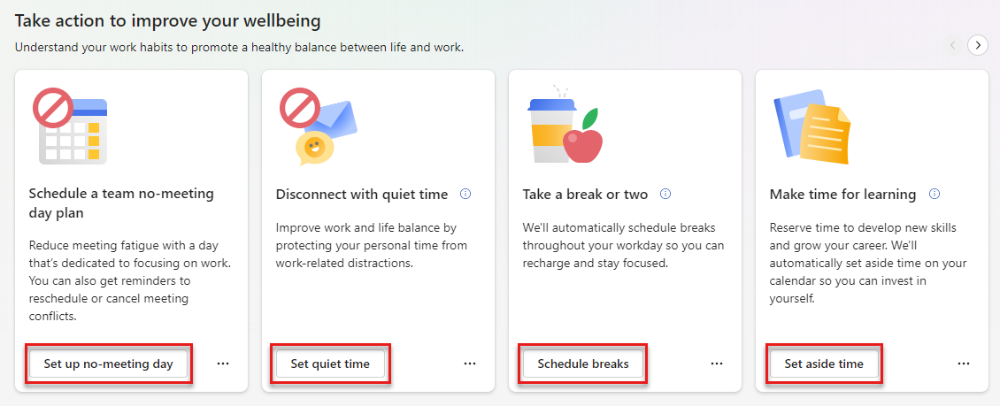

# Time management features in Viva Insights

*Applies to: users with Viva Insights subscriptions*

Like focus plans, Viva Insights can help you protect time on your calendar to:

* Take scheduled breaks.
* Learn.
* Catch up on messages.

When you start using a time management feature in Viva Insights, we automatically find time on your calendar and book time for the feature you picked--for example, catching up on messages. We book time on your calendar in the same way we do for focus plans. To learn more about automatic booking, refer to our [focus plan documentation](../use/focus-plan.md#concepts).

>[!Note]
>You can also find these features in the Briefing email you get on Fridays. [Learn more about wellbeing plans in Briefing](../briefing/be-wellbeing-plans.md).

## To start using time management features

To start using time management features through the Viva Insights app:

1. Go to the **Take action to improve your wellbeing** section of your **Wellbeing** tab. 
1. Pick a topic that suits your goals, and then select the action button at the bottom of the card. For example, if you want to reserve some time each day to learn a new skill, you'd select the **Set aside time** button on the **Make time for learning** plan card.
    >[!Tip]
    > To find all your options, make sure you use the arrows above the rightmost card.

    

1. A confirmation message lets you know that Viva Insights has booked time on your calendar. To change which days and times you set aside, select the **Change settings** link.

## To edit or leave a plan

To edit a plan after joining it:

1. Select **Settings** in the **Protect time** tab. 
1. Edit your settings.
1. Save.

If you want to leave the plan, select the **Leave plan** button, located to the right of to the plan you want to leave.

 

