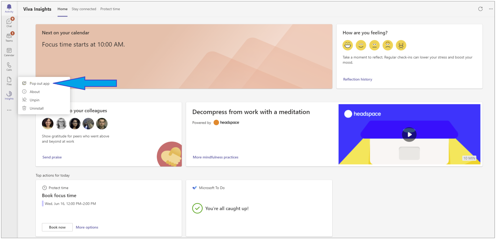

---

title: Viva Insights Headspace 
description: Use the Headspace feature in Microsoft Viva Insights app
author: madehmer
ms.author: helayne
ms.topic: article
ms.collection: viva-insights-personal
ms.localizationpriority: medium 
ms.service: viva
ms.subservice: viva-insights
manager: helayne
audience: user

---

# Mindfulness content from Headspace

>[!NOTE]
>The Headspace experience is available to you if your language in Teams is set to English, French, German, Portuguese, or Spanish.

Viva Insights has introduced a curated set of guided meditations and Focus music from Headspace. Reach these resources on the [Home](viva-insights-home.md) page to help you start your day grounded, relax your mind before a big presentation, or find focus before starting an important project. <!-- VERIFY WITH ANJI BUT KEEPING THIS OUT FOR NOW: A Headspace meditation to mindfully wrap up the day will also be integrated into the virtual commute. --> In just a few minutes a day, meditation and mindfulness with Headspace can help you decrease stress and increase focus.

## Start a guided meditation

Anytime you want, you can start a guided meditation that's been designed for the current time of day:

1. Open the **Home** page of Microsoft Viva Insights:

   

2. To start the Headspace exercise, select the 'Play' button on the **Headspace** card:

   

<!--  -->

3. (Optional) Browse through a curated set of meditations that are designed to fit different scenarios within the flow of your day. To see your options, open the **Practice mindfulness** page by selecting **More mindfulness exercises**.

4. Under **Practice mindfulness**, select a meditation option in the **Guided meditations** area or a musical option in the **Focus music** area:

   

## Run Headspace in the background

You can open and run Viva Insights in a new window. This lets you play Headspace meditations and Focus music while continuing your collaboration in Teams.

1. Locate the pinned Insights app on the left navigation pane of Teams.

2. Right-click the Insights icon.

3. Select **Pop out app**.

   

   This opens a new window in which the Insights app is running.

4. In this second window, select **More mindfulness exercises** and then start a Headspace meditation or Focus music as described in [Start a guided meditation](#start-a-guided-meditation).

5. Optionally, minimize the Insights window that you just opened. You can continue working in Teams in the original Teams window.

## Frequently asked questions

#### Q1. I have questions about meditation and other best practices. Where can I look for answers?

**A1.** Check out the Headspace app's [Questions about meditation](https://www.headspace.com/meditation-101/faq) page.

## Related topics

[Viva Insights Home page](viva-insights-home.md)
