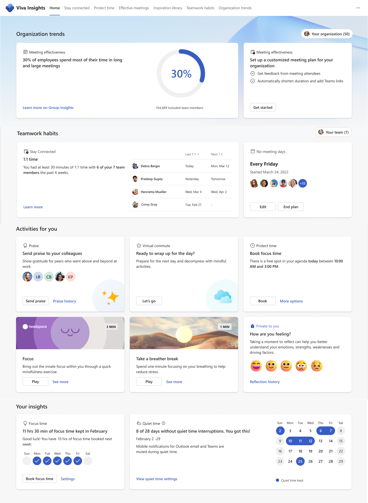
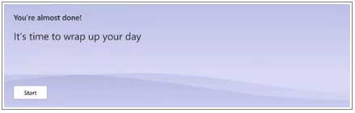

---

title: Viva Insights Home page in Teams
description: About the Home page in the Microsoft Viva Insights app
author: madehmer
ms.author: helayne
ms.topic: article
ms.collection: viva-insights-personal
ms.localizationpriority: medium 
ms.service: viva
ms.subservice: viva-insights
manager: helayne
audience: user
---

# Viva Insights Home in Teams

In Microsoft Teams, select **Insights** (left app bar) to open the **Home** page for the Microsoft Viva Insights app:

The Home page makes it easy to start the other Viva Insights features. You can reach some features on the top menu and others within the Home page.

You can also open a web-based Viva Insights at [insights.viva.office.com](https://insights.viva.office.com). You can also open Viva Insights through the Microsoft 365 App Launcher menu at [office.com](https://www.office.com).

## On the top menu

When you select a feature on the top menu, you'll leave the Home page.

* [Stay connected](viva-insights-stay-connected.md)
* [Protect time](viva-insights-protect-time.md)
* [Inspiration library](inspiration.md)

## On the Home page

You use the following features on the Home page with the on-screen instructions.  

* [Up-next card](#up-next-card) - View the card and its message.
* [Reflect](viva-insights-reflect.md) - In **How are you feeling?**, select a representative image. <!--In the following cases, you can take action directly on a feature's card on the Home page without needing to open the feature.  -->
* Send [Praise](viva-insights-praise.md) - In **Send praise to your colleagues**, select **Send praise**.
* [Guided meditations from Headspace](#take-a-break) - In the **Headspace** card, select the 'Play' button. (Alternatively, you can select from among **More mindfulness exercises**.)
* [Take a break](#take-a-break) - In **Take a break**, select **Start**.

>[!NOTE]
>Headspace is only available if you have your language is set to English in Teams. Additional languages will be supported soon. However, the **Take a break** option is available even if you don't have your default language set to English.

For the next three cards, you can take a quick action while remaining on the Home page. Alternatively, you can open the full feature (and leave the Home page) by selecting another option on the card &ndash; such as **More insights**.

* [Stay connected](viva-insights-stay-connected.md) &ndash; Follow up on an action shown in **Stay connected**, such as to book a 1:1 with a specific person.
* [Protect time](viva-insights-protect-time.md) &ndash; Take action on what's shown in **Protect time**, such as to book focus time for tomorrow.
* [Inspiration library](inspiration.md) &ndash; See inspirational articles within specific themes, such as wellbeing, culture, impact, and resilience.
* [Microsoft To Do](#microsoft-to-do) &ndash; Take action on what's shown in your **To Do** list, such as to book a meeting.

## Up-next card

On the Home page, the top card shown in the upper left alerts you in various ways based on the time of day and the events in your calendar. For example, if your lunch time (as configured in [the Outlook add-in](../use/use-the-insights.md#set-lunch-hours)) is approaching, it'll let you know how soon:

The card's color changes to alert you of other events, such as scheduled focus time, meetings, the switch from morning to afternoon, and for the end of your scheduled workday or [Virtual commute](viva-insights-virtual-commute.md):

## Mindfulness content from Headspace

This feature offers a curated set of guided meditations and focus music from Headspace. For more information, see [Headspace](viva-insights-headspace.md).

## Take a break

This feature offers a one-minute "breathing break" animated experience that you can use as often as you want during your workday. To start it, select **Start**.

## Microsoft To Do

This card shows tasks that are in your **To Do** list that are due today or for which a reminder for today has been set. Select **All To Do tasks for today** to open the Tasks app in Teams. For more information, see [Microsoft To Do](https://to-do.microsoft.com/tasks/).

## Related topics

[Viva Insights introduction](viva-teams-app.md)
