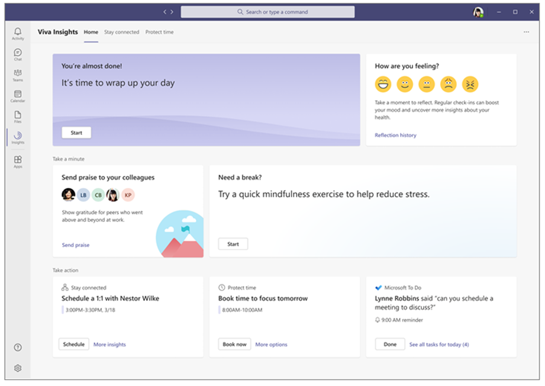
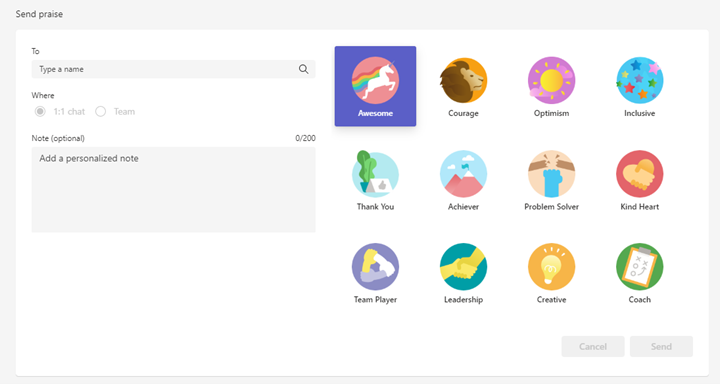
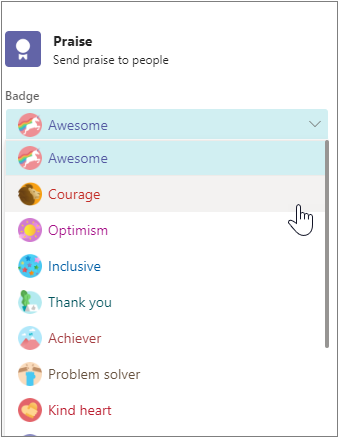
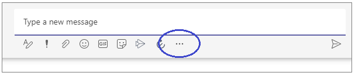
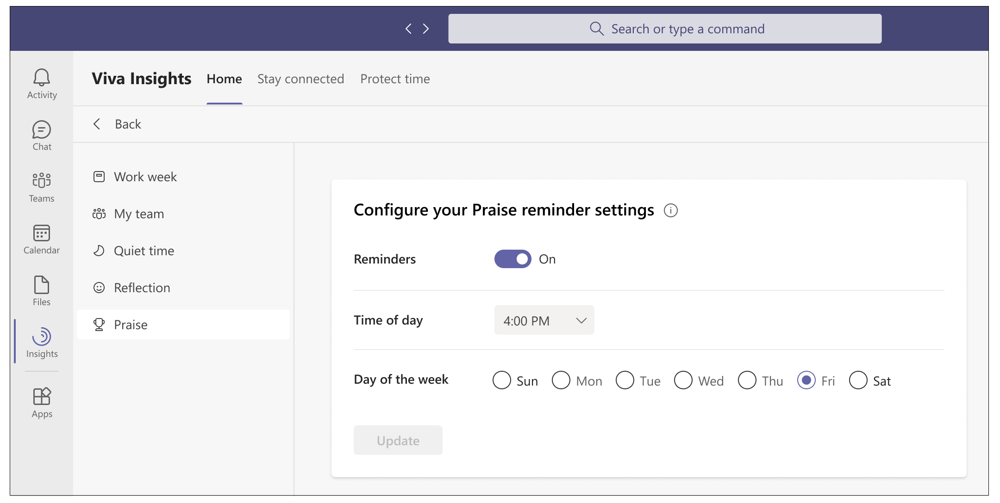
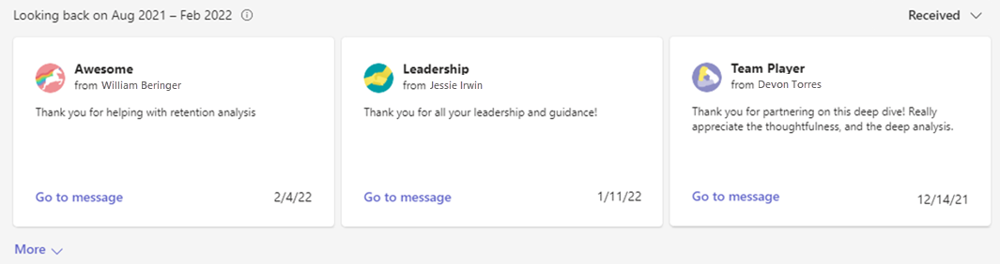

---

title: Praise with Viva Insights
description: Use the Praise feature in the Microsoft Viva Insights app
author: madehmer
ms.author: helayne
ms.topic: article
ms.collection: viva-insights-personal
ms.localizationpriority: medium 
ms.service: viva
ms.subservice: viva-insights
manager: helayne
audience: user
---

# Praise in Viva Insights

You can use this feature in the Microsoft Viva Insights app in Microsoft Teams to recognize the contributions of your employees and coworkers. Praise messages are shown as notifications in Teams. You can have a praise message delivered in a private chat, or for wider recognition, in a Teams channel conversation.

You can also set reminders to send acclaim on a regular basis to your coworkers and view your Praise history. See [Set a praise reminder](#set-praise-reminders) and [Praise history](#praise-history) for details.

>[!Note]
>The praise app is a messaging extension of Microsoft Teams. For more information, see [Messaging extensions](/microsoftteams/platform/messaging-extensions/what-are-messaging-extensions).

<!-- THIS LINK NEEDS TO GO HERE: [Messaging extensions](https://docs.microsoft.com/microsoftteams/platform/messaging-extensions/what-are-messaging-extensions) -->

## Send praise

To send praise, open the praise feature in one of the following ways:

* The Viva Insights [Home](#send-praise-from-the-viva-insights-home-page) page
* The [content pane](#send-praise-from-the-teams-content-pane-using-the-praise-messaging-extension) of Teams

### Send praise from the Viva Insights Home page

1. On the Home page, select the **Send praise to your colleagues** card, which is located on the **Home** page at center left:

   

   <!-- VERIFY THAT YOU CAN CLICK ANYWHERE ON THE CARD, NOT JUST THE IMAGES OR WORDS. -->

2. When the Praise page opens, the badge defaults to **Awesome**. If you’d like to send a different badge with your praise message, select a new choice:

    

3. Add the name of the person you want to praise.

4. Choose the visibility of this praise. To make this choice, you must first decide whether you want to keep the praise private between you and the recipient or to make it visible (as a form of kudos, for example) to everyone in a Teams channel:

   * To make the praise message appear privately in a 1:1 chat between you and the recipient, select **1:1 chat**. This option is available only if you and the recipient have already participated in a Teams chat together. <!--  OUT FOR NOW: If you are sending praise to more than one person, you can use this option only if you've had 1:1 chats with each of the recipients.-->

   * To let all the members of a Teams channel or subchannel see the praise message, select **Teams channel**. This option is available only if all of the praise recipients are participants in the Teams channel or subchannel that you choose.

5. (Optional) In the **Note** field, add a personalized note.

6. (Optional) Select **Preview**.
   * Inspect your praise on the left panel. If you need to edit it, select **Edit**. Change the badge choice, the recipients list, or the personalized note.

   

7. When it's ready to go, select **Send**.

### Send praise from the Teams content pane using the Praise messaging extension

In Viva Insights, you can always send praise directly from the [**Home** page](#send-praise-from-the-viva-insights-home-page), which does not require installing the Praise messaging extension.

1. Below the **Type a new message** field, select **Praise**:

   

   (If the Praise feature does not appear, follow the steps in [Find the Praise feature](#find-the-praise-feature).)

2. When the Praise pop-up window opens, the badge defaults to **Awesome**. If you want to send a different badge with your praise message, select a new choice:

   

3. If you’re in a group chat or channel, add the name of the person you want to praise. In a 1:1 chat, the name defaults to the other person in the chat.

4. (Optional) In the **Note** field, add a personalized note of up to 500 characters.

5. (Optional) Select **Preview**.

6. When it's ready to go, select **Send**.

### Find the Praise feature

1. Below the **Type a new message** field, select more options (the ellipsis):

   

2. In the **Find an app** field, start typing "praise" and then select the **Praise** app to open it.  

   

   The **Praise** app opens.

3. Continue with the steps in [Send praise from the Teams content pane using Praise messaging extension](#send-praise-from-the-teams-content-pane-using-the-praise-messaging-extension).

## Set praise reminders

Remind yourself to send praise to coworkers. Praise reminders are always recurring; this helps you build the habit of letting coworkers know that you appreciate their contribution.

>[!Note]
>
>* You can schedule praise reminders for any day of the week, including days not configured as workdays in your Outlook settings.
>* The time you select will apply to every day on which you'll see reminders. You cannot set different times for different days of the week.
>* The reminder will not arrive at exactly the scheduled time, but within 15 minutes on either side of it. For example, if your reminder is scheduled for 5:00, the reminder could show up anytime between 4:45 and 5:15.

You can set praise reminders either on the [**Settings** page](viva-teams-app-settings.md) or on the **Home** page, as described here:

1. Select the **Send praise to your colleagues** card, which is located on the **Home** page at center left.
2. In the praise reminder settings, select the time of day and day of the week, and then move the **Reminders** slider to **On**:

   

   On the day of the week and time that you configured, the Viva Insights app will remind you to send praise. Selecting the reminder notification opens the Praise feature, after which you can continue with the steps in [Send praise from the Viva Insights Home page](#send-praise-from-the-viva-insights-home-page).

## Praise history

In the **Looking back** section on the **Praise** page, you can see the history for as many as 24 messages that you have either sent or received over the last six months. This history includes any praise sent or received through this page and through the Teams messaging extension.

This history includes related praise details, such as the type of badge, who the sender and receiver were, the date and time it was sent, and so on. You can also view the original praise in the Teams chat by selecting **Go to message** within the detailed view of the badge.

You can also access your personal praise history by selecting **Review your praise history** in the **Praise** section that shows within your Teams channel **Posts**. This link only shows you your own personal history that nobody else can see.

## Upcoming changes

Starting in February 2022, what's currently available for educational praise badges will change. There are few badges that will no longer be available, such as for Self-awareness and Self-management.

The **Create your own badges** option will also no longer be available as of February 2022.

However, you'll continue to be able to view the history of any praise you sent or received in the past six months with any of these newly unavailable badges or options.

## Related topics

[Viva Insights introduction](viva-teams-app.md)

<!-- THIS CONTENT WAS ORIGINALLY FROM https://support.microsoft.com/en-us/office/send-praise-to-people-50f26b47-565f-40fe-8642-5ca2a5ed261e?ui=en-US&amp;rs=en-US&amp;ad=US -->
