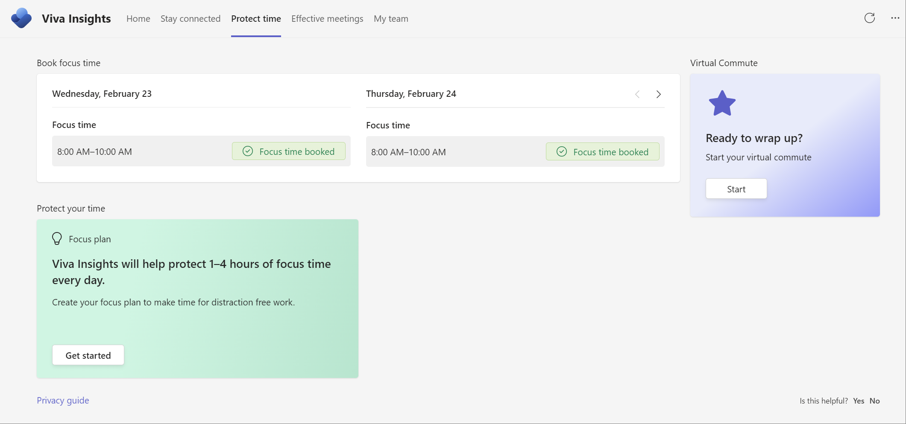

---

title: Protect time with Viva Insights
description: Use the Protect time feature in the Viva Insights app  
author: madehmer
ms.author: helayne
ms.topic: article
ms.collection: viva-insights-personal
ms.localizationpriority: medium 
ms.service: viva
ms.subservice: viva-insights
manager: helayne
audience: user
---

# Protect time

You can use this feature in the Microsoft Viva Insights app in Microsoft Teams to protect your time in the following ways:

* [Schedule focus time](#schedule-focus-time) for future workdays.
* [Start a virtual commute](viva-insights-virtual-commute.md) to end your day.

>[!Note]
>The images on this page represent the latest experience as part of a rolling release with an expected general availability by the end of April 2022.

## Schedule focus time

Research shows that it can take an average of 23 minutes to refocus on a task after a distraction. Constant distractions during focused work can cause higher stress and lower productivity. Further, it is difficult to focus on challenging work when you only have small chunks of time available between meetings or are distracted by incoming emails and chats. Blocking a few hours every day to focus without interruptions will help you make progress on your important tasks and projects.

Microsoft Viva Insights can help you protect time for focused work and minimize notifications (and thus distraction) by Teams and Skype for business chats and calls during your focus time.

You can schedule focus time on the **Protect time** page, as follows:

* **Book focus time** - Use this section to reserve time slots for focused work during the next two or more days.

  * After you select **Book time**, you'll see **Focused time booked**. If you see **Review meeting conflict**, select it to view your calendar and resolve the conflict.
  * If you have selected **Book time** and decide that you don’t need it anymore, you can delete the focus time block from your calendar.
  * Before booking time, you can select **Edit** (the pencil icon) to change the name of the focus time block, which automatically updates the subject for the scheduled focus time.

* **Focus plan** - Within **Focus plan**, select **Get started** to create a focus plan.

  * If this is not your first time using a focus plan, you'll automatically be set up with the default settings. Then based on the prompt, you can then select **Edit settings** to make any changes.
  * If this is your first focus plan, you'll be prompted to select the following options.

    * **Do this later** skips the prompts and simply enrolls you in a default plan based on your settings.
    * How much focus time do you want to schedule each day.
    * Do you prefer morning or afternoon hours for scheduled focus time.
    * If you'd like Teams to silence notifications during scheduled focus time.

At any time after the initial setup, you can confirm or change any of the options or leave the plan by selecting **Focus plan preferences** in **Settings** (gear icon) within the Viva Insights in Teams app.

## Related topics

* [Viva Insights introduction](viva-teams-app.md)
* [Virtual commute](viva-insights-virtual-commute.md)
