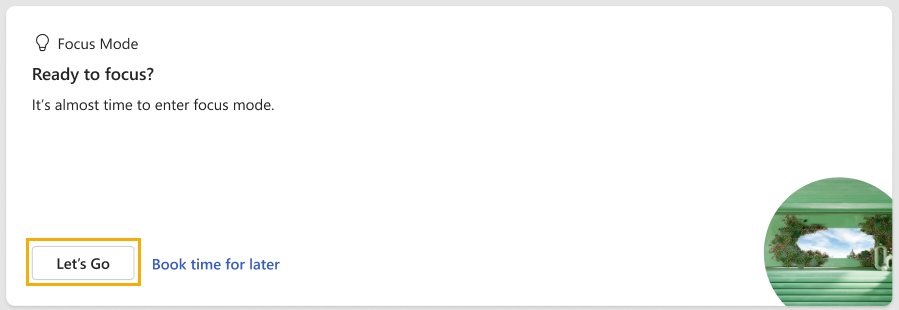
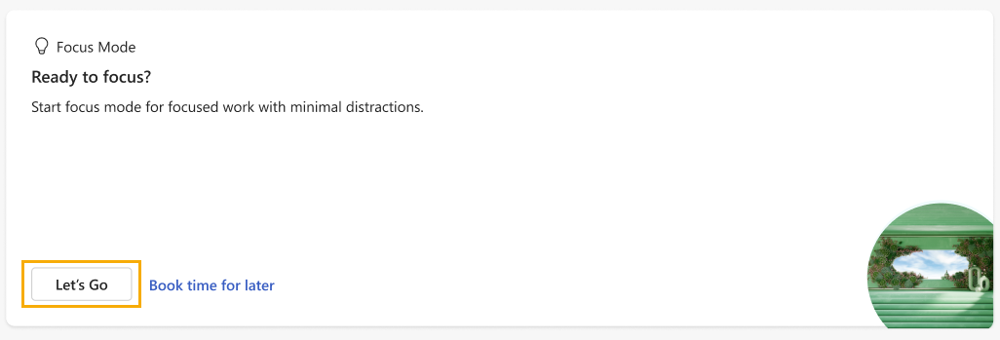
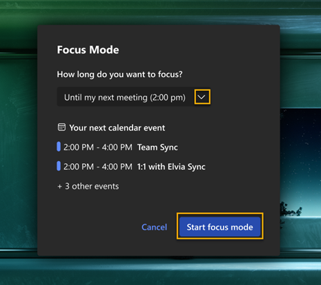
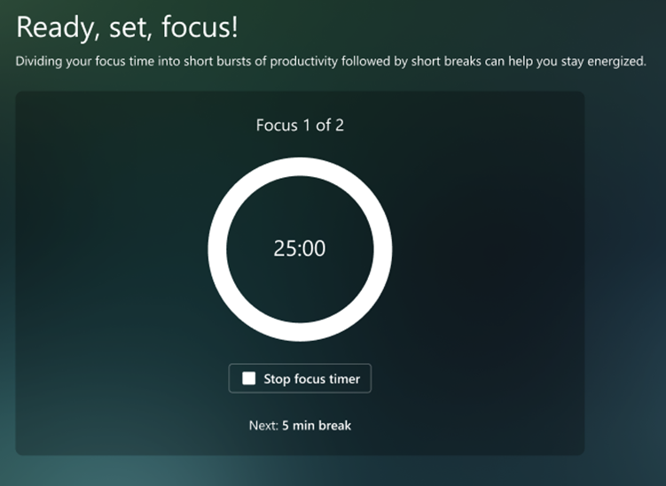
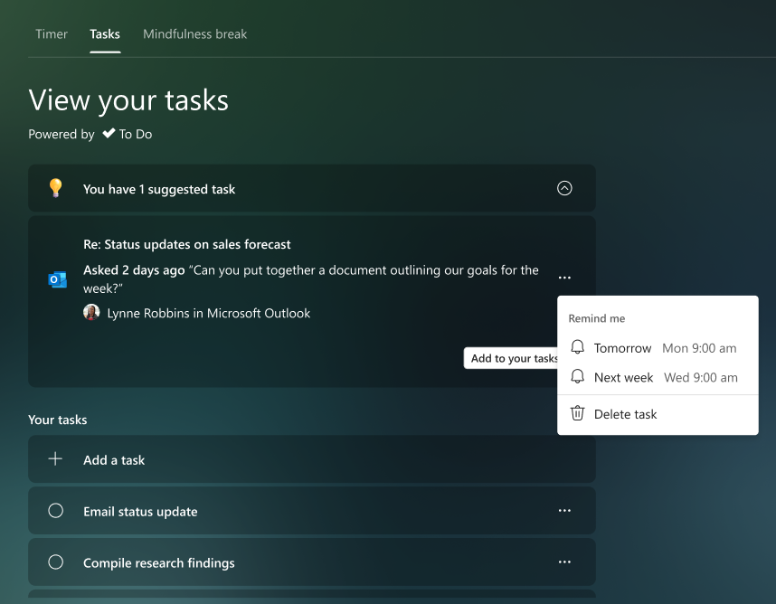
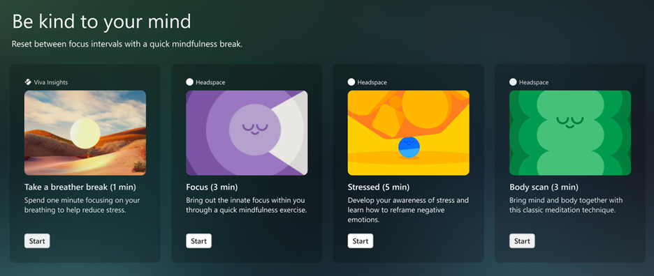
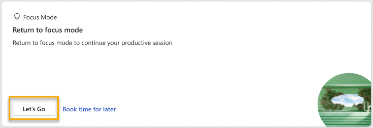
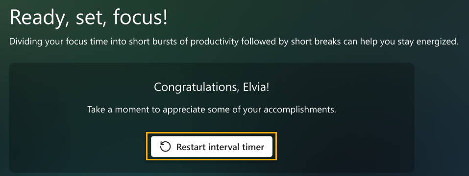

---

title: Protect time with Viva Insights
description: Use the Protect time feature in the Viva Insights app  
author: lilyolason
ms.author: v-lilyolason
ms.topic: article
ms.collection: viva-insights-personal
ms.localizationpriority: medium 
ms.service: viva
ms.subservice: viva-insights
manager: anirudhbajaj
audience: user
---

# Protect time with Viva Insights

You can use this feature in the Microsoft Viva Insights app to protect your time in the following ways:

* [Schedule focus time](#schedule-focus-time) for future workdays.
* [Configure quiet time](#configure-quiet-time) to disconnect from work and recharge.
* [Start a virtual commute](viva-insights-virtual-commute.md) to end your day.

:::image type="content" source="images/protect-time-small.png" alt-text="Screenshot that shows the Protect time page." lightbox="images/protect-time1.png":::

## Schedule focus time

Research shows that it can take an average of 23 minutes to refocus on a task after being interrupted. Constant distractions during focused work can cause higher stress and lower productivity. It is difficult to focus on challenging work when you only have small chunks of time available between meetings or are distracted by incoming emails and chats. Blocking a few hours every day to focus without interruptions can help you make progress on your important tasks and projects.

Viva Insights can help you protect time for focused work and minimize notifications (and thus distraction) from Teams chats and calls while focusing.

### Book focus time or a plan

You can schedule focus time on the **Protect time** page, as follows:

* **Book focus time** – Use this section to reserve time slots for focused work during the next two or more days.

  * After you select **Book time**, you'll see **Focused time booked**. If you see **Review meeting conflict**, select it to view your calendar and resolve the conflict.
  * If you have selected **Book time** and decide that you don’t need it anymore, you can delete the focus time block from your calendar.
  * Before booking time, you can select **Edit** (the pencil icon) to change the name of the focus time block, which automatically updates the subject for the scheduled focus time.

* **Focus plan** – Within **Focus plan**, select **Get started** to create a focus plan.

  * If this isn't your first time using a focus plan, you'll automatically be set up with the default settings from your last plan. Then based on the prompt, you can then select **Edit settings** to make any changes.
  * If this is your first focus plan, you'll be prompted to select the following options:

    * **Do this later**, which skips the prompts and simply enrolls you in a default plan based on your settings.
    * How much focus time you want to schedule each day.
    * Whether you prefer to focus in the morning or afternoon.
    * Whether you want a Teams reminder to begin focus mode.
    * Whether you want Teams to silence notifications during your scheduled focus time.

At any time after the initial setup, you can confirm or change any of the options or leave the plan by selecting the ellipses (**...**) at the top right of the Viva Insights app, selecting **Settings**, then selecting **Protect time** from the left pane.

### To use focus mode

Focus mode intersperses short breaks within your focus time to help you stay on-task and to boost productivity. Read on to learn how to start and use this feature.

#### Start a focus session

##### Scheduled focus session

If you pre-booked time to focus—either through a plan or by booking earlier —you’ll get a notification on the **Focus Mode** card.

If you said you wanted a reminder to start your focus session during setup, you’ll also get a Teams notification.

To enter focus mode, select either the Teams notification or **Let’s Go** on the **Focus Mode** card. If you don’t select one of these notifications, your calendar will still show the **Focus time** event, your Teams status will update to **Focusing**, and you won’t get Teams notifications unless they’re from priority contacts you set.

##### On-demand focus session

If you have some time to focus and you want to start a focus session on-demand, select **Let’s Go** on the **Focus Mode** card.

Pick how long you want to focus, then select **Start focus mode**.

#### Use features during your focus session

 When you’re in focus mode, Viva Insights shows you three sections: **Timer**, **Tasks**, and **Mindfulness break**.

>[!Note]
> If you want to keep using Teams while you’re in focus mode, select the ellipses at top-right, then select **Pop out app**.

##### Timer

When you launch focus mode, you’ll arrive at the **Timer** section. Here, your focus time is displayed in minutes, which correspond to the time you set through your plan, or when you booked time. If you need to increase or decrease this time, select the arrows. If you increase time, the app asks whether you want to extend your scheduled focus time. You can select the **Add 15 minutes** button to add 15 more minutes to your scheduled time, or you can add another amount by selecting the button’s down arrow.
 
To skip automatically scheduled breaks, select the box next to **Skip breaks**. 
To adjust other settings, like sounds and how long breaks and focus intervals last, open the **Timer settings**.

When you’re ready to start your timer, select the **Start focus timer** button. You can stop the focus timer whenever you need to.

##### Tasks

You can use the **Tasks** section to help direct your work during your focus session. **Tasks** displays existing tasks from Microsoft To Do, which are either due today or have a reminder set for today.

In addition to viewing your existing tasks, you can:

* **Add a new task.** Below **Your tasks**, select **Add a task**.
* **Add a suggested task surfaced from Outlook or Teams.** If To Do notices a potential task in your chats or emails, a notification appears above **Your tasks**. Select the down arrow to expand the message. If you want to put this task on your To Do list, select the **Add to your tasks** button.
* **Cross a completed task off your list.** Select the circle to the left of the task name, which sends the task to your **Tasks completed today** list. If you want to delete the task from To Do, select the trash can icon to the right of the task name.
* **Set a reminder.** Select the ellipses (…) to the right of the task name, then pick a time you want to be reminded. Reminders appear in your Microsoft To Do list and in your Briefing email, if you’re subscribed to receive Briefing emails. You can also **Edit** and **Delete** tasks from this menu.

##### Mindfulness break

During breaks between focus intervals, you can use the guided videos in Mindfulness break to catch your breath and reset. After you select **Start** beneath a video, you’ll complete a three- or five-minute exercise before your next focus interval starts.

##### Re-enter focus mode

If you leave the focus mode page, you can enter it again through the **Protect time** page. Select the **Let’s Go** button on the **Focus Mode > Return to focus mode** card.

#### To end a focus session

After your timer runs out, a **Congratulations** message appears. If you want to extend your focus time, select **Restart interval timer**.

If you’re done focusing, you can move forward with your day and continue using Teams. Your Teams status will stop showing as **Focusing** and, if they were muted, you’ll start receiving Teams notifications again.

## Configure quiet time

>[!Note]
> Quiet time is currently in private preview. 

Research shows that long hours and the pressure to always be available can lead to employee burnout. The amount of time you spend collaborating outside of business hours can be an indicator that you are at risk of burnout, even as you and your team embrace flexibility.

This feature can help protect your quiet time, which is the hours each day when you want to disconnect from work and recharge. To minimize work related interruptions, you can schedule when you want mobile notifications from Outlook and Teams to automatically be muted.

In the **Quiet time** section on the **Protect time** page, if you haven't scheduled quiet time and are prompted to, select **Let's go**. You are then prompted to select a start and end time for when to mute mobile notifications from Outlook and Teams. In **Mute mobile notifications all day**, you can also select which days to mute notifications for the full 24 hours.

After the initial setup, you'll see the following options in **Configure your quiet time**. You can get here by selecting the ellipses (**...**) at the top right of the Viva Insights app, selecting **Settings**, then selecting **Protect time** from the left pane. You can confirm or change any of the quiet-time options or turn quiet time off at any time.

## Create other plans

*Applies to: users with Viva Insights premium licenses*

In addition to focus plans, Viva Insights can also help you protect time on your calendar for scheduled breaks, learning, and message catch-up time. You can configure these plans to match your needs by setting a target amount of blocked time, and you can also personalize your booking preferences.  

### To create a breaks, learning, or message catch-up plan

You can create your plan in one of two ways: through the Viva Insights app or through the Briefing email you get on Fridays.

#### Through the Viva Insights app

To create a plan through the Viva Insights app, follow these steps:

1. Open the Viva Insights app, select the ellipses in the top-right corner of your screen, then select **Settings**.

    

2. In the **Settings** tab, choose **Protect time** from the left-side menu.

    

3. Review the different plans, then select **Get started** to join the plan or plans that align with your goals.

    

4. Configure the plan(s) to match your needs. For example, in the **Breaks** plan, select how long you want your breaks to be.

    

#### Through the Briefing email

To create a plan through the Briefing email, follow these steps:

1. Select **Book** to reserve time next week to catch up on certain kinds of activities—focus, messages, breaks, or learning.

    

2. When the email asks whether you want Viva Insights to automatically schedule this time for you, select **Yes**.

    

3. Select **Edit settings** to configure your plan to match your needs.

    

### To change or leave a plan

You can update your settings or leave a plan in the Viva Insights app.

To update your settings:

1. Select **Settings** in the **Protect time** tab.
2. Make updates.
3. Select **Save changes**.

    

>[!Note]
> It might take up to 24 hours for your changes to take effect.

To leave a plan after joining it:

1. Select **Settings** in the **Protect time** tab.
2. Select the **Leave plan** button, located to the right of to the plan you want to leave.

    

    

### Learn more about booking time for plans

To learn more about the concepts behind these plans, refer to [Focus plan](../Use/focus-plan.md#concepts).

## Related topics

* [Viva Insights introduction](viva-teams-app.md)
* [Virtual commute](viva-insights-virtual-commute.md)