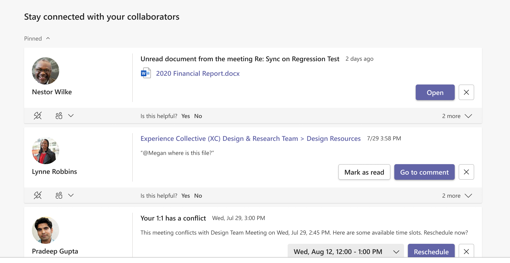

---

ms.date: 02/14/2023
title: Stay connected with Viva Insights
description: Use the Stay connected feature in Microsoft Viva Insights
author: lilyolason
ms.author: v-lilyolason
ms.topic: article
ms.collection: viva-insights-personal
ms.localizationpriority: medium 
ms.service: viva
ms.subservice: viva-insights
manager: anirudhbajaj
audience: user
---

# Stay connected

You can use **Stay connected** in the Microsoft Viva Insights app to stay connected with your collaborators and improve your productivity.

**Stay connected** includes the following insights:

* [Identify and pin important collaborators](#identify-and-pin-important-collaborators)   
* [Stay on top of outstanding task suggestions](#stay-on-top-of-outstanding-task-suggestions) 
* [Catch up on unread documents shared with you](#catch-up-on-unread-documents-shared-with-you) 
* [@Mentions for pinned important contacts](#-for-pinned-important-contacts) 
* [Upcoming meetings that need your RSVP](#upcoming-meetings-that-need-your-rsvp) 
 
#### Identify and pin important collaborators  

You might receive insights from various people but some items might deserve more attention than others. For example, an outstanding task suggestion from your manager or a message from a key customer would likely be of higher priority.  

Based on your collaboration patterns, you can pin some of your contacts as important. All insights from pinned important contacts are shown with higher priority at the top of the page.  

To pin a contact, select the **pin** icon on the bottom left below the contact’s name: 
   
   

To unpin a contact, select the **unpin** icon: 
   
   

#### Stay on top of outstanding task suggestions 

It is easy to lose track of commitments that you've made to your colleagues in email. This insight helps you make sure that nothing falls through the cracks by reminding you of tasks that you've agreed to do. It is based on emails that you've sent and requests from your colleagues during the last 14 days of email communication, and includes: 

* **Commitments** &ndash; Something that you promised or committed to do for someone else in an email 
* **Requests** &ndash; Something that another person asked you to do in an email 
* **Follow-ups** &ndash; Something that you asked for from someone else in an email 

In the following example, you can select **Re: Sync up on Regression Tests** to open the email in which you can follow up or select **Done** to confirm that you’ve already followed up.  
   
   

This insight is available in the languages listed in [Briefing languages](../briefing/be-languages.md).

#### Catch up on unread documents shared with you 

Have you searched for that document that you planned to read but you just cannot find it? With so many documents shared across meetings and emails, it can be difficult to stay caught up on documents shared by your colleagues. With this insight you can see a list of the shared OneDrive and SharePoint documents that you need to catch up on.  

In the following example, to open the document, select **Open**. To open the email through which the document was shared, select **Re: Sync on Regression Test**. 
   
   

#### @Mentions for pinned important contacts 

@Mention is a common way to tag colleagues on important work items. Microsoft Viva Insights can help you quickly triage recent @Mentions from pinned contacts so that you are caught up on important conversations and tasks in Teams. In the following example, select **Go to comment** to open the conversation and follow up. 
   
   

#### Upcoming meetings that need your RSVP 

Let your colleagues know if you can join their meeting so that they can run effective meetings. Meeting attendance information helps meeting organizers better plan and prepare for meetings, and reschedule if needed.  

In the following example, select **Sync on Proposal** to open the meeting invitation for more context on the meeting and then select **Accept** to accept (or **Decline** to decline) the meeting invitation. 
   
   

## Related topics

[Viva Insights introduction](viva-teams-app.md)
 
