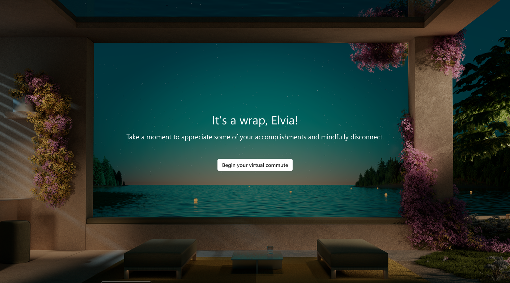
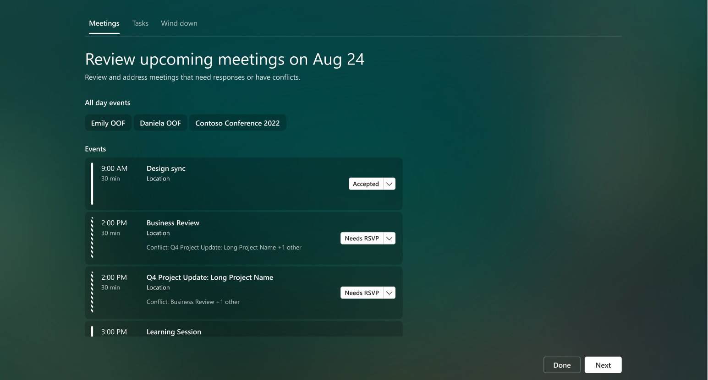
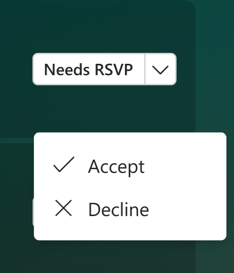
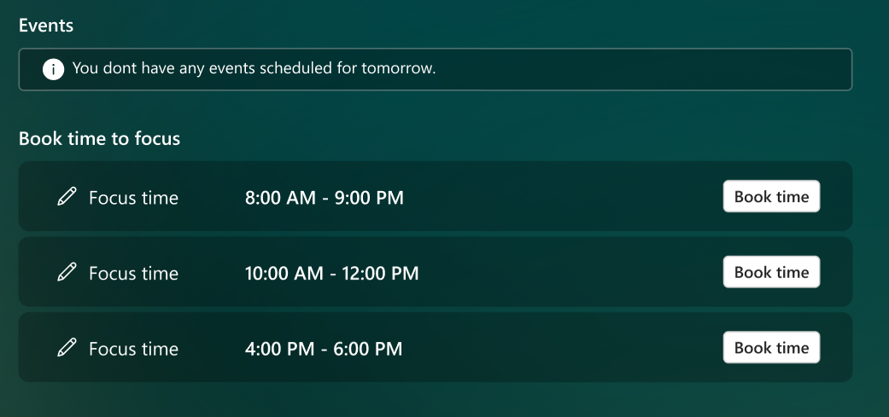
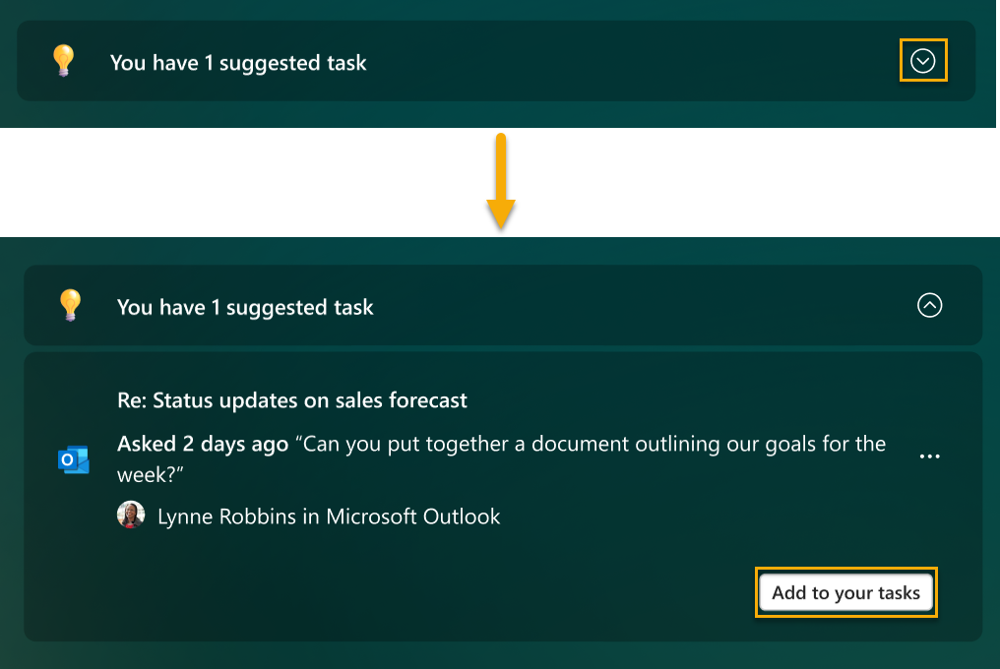
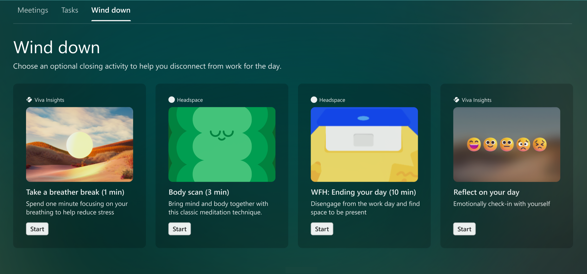

---

title: Virtual commute with Viva Insights
description: Use the virtual commute feature in Microsoft Viva Insights
author: lilyolason
ms.author: v-lilyolason
ms.topic: article
ms.collection: viva-insights-personal
ms.localizationpriority: medium 
ms.service: viva
ms.subservice: viva-insights
manager: anirudhbajaj
audience: user
---

# Virtual commute

You can use the virtual commute feature in the Microsoft Viva Insights app from either the [Up-next card](#from-the-up-next-card-on-the-home-page) on the Home page or [within Protect time](#within-protect-time).

## From the Up-next card on the Home page

When the Up-next card prompts you to "wrap up," you can select **Let's go** to start your virtual commute right away.

This message appears at the following times:

* If you've configured virtual commute reminders, the message appears 30 minutes before the time that you configured. For information about changing this and other settings, refer to [Insights app settings](viva-teams-app-settings.md).
* If you haven't configured virtual commute reminders, the message appears 30 minutes before the end of your workday as [scheduled in Outlook](https://outlook.office.com/calendar/options/calendar/view/appearance).

## Within Protect time

In **Protect time**, when prompted with, "Ready to wrap up?", select **Let's go**.

  

When you select this button, your virtual commute starts immediately. For details about the virtual commute experience, see [virtual commute steps](#virtual-commute-steps). Starting a virtual commute this way doesn't affect the scheduled days and time of day that you set in [Set up virtual commutes](#set-up-virtual-commutes).

## Set up virtual commutes

The first time you open **Protect time**, you're prompted to schedule your virtual commute reminders.

  

You can use this prompt to turn on the **Reminder** toggle, then select the days and time of day that you want to see the virtual commute reminder. When you're done, select **Save changes**.

>[!Note]
>
>* You can schedule virtual commute reminders for any day of the week, including days not configured as workdays in your Outlook settings.
>* The time you select will apply to every day on which you'll see reminders. You can't set different times for different days of the week.
>* The reminder might not arrive at exactly the scheduled time, but most reminders appear within five minutes before their scheduled time. For example, if your reminder is scheduled for 5:00, the reminder could appear between 4:55 and 5:00.

If you need to adjust these settings at any time, you can do so on the **Settings** page. For more information, see [Settings > Virtual commute](viva-teams-app-settings.md).

### Virtual commute sections

After you select **Let's go**, your virtual commute starts.

The commute guides you through the following sections. All sections are optional; to skip a section, just select **Next**.

#### Meetings

In **Meetings**, you can review tomorrow’s events—those that last all day, those that you’ve accepted, and those that still need your RSVP. 

 

If an event needs your RSVP, you can **Accept** or **Decline** it from this screen. 

 

If you don’t have any events coming up tomorrow, you’ll see open blocks on your calendar that you can use for focus time, instead. Select **Book time** to add that focus time to your calendar.

 

When you’re ready to move to the next section, select **Next** at the bottom-right of the page.

#### Tasks

In the **Tasks** section, you can review your open tasks. These tasks originate from Microsoft To Do, and they’re are either due today or have a reminder set for today.

In addition to viewing your existing tasks, you can do a few other things in this section:

* **Add a new task**. Below **Your tasks**, select **Add a task**.

* **Add a suggested task surfaced from Outlook or Teams.** If To Do notices a potential task in your chats or emails, a notification appears above **Your tasks**. Select the down arrow to expand the message. If you want to put this task on your To Do list, select the **Add to your tasks** button. 

    

* **Cross a completed task off your list.** Select the circle to the left of the task name, which sends the task to your **Tasks completed today** list. If you want to delete the task from To Do, select the trash can icon to the right of the task name.

* **Set a reminder.** Select the ellipses (…) to the right of the task name, then pick a time you want to be reminded. Reminders appear in your Microsoft To Do list and in your Briefing email, if you’re subscribed to receive Briefing emails. You can also **Edit** and **Delete** tasks from this menu.

    

After you’re done reviewing and managing your tasks, select **Next** to move to the last section.

##### Wind down

**Wind down** provides some activities to help you close out your workday mindfully and disconnect from work:

* A breather break
* If you have access to Headspace, a few guided meditation videos
* The opportunity to reflect, just like you would using the [Reflect](viva-insights-reflect.md) feature on the **Home** page

**Start** one or more of these activities to help transition to the next part of your day.

When you’re ready to complete your virtual commute, select the **Done** button.

## Related topics

* [Viva Insights introduction](viva-teams-app.md)
* [Protect time](viva-insights-protect-time.md)
