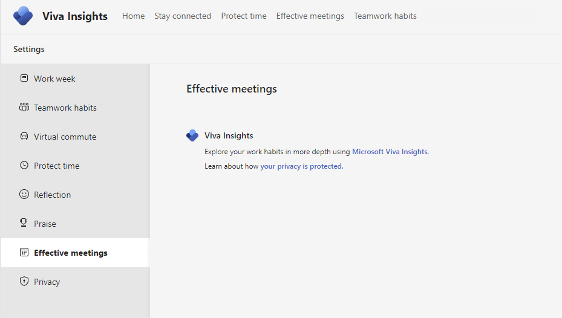

---

title: Admin tasks for the Viva Insights app
description: Admin tasks for the Microsoft Viva Insights app available for Microsoft Teams
author: madehmer
ms.author: v-lilyolason
ms.topic: article
ms.collection: 
- viva-insights-manager
- viva-insights-leader
ms.localizationpriority: medium 
ms.service: viva
ms.subservice: viva-insights
manager: anirudhbajaj
audience: Admin

---

# Admin tasks for Viva Insights

As a [Teams Service Administrator](/microsoftteams/using-admin-roles#teams-roles-and-capabilities), you can deploy and pin the Microsoft Viva Insights app in Microsoft Teams for all the users or for specific groups in your organization [through custom policies](/microsoftteams/teams-app-setup-policies).

## Prerequisites

Before people in your organization can use the Viva Insights app, they must have the following:

* Access to Microsoft Teams
* An Exchange Online account

## Install the app

Complete the steps in the following playbooks to get the Viva Insights app up and running for people in your organization.

1. Confirm they have a [Viva Insights service plan](../overview/plans-environments.md).
2. In the [Teams admin center](https://go.microsoft.com/fwlink/p/?linkid=2024339), add the Viva Insights app to the list of allowed apps within the organization, as follows:
[Release the Viva Insights app within your organization](https://download.microsoft.com/download/1/b/9/1b980a29-f166-4b72-8d8e-d1126f4028c7/Release-the-Insights-app.pdf).

   >[!Note]
   >To allow or block specific users in your organization from using Viva Insights, do the following:
   >
   >1. Confirm that Viva Insights is turned on for your organization on the [Manage apps](/microsoftteams/manage-apps) page.
   >2. Create a custom app permission policy and assign it to those users. For details, see [Manage app permission](/microsoftteams/manage-apps) policies in Teams.

3. In Teams, pin the Viva Insights app in the left app bar for all users in your organization: [Pin the Viva Insights app](https://download.microsoft.com/download/5/d/f/5df6c702-58f2-4768-b8e5-26ffd2c78b80/Pin-the-Insights-app.pdf).
4. Now that Viva Insights is available, all users can follow these steps to [Discover and pin the Viva Insights app](viva-teams-app-install.md).

>[!Important]
>If your organization assigned licenses before July 2021 (under the Workplace Analytics SKU), follow [these steps](#access-to-premium-features) to enable or disable access to the Viva Insights premium features released starting in November 2021.

## Disable Headspace

When the Headspace feature is enabled, users can find it on the [Home](viva-insights-home.md) page of Viva Insights. As an admin, you can disable this feature by using PowerShell cmdlets.

The PowerShell commands for working with Viva Insights features are described in [Set-VivaInsightsSettings](/powershell/module/exchange/set-vivainsightssettings). To disable Headspace, see [Example 1](/powershell/module/exchange/set-vivainsightssettings).

## Configure meeting effectiveness surveys

As the admin, you can configure the meeting effectiveness surveys for your organization at the [user](#user-level-configuration) or [tenant level](#tenant-level-configuration). You can enable or disable the survey for a specific user or multiple users with PowerShell, or you can set the default state for all users in your tenant as opted in or opted out in the Microsoft 365 admin center.

### Prerequisites

Confirm the following before configuring access:

* **Admin role** - You need to have a Global admin or an Exchange Online admin role to configure users for meeting effectiveness surveys in the Microsoft 365 admin center. To configure individual users through PowerShell, you need to have an Exchange Online admin, a Global admin, or an Insights admin role.
* **Understand data privacy** - See the [Privacy guide](./viva-teams-app-privacy.md) to understand how privacy is built into meeting effectiveness surveys and to learn what you can configure to address your organization's specific privacy requirements.

### Tenant-level configuration

As the admin, use the following steps to change the setting for meeting effectiveness surveys at the tenant level. This setting is enabled by default, so that all users will receive the surveys. Users can opt out individually from within their Viva Insights app settings.

>[!IMPORTANT] 
> If you opt out of the meeting effectiveness surveys at the tenant level, people in your organization will be opted-out by default from getting feedback on meetings they organize. However, individuals can override this tenant-level setting. To prevent a person from opting-in and and to disable the feature completely, you need to disable the surveys for that user with PowerShell, like we describe [below](#set-access-for-multiple-users).

#### To configure the default state for a tenant

>[!Note] 
> If you're part of the Targeted Release program, you might see a new admin experience. To learn how configure access through this new experience, refer to [Using the new admin center](../../advanced/setup-maint/new-admin-center.md#personal-insights). 

1. Sign in to the [Microsoft 365 admin center](https://admin.microsoft.com/Adminportal).
2. Make sure you're using the new admin center. To do this, if the switch in the upper right of the page reads **Try the new admin center**, select it so that it reads **The new admin center**.
3. In the left pane, expand **Settings**, and then select **Org Settings**.
4. Under **Org Settings**, select **Viva Insights**.
5. Select or deselect the checkbox for **Meeting effectiveness surveys**, and then select **Save changes**. If you deselect the checkbox, all users in your organization will not receive the surveys, including all those who were receiving the surveys. However, individuals can explicitly opt in again within their Viva Insights app.

>[!Note]
>After you change the survey setting in the admin center, it will take up to 24 hours for the new setting change to take effect.

### User-level configuration

As the admin, you can use the [Exchange Online PowerShell V2](/powershell/module/exchange/set-vivainsightssettings) module to set access [for one user](#set-access-for-one-user) or [for multiple users](#set-access-for-multiple-users) for meeting effectiveness surveys.

>[!Note]
>The following user-level configuration can only be modified when users have P1 licenses enabled for Viva Insights.

#### Check a user's access

To check whether a user has access to features in Microsoft Viva Insights in Microsoft Teams, follow the directions in [Get-VivaInsightsSettings](/powershell/module/exchange/get-vivainsightssettings).

#### Set access for one user

To enable or disable meeting effectiveness surveys for a specific user, use the Exchange Online PowerShell V2 module and the following command line, where you replace **roy@contoso.com** with your applicable username and organization:

```powershell
Set-VivaInsightsSettings -Identity roy@contoso.onmicrosoft.com -Enabled $false -Feature MeetingEffectivenessSurvey
```

* If you set the Enabled parameter to **$false**, the meeting effectiveness surveys will be **Off** for that user. The user won't be able to override this setting or opt in to the meeting effectiveness surveys. In other words, you're completely disabling the feature.
* If you set the Enabled parameter to **$true**, the meeting effectiveness surveys will be **On** for that user. Users can then opt out from meeting effectiveness surveys. If no action occurs, this setting applies by default.

>[!Note]
>When Enabled is set as $true, people who had previously opted out will continue to be opted out and will not receive any surveys until they opt back in through their Viva Insights app.
>
>**Suggestions for you cards** (How your meetings succeeded and How your meetings can improve) derived from meeting metrics data (outside of surveys)  appear regardless of tenant- and user-level disablements.

#### Set access for multiple users

You can also enable or disable meeting effectiveness surveys for multiple users with a PowerShell script that iterates through the specified users, changing the value one user at a time.

Use the following script to:

* Create a .csv file with all users that were processed with their current status.
* List the user principal name for each user.
* Set the specified Enabled parameter for each user.

1. Create an input .csv text file that contains the **Identity** of the users you want to configure. For example:

   ```powershell
   Identity
   ClaudeL@contoso.com
   LynneB@contoso.com
   ShawnM@contoso.com
   ```

2. Specify the location of the input .csv file, the output .csv file, and the value of Enabled to $true or $false for each user:

   ```powershell
   $inFileName="<path and file name of the input .csv file that contains the users, for example: C:\admin\Users2Opt-in.csv>"
   $outFileName="<path and file name of the output .csv file that records the results, for example: C:\admin\Users2Opt-in-Done.csv>"
   $meetingEffectivenessSurveysMode = $true
   
   $users=Import-Csv $inFileName
   ForEach ($user in $users)
   {
   $user.identity
   $upn=$user.identity
   Set-VivaInsightsSettings –Identity $upn -Enabled $meetingEffectivenessSurveysMode -Feature MeetingEffectivenessSurvey
   }
   ```

3. Run the resulting commands at the [Exchange Online PowerShell V2](/powershell/module/exchange/set-vivainsightssettings) module command prompt.


### Notification scenarios

People see different notifications and settings in their Viva Insights app in Teams or on the web, depending on which settings scenario you picked above.

**Scenario 1: You didn't change the default setting in the Microsoft admin center, and the meeting effectiveness survey feature is on for all people in your organization.**

The first time people in your organization use the Viva Insights app, they get a notification about meeting effectiveness surveys. On their **Settings > Effective meetings** page, the toggle for **Meeting effectiveness surveys** is switched on. If people want to opt out of the survey, they can switch the toggle off.

   

   


**Scenario 2: In the Microsoft admin center, you set the meeting effectiveness survey feature to default-off.**

The first time people in your organization use the Viva Insights app, they get a notification asking whether they want to start using meeting effectiveness surveys. On their **Settings > Effective meetings** page, the toggle for **Meeting effectiveness surveys** is switched off. If people want to start using the surveys, they can switch the settings toggle on, or select **Get started** on the first-use notification.

   

**Scenario 3: You used a PowerShell cmdlet to disable access to the meeting effectiveness survey feature.**

People in your organization don't receive *any* notifications about meeting effectiveness surveys. When they go to their **Settings > Effective meetings** page in the Viva Insights app in Teams or on the web, they don't see a toggle to turn on or off the feature.

   

## Premium access for licenses assigned before July 2021

The following steps are only applicable to organizations who assigned licenses prior to July 2021. You need to confirm the following assignment options in Azure Active Directory for the Microsoft Viva Insights SKU:

* **Microsoft Viva Insights** - Enables access to premium personal and manager features released starting in November 2021, including the updated [Teamwork habits](../../org-team-insights/teamwork-habits.md) page in the Viva Insights app.
* **Microsoft Viva Insights (WpA transition)** – This option is only applicable for organizations who assigned licenses before July 2021 and want to keep their access to the advanced analyst features. If this is the only option enabled, then their access to advanced insights will continue unchanged. However, you must enable the first app option for access to the premium features released starting in November 2021.

>[!Important]
>If your organization assigned Viva Insights licenses starting in July 2021, the Microsoft Viva Insights assignment option controls access to all premium personal, manager, and advanced analyst features. Enabling or disabling the Microsoft Viva Insights (WpA transition) option in Azure Active Directory will not affect their access to these features.

### Access to premium features

To confirm, enable, or disable access to premium features for users with licenses assigned before July 2021, complete the following steps.

1. Go to [Azure portal](https://portal.azure.com/) > **Azure Active Directory**.
2. In the left navigation, select **Licenses** > **All products**.
3. Search for and select **Microsoft Viva Insights**.
4. In the left navigation, for groups, select **Licensed groups** or for individual users, select **Licensed users**.
5. At the top, select **+Assign**.
6. In **Users and groups**, select the group or individual to add, which will then show up under **Name**.
7. Select **Assignment options**, and then select **On** to enable or **Off** to disable the following:

   * **Microsoft Viva Insights** – Enables access to premium features that were released starting in November 2021.
   * **Microsoft Viva Insights (WpA transition)** – Only applicable to users who were assigned licenses **before July 2021**.

    

8. Select **Review + assign**, and then near the bottom, select **Assign** to apply the changes.

## Related topics

[Viva Insights introduction](viva-teams-app.md)
