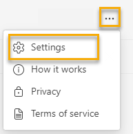

---

title: Configure Viva Insights
description: Learn how to configure the settings for the Microsoft Viva Insights app in Teams
author: lilyolason
ms.author: v-lilyolason
ms.topic: article
ms.localizationpriority: medium 
ms.collection: 
- viva-insights-personal
- viva-insights-manager
- viva-insights-leader
ms.service: viva
ms.subservice: viva-insights
manager: anirudhbajaj
audience: user

---

# Configure the app

Use the **Settings** page to configure the features for the Microsoft Viva Insights app. For example, you can turn reminders on or off, or change the day and hour settings for features on the Settings page, such as for [Praise](viva-insights-reflect.md) and [Reflection](viva-insights-reflect.md).

To configure the settings:

1. In the upper-right corner of any page, select the **ellipsis** (...), and then select **Settings**.

   

2. You can configure settings for the following features:

   * **Workweek** – Edit the days of the week that you work, your start time, end time, and your time zone. These settings are kept synchronized with the same settings in [Outlook](https://outlook.office.com/calendar/options/calendar/view/appearance). That is, if you change them in one place, they will be updated everywhere that they appear.
   * **Virtual commute** – Choose whether you want a reminder to wrap up your day and when you want to see that reminder.
    * Protect time – You can do three things in Protect time settings:
        * Set up your **quiet hours**: Select whether you want to mute mobile notifications during certain times of the day, and whether there are some days you want to mute mobile notifications all day.
        * Set up a **no-meeting day** reminder, which reminds you to clear conflicting meetings on no-meeting days.
        * Configure your **focus plan**. For more information about focus plans, refer to [Focus plan](../Use/focus-plan.md).
   * **Reflection** – Choose whether you want a reminder to reflect and when you want to see that reminder. For more information about reflections in the Viva Insights app, refer to [Reflect](./viva-insights-reflect.md).
   * **Praise** – Choose whether you want a reminder to send praise to your colleagues and when you want to see that reminder. For more information about praise in the Viva Insights app, refer to [Send praise](./viva-insights-praise.md).
   * **Effective meetings** – Choose whether you to send a meeting effectiveness survey to participants in meetings you organize.
   <!--pending verification on licensing--> 
   * **Teamwork habits** – <!--This option is available only to people who are recognized in Azure AD as managers.-->Initially this shows your team as it is listed in Azure Active Directory. You can use this option to update the list of team members. However, after you edit your team members here, it will no longer synchronize with Azure Active Directory.  

## About reminders

As described above, you can set reminders for several features in the Viva Insights app. You can schedule these reminders for any day of the week, including days not configured as workdays in your Outlook settings.

When you set reminders:

* The time you select will apply to every day on which you'll see reminders; you can’t set different times for different days of the week.  
* They won’t arrive at exactly the scheduled time, but within 15 minutes on either side of the scheduled time. For example, if your reminder is scheduled for 5:00, the reminder could show up anytime between 4:45 and 5:15.
* Each reminder shows up in your Teams activity feed. When you see it, you can select it there and it'll open the feature (reflection, praise, virtual commute, or no-meeting day) directly in the Viva Insights app.

## Related topics

[Viva Insights introduction](viva-teams-app.md)
