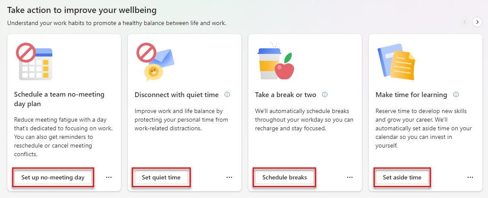

# Wellbeing plans

*Applies to: users with Viva Insights subscriptions*

In addition to focus plans, Viva Insights can also help you protect time on your calendar for scheduled breaks, learning, and message catch-up time. Configure these plans to match your needs by setting a target amount of blocked time, and personalize your booking preferences.  

>[!Note]
>You can also create a wellbeing plan through the Briefing email you get on Fridays. [Learn more about wellbeing plans in Briefing](../briefing/be-wellbeing-plans.md).

## To create a plan

To create a plan through the Viva Insights app:

1. Go to the **Take action to improve your wellbeing** section of your **Wellbeing** tab.
1. Pick a plan that suits your goals, then select the action button at the bottom of the card. For example, if you want to reserve some time each day to learn a new skill, you'd select the **Set aside time** button on the **Make time for learning** plan card.

1. The app takes you to the plan's settings. Configure your preferences here, and then save.

<!--ppe environment isn't letting me do this right now; will need screenshots.-->

## To edit or leave a plan

To edit a plan after joining it:

1. Select **Settings** in the **Protect time** tab. 
1. Edit your settings.
1. Save.

If you want to leave the plan, select the **Leave plan** button, located to the right of to the plan you want to leave.

 

