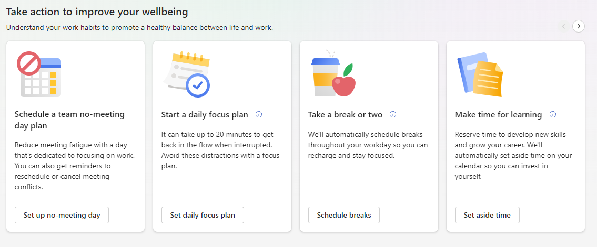
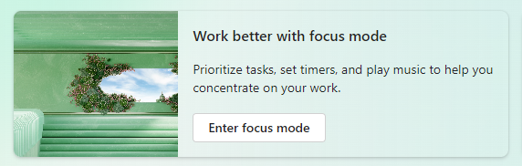
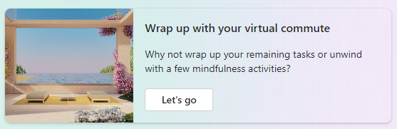
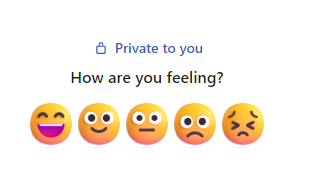
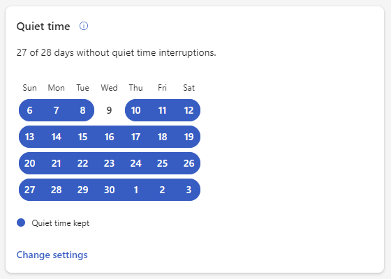
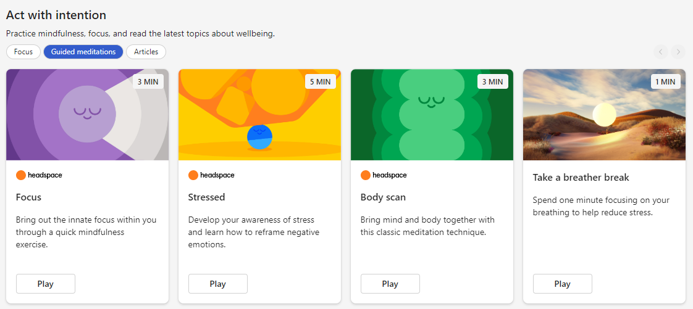
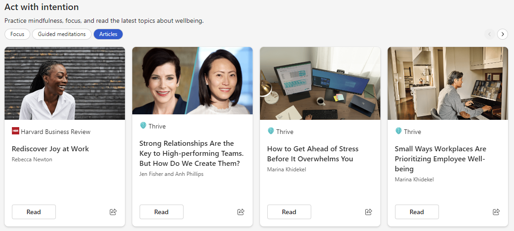

# Wellbeing
	
Use the **Wellbeing** tab in Microsoft Viva Insights to understand your work habits, manage your team better, and promote a healthy balance between life and work. Here's what you can do in **Wellbeing**:

* Start plans to [focus](../use/focus-plan.md), [learn, take breaks, and catch up on messages](wellbeing-plans.md).

    

* [Book impromptu focus sessions and enter a distraction-free focus mode](focus.md).

    

* Prep for tomorrow and end your day mindfully with a [virtual commute](virtual-commute.md).

    

* [Reflect](reflect.md) on how you're feeling.

    

* Set up after-hours [quiet time](quiet-time.md) and keep track of how well you're keeping that time work-free.

    

* Start a [guided meditation with Headspace](headspace.md).

    

* Read wellbeing-related articles.

    

If you're a leader, you'll find wellbeing organizational insights for your teams, recommended actions to boost productivity and wellbeing, and impact insights that show you how actions you've taken are helping your organization. [Read more about organizational insights for leaders](../../org-team-insights/teams-and-web/org-insights-in-teams.md).

## Related topics

* [Viva Insights introduction](viva-teams-app.md)
* [Virtual commute](viva-insights-virtual-commute.md)