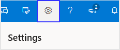

# Viva Insights Outlook add-in

_**Applies to**: Microsoft Viva Insights elements are available in varying levels to users of different Microsoft Office 365 and Microsoft 365 plans. See [Plans and environments](../overview/plans-environments.md) for details. Also see [How do I find my plan?](../overview/mya-faq.md#q4-how-can-i-find-out-what-my-plan-is)_

Did you ever miss an important email or forget a commitment you made to your co-workers? Do meetings and emails tend to take over your calendar? Do you ever wish to see reminders for 1:1 meetings with your manager, direct reports, or other top collaborators? Would you like to be notified if an upcoming meeting doesn't have a quorum?

If your answer to any of these questions is _yes_, the Microsoft Viva Insights Outlook add-in provides insights that can help you stay on top of your tasks and get more done during your workday.

This add-in is an extension of your Microsoft Outlook experience and works within Outlook to help you gain focus time, maintain your work relationships, plan time away from work, and improve your overall work-life balance.

## Privacy by design

This Outlook add-in preserves all the data-subject rights afforded by GDPR. The insights you see in the add-in are only available to you. They are computed as needed, from your email and meeting information, and are never stored outside your mailbox.

Additionally, the add-in begins processing data for insights only after the first time you open it. [Learn more](https://www.microsoft.com/TrustCenter/CloudServices/office365/default.aspx) about how Microsoft protects your privacy.

## How to see the add-in

Before you can use the Viva Insights Outlook add-in, be sure that the following prerequisites are in place:

* Have an applicable [Microsoft 365 plan](../overview/plans-environments.md) and let at least 24 hours elapse since you were granted that license.
* Have a valid mailbox. This cannot be a shared mailbox or even a shared mailbox that was converted into a user mailbox. It must be a user mailbox from the start. We recommended that you [provision a new user mailbox](/exchange/recipients/create-user-mailboxes#create-user-mailboxes), if necessary.
* Have the following in place:

  * Your computer has Microsoft Outlook version 1705 (build 8201.2102) or higher for Windows, or version 15.39.1010 or later for Mac.
  * Add-in commands are enabled for the Outlook add-in. For details, see [Add-in commands for Outlook](/outlook/add-ins/add-in-commands-for-outlook).
  * Internet Explorer version 10 or 11 is installed on your computer.  

* The admin enables the add-in by default in the Exchange admin center. If your admin sets the deployment status as "Optionally, disabled by default," you can manually add the Viva Insights Outlook add-in yourself from the Microsoft Store Add-ins.

>[!Note]
>The Viva Insights Outlook add-in is not available on mobile devices.

Open the Viva Insights Outlook add-in in one of the programs listed under [Open the Viva Insights add-in](#open-the-add-in), namely [Windows Outlook desktop](#windows-outlook-desktop), [Outlook on the web](#outlook-on-the-web), or [Mac Outlook desktop](#mac-outlook-desktop).

* Select an email. In Outlook, you can do this in one of the following ways:

  1. Open the email in a new window.
  2. With the [Outlook Reading Pane](https://support.office.com/article/use-and-configure-the-reading-pane-to-preview-messages-2fd687ed-7fc4-4ae3-8eab-9f9b8c6d53f0) open, view the email in the Reading Pane.

   >[!Note]
   >This works only with emails to which [information rights management](/exchange/policy-and-compliance/information-rights-management#apply-irm-protection-to-messages) have not been applied.  

## Open the add-in

You can use the Viva Insights Outlook add-in in the following environments:

### Windows Outlook desktop

1. Open the **Home** ribbon of Microsoft Outlook.
2. Select the **Viva Insights** icon.

### Outlook on the web

1. Open [Outlook on the web](https://outlook.office.com/mail/inbox).
2. Open an email message.
3. Select the **ellipsis** (**...**) in the top-right corner of your email message, and then select **Viva Insights**.

>[!Note]
>You can pin the Add-in to your quick access pane for easier access; see [Pin the add-in](#pin-the-add-in) for details.

### Mac Outlook desktop

In the new Mac interface, add-ins are not currently available, but you can enable them by switching to the old interface, as described here:

#### To enable the Viva Insights Outlook add-in for the Mac

1. Switch to the old UI by using the toggle at the top of the page:

   

2. In the Outlook **Home** ribbon, open Viva Insights by using the same steps as for [Windows Outlook desktop](#windows-outlook-desktop).

>[!Note]
>If the Viva Insights add-in is not showing up for you, check out the prerequisites that are described in [How to see the add-in](#how-to-see-the-add-in).

## What you might see

After you open the Viva Insights add-in, you'll see a number of cards in the right (Viva Insights) pane.
  
This pane will show you a number of options, such as the following:

* [Prepare for your meetings](use-the-insights.md#prepare-for-your-meetings) - Prepare for your meetings and then drive more effective meetings.
* [Track email and document open rates](use-the-insights.md#track-email-and-document-open-rates) - Track readership of emails that you've sent sent by viewing the percentage open rate, the percentage attachment click rate, and so on.
* [View outstanding tasks](use-the-insights.md#view-outstanding-tasks) - Make sure nothing falls through the cracks by seeing reminders of tasks that you've agreed to do.
* [Follow up on your requests](use-the-insights.md#follow-up-on-your-requests) - Receive reminders to follow up on commitments made by your colleagues or on requests that you have made.  
* [Book time to focus](use-the-insights.md#book-time-to-focus) - Protect your calendar by reserving focus time before meetings take over.  
* [Catch up on email](use-the-insights.md#catch-up-on-email) - Cut through the clutter with a summary of unread email from your more important contacts.
* [Catch up on documents](use-the-insights.md#catch-up-on-documents) - See a list of shared OneDrive and SharePoint documents that you need to catch up on.  
* [Add important people](use-the-insights.md#add-important-people) - Manage your list of important contacts. You'll see reminders when you have tasks to complete for these people or unread emails from them.
* [Set lunch hours](use-the-insights.md#set-lunch-hours) - Use this card to protect your lunch hours and personalize your insights.
* [Plan your time away](use-the-insights.md#plan-your-time-away) - Use this card to plan your time away from work.
* [Catch up with your team](use-the-insights.md#catch-up-with-your-team) - Stay on top of your team's needs with insights for 1:1 meetings, outstanding tasks, and so on.
* [Meeting suggestions](use-the-insights.md#meeting-suggestions) - Grow and nurture your network by staying connected with important colleagues.

## Pin the add-in

If you're using Outlook on the Web, you can pin the add-in for easier access.  

1. In Outlook on the web, select the **Settings** (gear) icon.

    

2. In **Settings**, select **View all Outlook Settings**.
3. Confirm **Mail** is selected in the left pane, and in the center pane, select **Customize actions**.

    

4. In the right pane, in the **Message surface** area, select **Viva Insights**.
5. In the right pane, in the **Toolbar** area, select **Viva Insights**.
6. Save your new settings.

## To opt out

>[!IMPORTANT]
>The dashboard will be retired soon, but you can access opt-out settings on the Viva Insights app in Teams or on the web. To view settings in the app, select **Try it now** on the banner message.
>
> [Read more about this change](../reference/mya-retirement.md).

1. Open your [dashboard](https://myanalytics.microsoft.com).
2. Select the **Settings** (gear) icon at top right.

    

3. Under **Viva Insights**, select **Settings**.
4. For **Insights Outlook add-in**, set the control to **Off**.  
5. Select **Save** to save your changes.

>[!NOTE]
>It might take up to 24 hours for your saved changes to take effect.

## To remove the Viva Insights icon

If you opt out of the Viva Insights Outlook add-in, you might also want to remove its icon from the Outlook ribbon. To do so, follow these steps:

1. In Outlook, select **Get Add-ins**.

   

2. On the left navigation pane, select **My add-ins**.

3. On the **Viva Insights** card, select the **ellipsis** (**...**), and then select **Remove**.

### If I am opted out, can I opt back in?

Yes; if you opt yourself out or if an admin opts you out, you can opt back in any time to regain access to the Viva Insights Outlook add-in.

## To opt in

>[!IMPORTANT]
>The dashboard will be retired soon, but you can access opt-out settings on the Viva Insights app in Teams or on the web. To view settings in the app, select **Try it now** on the banner message.
>
> [Read more about this change](../reference/mya-retirement.md).

1. Open your [dashboard](https://myanalytics.microsoft.com).
2. Select the **Settings** (gear) icon at top right.

    

3. Under **Viva Insights**, select **Settings**.
4. For **Viva Insights Outlook add-in**, set the control to **On**.  
5. Select **Save** to save your changes.

>[!NOTE]
>It might take up to 24 hours for your saved changes to take effect.

## Related topics

* [Use Viva Insights](use-the-insights.md)
* [Viva Insights elements](MyA-elements.md)
