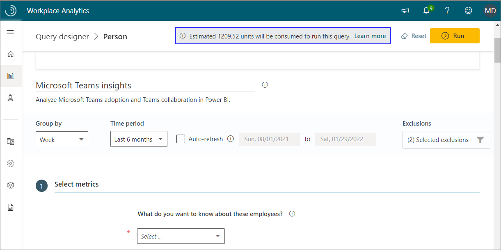
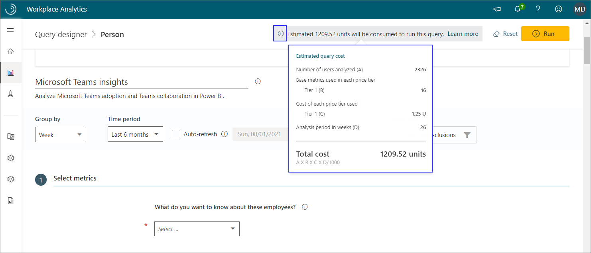

---

title: Capacity model for Viva Insights
description: Learn about the capacity model for using the Query designer for advanced analysis of Viva Insights
author: madehmer
ms.author: helayne
ms.topic: article
ms.localizationpriority: medium 
ms.collection: viva-insights-advanced 
ms.service: viva 
ms.subservice: viva-insights 
search.appverid: 
- MET150 
manager: scott.ruble
audience: Admin
---

# Capacity model

Effective October 2021, the Microsoft Viva Insights SKU replaced the Microsoft Workplace Analytics SKU.

You can subscribe a tenant to the advanced insights and tools in Viva Insights through the Capacity model where the tenant consumes capacity units based on their volume of query usage.

The appearance and behavior of the pages used to create and run queries and [query results](/viva/insights/use/view-download-and-export-query-results?toc=/viva/insights/use/toc.json&bc=/viva/insights/breadcrumb/toc.json) will differ based on your tenant's SKU subscription.

## Analysts with the capacity model

As an analyst of a tenant with the capacity model, each query that you run consumes units based on the following factors:

* The number of measured employees included in the analysis
* The number of weeks of data included in the query output for each measured employee
* The number of metrics used in the query
* The type of metrics used from the different price tiers; metrics in the higher price tiers consume more units than metrics in lower price tiers (see [Capacity model details](#capacity-model-details) for details)

When designing a query, Viva Insights uses these factors to calculate the cost of the query. Within the query editor, you'll see the estimated number of units the query will consume in its current state. This number is updated as the query is edited:

The bar above the estimated query cost shows how many units remain in the tenant's account. You can continue to run queries as long as this balance is greater than zero units.

The Power BI templates that are currently available in Query designer use one or more predefined queries to use with the provided Power BI template.

## Capacity cost calculator

Before you run a query or a template in Query designer, you can get an estimate with the following Capacity cost calculator in Power BI.

The steps below describe how to use the following interactive, embedded calculator that will give you an estimate for running a specific Viva Insights template or query. Select the details about the query or template to get an estimate that shows in the **Estimated cost** section on this page.

**To get a template estimate**

1. In **Select a Power BI template** on the first page of the **Capacity cost calculator**, select the name of the template.
2. In **Select time period**, select the time period for the analysis.
3. In **Select employees**, enter or select the number of measured employees to include in the analysis.
4. In **Estimated cost**, you’ll see an estimate on the right side of the page.

**To get a query estimate**

1. Select **Queries** at the bottom right of the **Capacity cost calculator**.
2. In **Query type**, select the type of query.
3. In **Select query**, select the query metrics you want to include in your analysis.
4. In **Select time period**, select the time period for the analysis.
5. In **Select employees**, enter or select the number of measured employees to include in the analysis.
6. In **Estimated cost**, you’ll see an estimate on the right side of the page.

<iframe width="800" height="486" src=https://msit.powerbi.com/view?r=eyJrIjoiZWY3ZGUyZDEtYjdjMS00ZDE4LTkyZmQtOGQzMzg0NzU0ZTM1IiwidCI6IjcyZjk4OGJmLTg2ZjEtNDFhZi05MWFiLTJkN2NkMDExZGI0NyIsImMiOjV9 frameborder="0" allowFullScreen="true"></iframe>

>[!Tip]
>
>* To more easily read the options, select the **Open in full screen mode** icon (double arrow at bottom right) for a larger view of the calculator.
>* Hover the cursor over the **filter** icon to view how the data is being filtered.
>* Select **Clear all** to clear all the selections.

### Capacity model details

In a capacity-model tenant, queries consume "units" when they are run. Usage calculation is as follows:

**Units consumed** = **A** x **B** x **C** x **D**

The usage formula consists of the following parts:

* **A = measured population**

   This is the number of measured employees the query will analyze.

* **B = metrics**

   This is the number of unique base metrics that are used at each price tier in a query. A [price tier cost](#price-tier-costs) is associated with each metric.

   If a query includes more than one customization of one base metric, it counts as only a single use of that metric. For example, if a query measures Meeting hours between 8:00 and 9:00 AM and Meeting hours between 9:00 and 10:00 AM, this counts as consuming one metric, which is Meeting hours.

* **C = price tier cost**

   See [Price tier costs](#price-tier-costs) for details.

* **D = weeks**

   This is the analysis period, in weeks.

### Price tier costs

This is the cost of the price tier that is in use for a metric in the query. A query consumes units at this rate. The higher the tier, the more units are consumed:

| Tier | Metric used in the query | Units |
| ---- | ------------ | -------------- |
| 1    | Most of the metrics - Such as collaboration hours, internal network size, low quality meeting hours, and 65 other basic metrics | 1.25 |
| 2    | Advanced metrics - Specifically, the [Network query metrics](/viva/insights/tutorials/ona-metrics?toc=/viva/insights/use/toc.json&bc=/viva/insights/breadcrumb/toc.json). | 2.25 |
| 3    | Metrics with [CRM data](/viva/insights/tutorials/crm-queries?toc=/viva/insights/use/toc.json&bc=/viva/insights/breadcrumb/toc.json) - External-facing metrics that calculate across CRM contacts. If you use CRM attributes to create filter customizations for a metric (for example, the Meeting hours metric where at least one attendee has _AccountName_ = _Contoso_), the metric is in tier 3. If a single metric has more than one customization and at least one of them uses a CRM attribute, the metric is in tier 3. | 6.00 |

>[!Note]
>If you use metrics at multiple price tiers, a subtotal is calculated for each metric, and then all subtotals are added together. For example, if your query uses one metric in each of two price tiers, the total number of units consumed is **A** x **B** x **C** x **D** (for the metric on price tier 1) + **A** x **B** x **C** x **D** (for the metric on price tier 2)

### Population scope in usage calculations

As described in Capacity model details, the calculation is the same across all query types: **Units consumed** = **A** (measured employees) x **B** (metrics) x **C** (price-tier cost) x **D** (weeks).

The population scope (measured employees) for the different query types is as follows:

* **Person query** - The population (A) equals the number of measured employees, as filtered in the query definition
* **Meeting query** - The population equals the number of licensed users that are invited in the filtered meetings
* **Person-to-group query** - The population equals the number of time investors
* **Group-to-group query** - The population equals the number of time investors
* **Peer Comparison** - The population equals the number of employees in the reference groups
* **Network: Person query** - The population equals the number of filtered measured employees in the query; note that network metrics are charged at tier 2 (see [Price tier costs](#price-tier-costs))
* **Network: Person-to-person query** - The population scope is determined by the number of filtered measured employees in the query. Note that network metrics are charged at tier 2 (see [Price tier cost](#price-tier-costs))

### Usage calculation for a query

The query page shows how units are calculated for the query that's being defined. To see more details about the calculation, select the **Information** (i) icon:

>[!Important]
>
>* The cost shown is only an estimate. The estimate might vary from the query's actual cost, which can be seen after the query is successfully ran.
>* A running cost estimate is currently not available for meeting queries.

### Recurring query charges

Viva Insights uses the usage formula to calculate the units that are consumed whenever analysts run a query in the Query designer, except for recurring ([auto-refresh](/viva/insights/tutorials/query-auto-refresh?toc=/viva/insights/use/toc.json&bc=/viva/insights/breadcrumb/toc.json)) queries. The first time a recurring query runs, the formula uses the current number of employees and weeks that the query definition specifies. In subsequent runs of the query, the formula automatically uses the additional time period as the query duration. You are not charged for any historical data that has already been analyzed.

Note that the queried population can change between query refresh runs. For example, when you set up a new "last four weeks" auto-refresh query that includes 1,000 licensed employees. And then before the query runs again, another 2,000 employee licenses are approved. The first time the query refreshes after the initial run, it will include:

* **1** - Weeks 2 to 4 for the original population

* **2** - Week 5 for the original population

* **3** - Weeks 2 to 5 for the newly licensed population

Of these, the refresh query will charge for **2** and **3** because neither were included in the original query run, but it will not charge for **1**, which duplicates the data that was returned in the original query.

### Charges for running an existing query again

If you open an existing, previously run query, and you edit it and run it again, you'll incur a new cost. Same as if you were running a new query for the first time. The steps to do this are as follows:

1. Open the **Query designer** > **Results** page.
2. In the list of queries, find a query whose status shows as completed, as indicated by a green check mark.
3. In the row for that query, select **More options** (the ellipsis) and then select **View query**:

   

4. Change a detail about the query. For example, change **Group by** from **Week** to **Month**, and then select **Run**. The edited query runs again. As it does, it incurs a new cost, in units, calculated as described in [Capacity model details](#capacity-model-details).

### No additional charges

No additional units are charged for the following:

* Viva Insights licenses for advanced insights that are assigned. You are charged for query volume, which is independent of licensing.  
* Your use of the following features: [Plans](/viva/insights/tutorials/solutionsv2-intro?toc=/viva/insights/use/toc.json&bc=/viva/insights/breadcrumb/toc.json), [My team in Viva Insights](../org-team-insights/teamwork-habits.md), [My organization in Viva Insights](../org-team-insights/org-trends.md), and [Explore the stats](../use/explore-intro.md).
* Your choice of tool, such as Excel, PowerPoint, Power BI, or another visualization tool.
* Use of organizational attributes in queries.
* The number of analysts who run queries in your organization.

### Query results

In **Query designer** > **Results**, you'll see additional information if the capacity model is in use for a tenant:

* **Workplace Analytics SKU** - Analysts in an advanced insights tenant can use the **Query designer** > **Results** page as described in [View, download, and export query results](/viva/insights/use/view-download-and-export-query-results?toc=/viva/insights/use/toc.json&bc=/viva/insights/breadcrumb/toc.json).

* **Capacity-model tenants** - For analysts in a capacity-model tenant, the **Results** page shows additional information. On this page, the **Query Cost** column shows the number of units charged to each query. Select the Information tooltip (i) icon to see details about a charge, namely the number of people analyzed, the number of base metrics used, the price tier of each metric, and the analysis period:

   

### View analyst usage

The **Analyst usage** report is available for download within the app. This report lists the queries that were run during a specified time period, the analysts who submitted them, and other details, including the query cost:

>[!Note]
>Only admins can download the Analyst usage report.

#### To download the Analyst usage report

1. Sign in to the advanced insights app as an admin.
2. Go to the **Analyst usage** page:

   

3. Select the time period for which you want information about query usage.
4. Select **Download**.

## Analysts with tenants

Analysts of tenants with the Workplace Analytics SKU won't see any query usage or capacity units in Query designer.

## Related topics

* [Templates](../Tutorials/Power-bi-templates.md)
* [Glossary](../Use/Glossary.md)
* [Metric descriptions](../Use/Metric-definitions.md)
