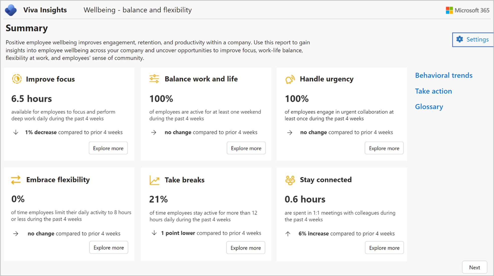
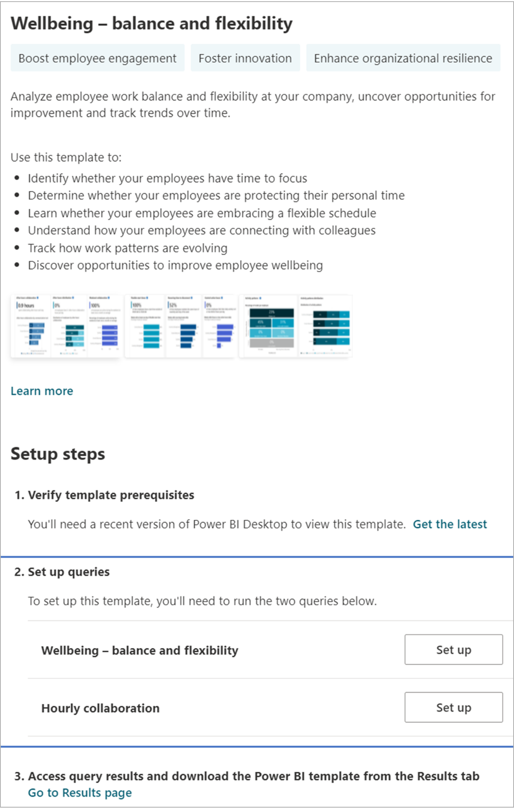
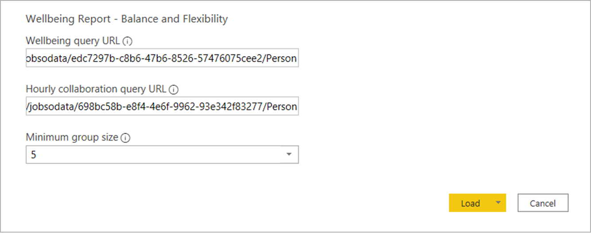
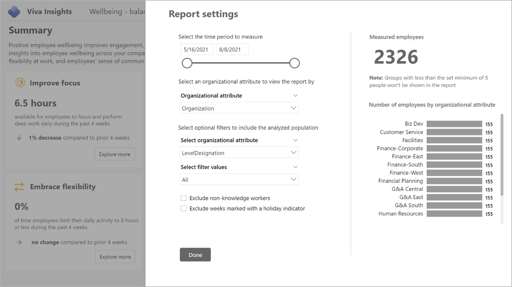

---

title: Wellbeing dashboard
description: Use the Wellbeing dashboard in Power BI to visualize insights into employee wellbeing across the company that's based on Viva Insights data
author: madehmer
ms.author: helayne
ms.topic: article
ms.localizationpriority: medium 
ms.collection: viva-insights-advanced 
ms.service: viva 
ms.subservice: viva-insights 
search.appverid: 
- MET150 
manager: scott.ruble
audience: Admin
---

# Wellbeing dashboard

The **Wellbeing &ndash; balance and flexibility** dashboard uses a template that's populated by Microsoft Viva Insights data to help you get insights into employee wellbeing across your company. This analysis can help you uncover opportunities to improve focus, work-life balance, flexibility at work, and employee's sense of community.

The dashboard includes the following reports.

* **Improve focus** &ndash; Do you have time to focus on your core priorities?
* **Balance work and life** &ndash; Are you able to protect personal time?
* **Handle urgency** &ndash; Can you manage unexpected demands and proactively shift some to planned work?
* **Embrace flexibility** &ndash; Are you adopting a flexible working schedule?
* **Take breaks** &ndash; Are you able to mindfully disconnect?
* **Stay connected** &ndash; Are you part of a community at work?

Each report includes a **Why this matters** section that explains the business implications, best practices, and recommended actions to help maintain or improve employee wellbeing.

To populate the dashboard in Power BI, you must set up and successfully run the predefined **Wellbeing - balance and flexibility** and **Hourly collaboration** query in the Query designer.

After you successfully run these queries, you can download the template for the **Wellbeing - balance and flexibility** query on the **Results** page. After you download the template, you can then connect the query data from Viva Insights to the dashboard in Power BI.

## Demonstration

The following demo uses sample data that is only representative of this dashboard and might not be exactly what you see in a live dashboard specific to your organization's unique data.

 <iframe width="800" height="486" src="https://msit.powerbi.com/view?r=eyJrIjoiMzhjNmE0NWMtYWMwYi00N2EzLWE1YjUtY2FhNzc1MDE0OTc3IiwidCI6IjcyZjk4OGJmLTg2ZjEtNDFhZi05MWFiLTJkN2NkMDExZGI0NyIsImMiOjV9&embedImagePlaceholder=true " frameborder="0" allowFullScreen="true"></iframe>

The template for the Wellbeing dashboard is on the Results page in [Query designer](https://workplaceanalytics.office.com/en-us/Analyze/QueryDesigner/NewQuery). (If that link doesn't work, try [this link instead](https://workplaceanalytics-eu.office.com/en-us/Analyze/QueryDesigner/NewQuery).) For complete steps, see [Set up the report](#set-up-the-report).

## Prerequisites  

Before you can run the queries and populate the dashboard in Power BI, you must:

* Be assigned the role of [Analyst](../use/user-roles.md) in the advanced insights app.
* Have the latest version of Power BI Desktop installed. If you have an earlier version of Power BI installed, uninstall it before installing the new version. Then go to [Get Power BI Desktop](https://www.microsoft.com/p/power-bi-desktop/9ntxr16hnw1t?activetab=pivot:overviewtab) to download and install the latest version.

## Set up the report

>[!Note]
>This dashboard is currently only available in English and will only work with data generated from the English version of the app. Before running the required queries, confirm the browser language in the app's URL includes **en-us**, or change it to include **en-us**: ...office.com/en-us/...

1. In [the app](https://workplaceanalytics.office.com/)(if that link doesn't work, try [this link instead](https://workplaceanalytics-eu.office.com/)), select **Analyze** > **Query designer**.

2. In **Create** > **Other templates**, select **Wellbeing - balance and flexibility** to see the required setup steps, and then in step 2, select **Set up**.

   

3. When prompted, confirm the following settings:

   * **Name** &ndash; Customize or keep the default name
   * **Group by** &ndash; Week
   * **Time period** &ndash; Select the time period you want to analyze
   * **Auto-refresh** &ndash; Keep this setting disabled by default. Turn it on only if you plan to track indicators on a weekly basis.
   * **Meeting exclusions** &ndash; Select the preferred rule for your tenant

   >[!Important]
   >If you try to delete a predefined metric, you'll see a warning that the deletion might disable portions of the Power BI dashboard and reduce query results. In turn, this can limit your ability to visualize employee wellbeing patterns. Depending on the metric you delete, you might disable a single Power BI chart, several charts, or all the charts. Select **Cancel** to retain the metric.

4. In **Select filters**, select **Active only** for "**Which measured employees do you want to include?**" Optionally, you can further filter the employees in scope for the dashboard. For more details about filter and metric options, see [Create a person query](./person-queries.md#create-a-person-query).

5. In **Organizational data**, keep the preselected **Organization** and **LevelDesignation** attributes that the dashboard requires.

   >[!Important]
   >If you remove the required, preselected Organizational data attributes, you might disable one or more Power BI charts.

6. Select any additional attributes (columns) that you want to include in the reports.
7. Select **Run** to run the query, which might take a few minutes to complete.
8. When prompted, return to Query designer, and then repeat  **Steps 3-7** for the **Hourly collaboration** query, which requires the same selections as for the Wellbeing query.

   >[!Important]
   >If you try to delete a predefined metric, you'll see a warning that the deletion might disable portions of the Power BI dashboard and reduce query results. In turn, this can limit your ability to visualize employee wellbeing patterns. Depending on the metric you delete, you might disable a single Power BI chart, several charts, or all the charts. Select **Cancel** to retain the metric.

9. When prompted, continue to **Results**. After both queries successfully run, select the **Download** icon for the **Wellbeing - balance and flexibility** query results, select **PBI template**, and then select **OK** to download the template.
10. Open the downloaded **Wellbeing - balance and flexibility** template.
11. If prompted to select a program, select **Power BI**.
12. When prompted by Power BI, copy and paste the OData links for both queries into their respective fields.

    1. In the Viva Insights **Query designer** > **Results** page, select the **Link** icon for each query, and select to copy the generated OData URL link.
    2. In Power BI, paste each copied link into its respective field.
    3. Set the **Minimum group size** for data aggregation within this report's visualizations in accordance with your company's policy for viewing Viva Insights data.
    4. Select **Load** to import the query results into Power BI. Loading these large files may take some time to complete.

    

13. If you're already signed in to Power BI with your advanced insights app organizational account, the dashboard visualizations will populate with your data: You are done and can skip the following steps. If not, proceed to the next step.
14. If you're not signed in to Power BI, or if an error occurs when updating the data, sign in to your organizational account again. In the **OData feed** dialog box, select **Organizational account** and then select **Sign in**. See [Troubleshooting](../tutorials/power-bi-templates.md#troubleshooting) for more details.

    

15. Select and enter credentials for the organizational account that you use to sign in to Viva Insights, and then select **Save**.

    >[!Important]
    >You must sign in to Power BI with the same account you use to access Viva Insights.

16. Select **Connect** to prepare and load the data, which can take a few minutes to complete.

## Report settings

After the Wellbeing - balance and flexibility report is set up and populated with Viva Insights data, as a first step to viewing data in the dashboard, view and set the following parameters in **Settings**. You can find **Settings** on the right panel of the introduction page. You can also adjust the report settings as you go through the report pages through the **Settings** icon.

* **Select the time period to measure** &ndash; This is the time period that you want to analyze.
* **Select an organizational attribute to view the report by** &ndash; The primary "group-by" attribute shown in all subsequent reports. You can change this attribute at any time and all subsequent report pages will show group values by the new attribute.
* **Select optional filters to exclude employee groups** &ndash; To filter the measured employee population, you can filter by any selected organizational attribute, and then filter by any of the values for these attributes. If you use filters, the measured employees count will represent a reduced number. Measured employees are the number of employees in the filtered population who were active during the specified time period. Active employees are those who sent at least one email or instant message during a work week that's included in the current time period.
* **Exclude weeks marked with a holiday indicator** &ndash; Select to exclude unusually low collaboration weeks based on individual collaboration patterns. These low collaboration weeks usually occur when employees are taking time off from work.
* **Exclude non-knowledge workers** &ndash; Select to exclude employees who spent a weekly average of less than five hours in meetings, email, instant messages, and calls because they are unlikely knowledge workers or they do not use Outlook or Teams.

After confirming the settings, check the number of measured employees to confirm this is the population you want to analyze.

### Customize working hours

For Embrace flexibility and Take breaks, you can customize the working hours for your organization as a baseline. Select **Customize working hours**, and then select the standard start time and end time. Employees’ collaboration patterns will then be compared with these time settings.

## About the report

The Wellbeing - balance and flexibility report includes the following report pages that help you identify your employees' wellbeing across the company.

* **Improve focus** &ndash; Shows the average daily collaboration hours for each employee by organization as compared to focus hours. This highlights how an employee's collaboration load is impacting their focus time.
* **Balance work and life** &ndash; Shows the average daily after-hours collaboration for each employee, the distribution of employees by their after-hours collaboration, and percentage of employees that were active during the weekends at least once every four weeks. Understanding employees' after-hours and weekend work behaviors can uncover opportunities to improve their work-life balance.
* **Handle urgency** &ndash; Shows the percentage of employees and work weeks involved in urgent collaboration and the impact of urgent collaboration on employees' after-hours collaboration patterns. Urgent collaboration is defined by the following keywords in the email subject lines or meeting invitation titles: "urgent," "immediately," "ASAP," "fire drill," "immediate action." This list of keywords is also provided in the report. Keywords are by default in English in the query template. Users that are assigned the role of analyst can add or edit keywords in the template. This highlights how unexpected demands are managed in your company and unlocks opportunities to shift some of them to planned work.
* **Embrace flexibility** &ndash; Highlights three key aspects that help you identify employees' flexibility at work:
   * **Flexible start times** &ndash; Shows the percentage of weeks in which the employees have at least one day of flexible start time in a week.
   * **Recurring time to disconnect** &ndash; Shows the percentage of weeks in which the employees take at least one hour of recurring break each day over the week.
   * **Control active hours** &ndash; Shows the percentage of weeks in which the employees limit their work activities to their expected working hours over the week. If the employees have a standard work schedule from 9:00 AM to 5:00 PM, their expected working hours for each day is eight hours.
This analysis provides insights about how employees are adopting flexible working schedules.
* **Take breaks** &ndash; Shows the percentage of weeks in which an average employee falls under each activity pattern by organization. Defined by collaboration hour blocks and whether recurring breaks are taken, the activity patterns indicate how employees arrange their weekly work schedule. This information provides opportunities to identify groups that may experience burnout and struggle to disconnect from work.
* **Stay connected** &ndash; Highlights how employees connect with colleagues through small group meetings and informal communication. Understanding the average weekly meeting hours an employee spent in small group meetings and the distribution of emails and chats by type of colleagues they interact with can provide insights about whether employees are forming communities and rapport at work.

The dashboard also includes:

* A **Behavioral trends** page that tracks key metrics over time
* A **Take action** page that provides actionable recommendations to improve behaviors
* An **Explore further** page that highlights the research and studies in each topic
* A **Glossary** page that describes all the metrics in the report

## Power BI tips, troubleshooting, and FAQs

For details about how to share the dashboard and other Power BI tips, troubleshoot any issues, or review the FAQ, see [Power BI tips, FAQ, and troubleshooting](../tutorials/power-bi-templates.md).

## Related topic

[View, download, and export query results](../use/view-download-and-export-query-results.md)
