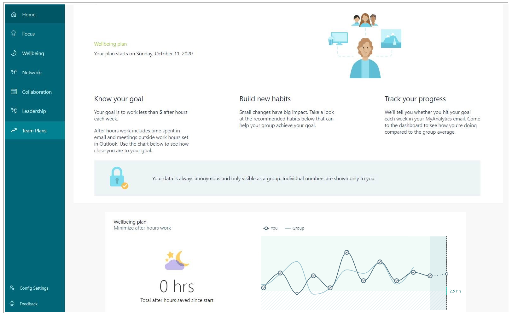
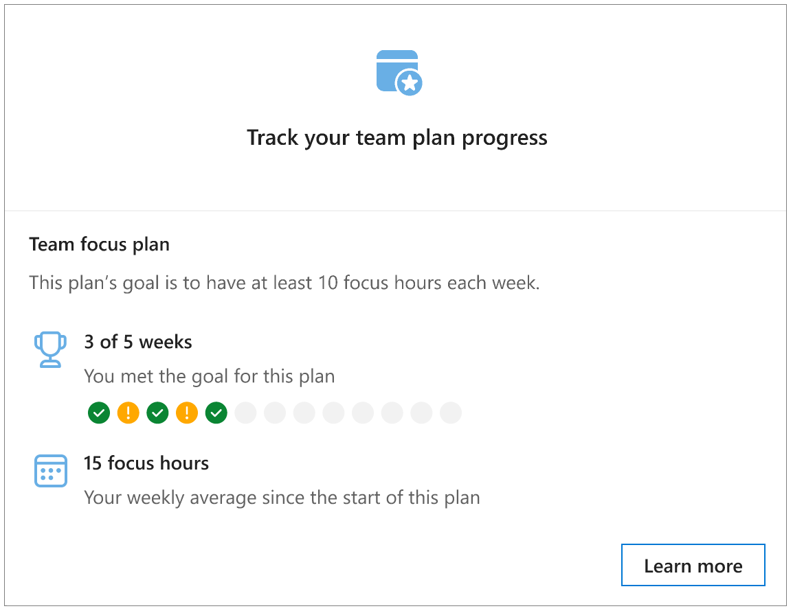

# Plan participants' experience

**Role** - A participant in a plan or a person who is using Viva Insights for personal insights

While analysts and program managers can create and manage plans as part of Microsoft Viva Insights, the actual work of change is done by people. People who are using Viva Insights can participate in a plan and use it as an opportunity to change their workplace habits for the better.

All plans are scheduled to start on a Sunday. As soon as the plan starts and through the duration of the plan, its participants will receive or can view what is described in the following sections.

<!-- THIS IS TURNED OFF FOR NOW (MAY 2019)
## Welcome email

As a program manager schedules a plan, they can choose to let participants receive an automatically generated [welcome email](../Images/WpA/Tutorials/welcome-msg-prog-partic.png) from Viva Insights. This one-time email explains the details of the plan: its sponsor, its duration, and its targets -- the habits that participants are expected to work on.  
-->

## Viva Insights

[Viva Insights in Teams](../personal/teams/viva-insights-home.md), [Viva Insights Home page](../personal/use/home-web.md), and the [Dashboard](../personal/use/dashboard-2.md) are available resources for plan participants. In addition to the standard content available to all, the dashboard also includes a new participant section during a plan.

When people are part of a plan, they'll see a new **Team Plans** in their dashboard for tracking their progress. This added section contains information, such as recommended habits and a report about their progress as compared to the plan goals.

## Digest

People who use Viva Insights get a monthly [digest](../personal/use/email-digests-3.md) that focuses on a different work pattern each week, including: Focus, Wellbeing, Network, and Collaboration. This weekly digest is _not_ affected by a participant's enrollment in a plan.

### Teams Plan section

For plan participants, their monthly digest includes an additional section, such as the _Teams Plan_ section. This section summarizes their progress in the plan over the preceding month.

## Inline suggestions

[Inline suggestions](../personal/Use/mya-notifications.md) are brief, data-driven and AI-driven notifications that show up in Outlook when reading or composing an email or a meeting invitation. Different inline suggestions apply to different situations. For example, if you have outstanding to-do tasks, an inline suggestion might ask if you want to review them.

### Plan-only inline suggestions

Many inline suggestions are available to all participants (see [broadly available inline suggestions](#broadly-available-inline-suggestions)), but some apply only to participants of a particular Teamwork plan, such as the [Collaboration plan](#collaboration-plan) or the [Wellbeing plan](#wellbeing-plan):

#### Collaboration plan

Participants in the Collaboration plan might see the following inline suggestion<!--s-->.

| Where it shows up  | What it says | How it helps  |
| :------ |-------|---------|
|Reading pane (meeting invitation) &nbsp; &nbsp; &nbsp; &nbsp; &nbsp; &nbsp; &nbsp; &nbsp; &nbsp; &nbsp; | Could this meeting be 45 minutes? Suggest shortening to save everyone one hour per month. **Reply to &lt;name&gt;** &nbsp; &nbsp; &nbsp; &nbsp; &nbsp; &nbsp; &nbsp; &nbsp; &nbsp; &nbsp; &nbsp; &nbsp; &nbsp; &nbsp; &nbsp; &nbsp; &nbsp; &nbsp; &nbsp; &nbsp; &nbsp; &nbsp; &nbsp;  | Suggests that you ask the meeting organizer to shorten hour-long meetings to 45 minutes. |
<!--
|Meeting compose	| Some attendees have a lot of meetings this week. Is everyone required? **Mark who’s optional** &nbsp; &nbsp; &nbsp; &nbsp; &nbsp; &nbsp; &nbsp; &nbsp; &nbsp; &nbsp; &nbsp;  | Suggests that you reconsider whether everyone is required in the meeting that you are organizing, in light of the high meeting load of your invitees. |
-->

#### Wellbeing plan

Participants in the Wellbeing plan might see the following inline suggestion.

| Where it shows up  | What it says | How it helps  |
| :------ |-------|---------|
|Reading pane (meeting invitation) &nbsp; &nbsp; &nbsp; &nbsp; &nbsp; &nbsp; &nbsp; &nbsp; &nbsp; &nbsp; &nbsp;  | Looks like this meeting is outside your typical working hours. Here are some alternate times that work for everyone. **See suggested times** &nbsp; | Suggests that you ask the organizer to move the meeting to a time during working hours that works for all attendees. &nbsp; &nbsp; &nbsp; &nbsp; &nbsp; &nbsp; &nbsp; &nbsp; &nbsp; &nbsp; &nbsp; &nbsp; &nbsp; &nbsp; &nbsp; &nbsp; &nbsp; &nbsp; &nbsp; &nbsp; &nbsp; &nbsp;  |

<!-- Verifying this wording and finding out when to publish the following (Focus plan) section: 

#### Focus plan

Participants in the Focus plan might see the following inline suggestion:

| Where it shows up  | What it says | How it helps  |
| :------ |-------|---------|
|Reading pane (meeting invitation) &nbsp; &nbsp; &nbsp; &nbsp; &nbsp; &nbsp; &nbsp; &nbsp; &nbsp; &nbsp; &nbsp;  | Looks like this meeting is outside your typical working hours. Here are some alternate times that work for everyone. **See suggested times** | Suggests that you ask the organizer to move the meeting to a time during working hours that works for all attendees. &nbsp; &nbsp; &nbsp; &nbsp; &nbsp; &nbsp; &nbsp; &nbsp; &nbsp; &nbsp; &nbsp; &nbsp; &nbsp; &nbsp; &nbsp; &nbsp; &nbsp; &nbsp; &nbsp; &nbsp; &nbsp; &nbsp;  |

-->  

### Broadly available inline suggestions

Many other inline suggestions are available to _all_ Viva Insights participants, whether they are enrolled in a Teamwork plan or not. See [Inline suggestions in Outlook](../personal/use/mya-notifications.md) for details.

## Related topics

* [Plan introduction](/viva/insights/tutorials/solutionsv2-intro?toc=/viva/insights/use/toc.json&bc=/viva/insights/breadcrumb/toc.json)  
* [Plan walkthrough](/viva/insights/tutorials/solutionsv2-task?toc=/viva/insights/use/toc.json&bc=/viva/insights/breadcrumb/toc.json)
* [Plan concepts](/viva/insights/tutorials/solutionsv2-conceptual?toc=/viva/insights/use/toc.json&bc=/viva/insights/breadcrumb/toc.json)

<!-- REPLACING THe FOLLOWING TABLES WITH LINKS TO THE COMPLETE LIST IN THE MYA TOPICS

#### Get more time to focus

| Where it shows up  | What it says | How it helps  |
| :------ |-------|---------|
|Reading pane (meeting invitation) &nbsp; &nbsp; &nbsp; &nbsp; &nbsp; &nbsp; &nbsp; &nbsp; &nbsp; &nbsp; &nbsp; &nbsp;  |Looks like you have a lot of meetings this/next week. Would you like to reserve some time for focused work? **See available times** &nbsp; &nbsp; &nbsp; &nbsp; &nbsp; &nbsp; &nbsp; &nbsp; &nbsp; &nbsp; &nbsp; &nbsp; &nbsp; &nbsp; &nbsp; &nbsp; &nbsp; &nbsp;  |Reminds you (the meeting attendee who has a heavy meeting load) to book time for focused work|
|Reading pane (meeting invitation) &nbsp; &nbsp; &nbsp; &nbsp; &nbsp; &nbsp; &nbsp; &nbsp;  |This meeting conflicts with your scheduled focus time. Do you want to move your focus block? **See available times** &nbsp; &nbsp; &nbsp; &nbsp; &nbsp; &nbsp; &nbsp; &nbsp; &nbsp; &nbsp; &nbsp;  |Helps you to protect your focus time block, by suggesting that you move a booked focus session to another time when a meeting request conflicts with it.|

#### Stay up-to-date with important relationships

| Where it shows up | What it says | How it helps |
| :------ |-------|---------|
| Reading pane (email) &nbsp; &nbsp; &nbsp; &nbsp; &nbsp; &nbsp; &nbsp; &nbsp; | You may have outstanding tasks for sender. Would you like to review now? **See my tasks**   &nbsp; &nbsp; &nbsp; &nbsp; &nbsp; &nbsp; | Reminds you that there might be outstanding task items for the sender. &nbsp; &nbsp; &nbsp; &nbsp; &nbsp; &nbsp; &nbsp; &nbsp; &nbsp; &nbsp; &nbsp; &nbsp; &nbsp; &nbsp; &nbsp; &nbsp; &nbsp; &nbsp; &nbsp;  &nbsp; &nbsp;  |

#### Reduce after-hours work and team impact

| Where it shows up  | What it says | How it helps |
| :------ |-------|---------|
|Email compose &nbsp; &nbsp;  &nbsp; &nbsp; &nbsp; &nbsp; &nbsp; &nbsp; &nbsp; &nbsp; &nbsp; &nbsp;  | There are some open times during your working hours to catch up on email. **Book time**  &nbsp;  &nbsp; &nbsp; &nbsp; &nbsp; &nbsp; | Suggests that you book time during the day to do email instead of catching up after hours.  &nbsp; &nbsp; &nbsp;  &nbsp;  |

#### Build better collaboration habits

| Where it shows up  | What it says | How it helps |
| :------ |-------|---------|
|Meeting compose &nbsp; &nbsp; &nbsp; &nbsp; &nbsp; &nbsp; &nbsp; &nbsp; &nbsp; &nbsp; &nbsp; &nbsp; &nbsp; &nbsp;  | Could this meeting be 45 minutes? Build in some buffer time and save attendees time. **Shorten meeting**  &nbsp; &nbsp; &nbsp; &nbsp; &nbsp; &nbsp;|Suggests that you shorten hour-long meetings to 45 minutes. &nbsp; &nbsp; &nbsp; &nbsp; &nbsp; &nbsp; &nbsp; &nbsp; &nbsp; &nbsp; &nbsp; &nbsp; &nbsp; &nbsp; &nbsp; &nbsp; &nbsp; &nbsp; &nbsp; &nbsp; &nbsp; &nbsp; &nbsp; &nbsp; &nbsp; &nbsp; &nbsp; &nbsp; &nbsp; &nbsp; &nbsp; &nbsp; &nbsp; &nbsp; &nbsp; &nbsp; &nbsp; &nbsp; &nbsp; &nbsp; &nbsp; |

-->
